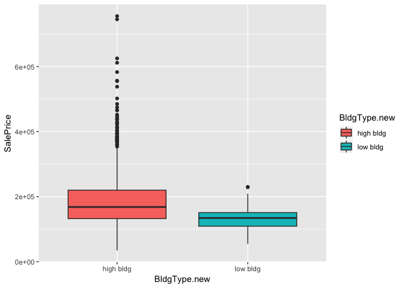
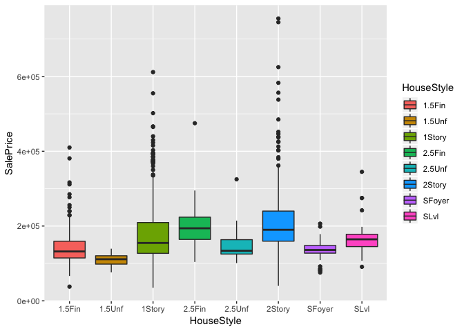
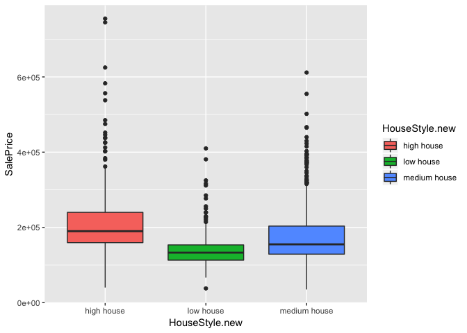
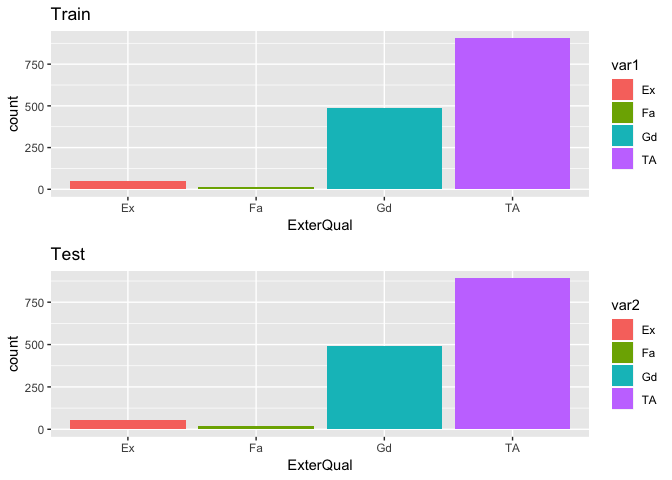
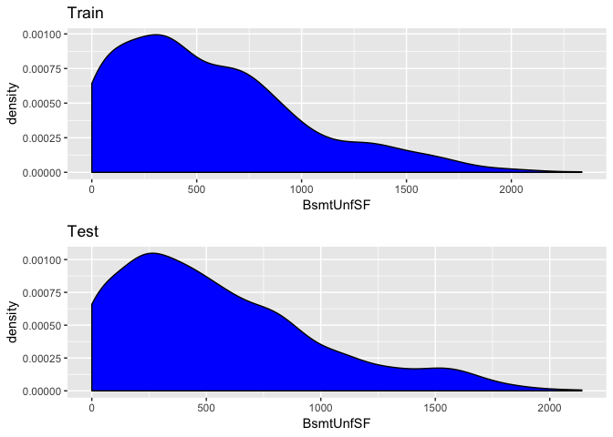
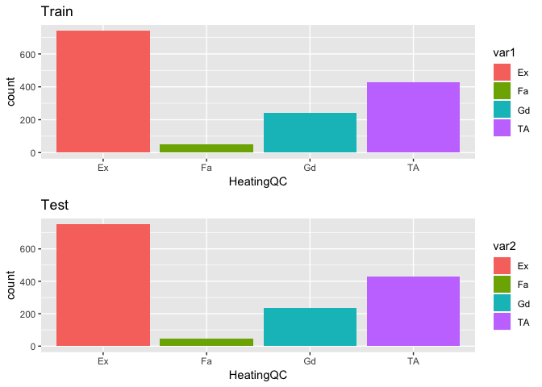
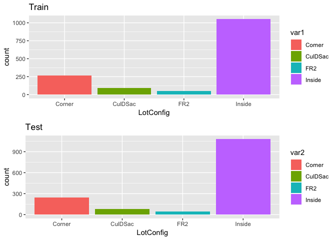
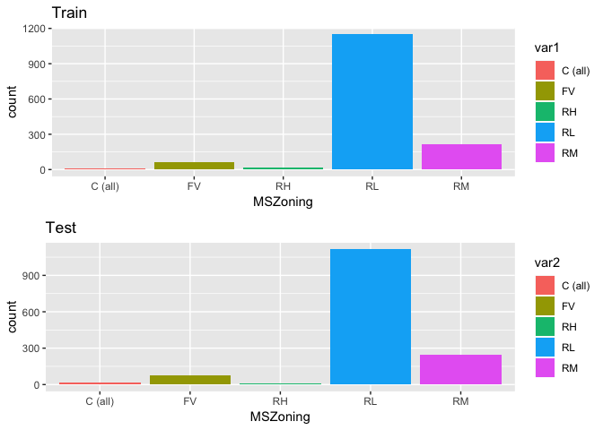
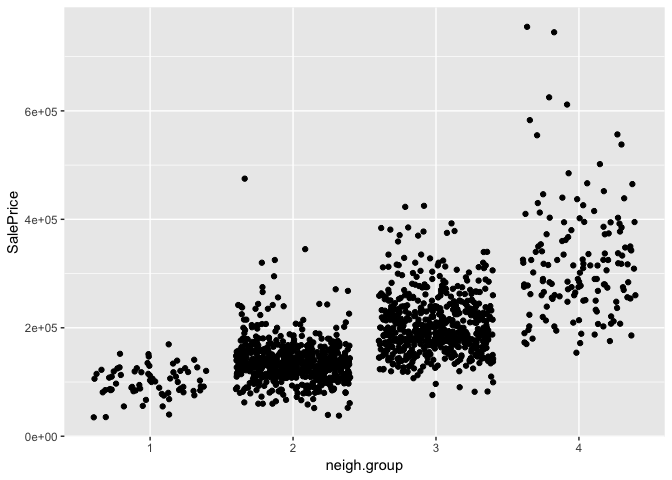

=================
House Price Prediction - Regression
==================


Import Dataset
--------------------

```r
library(plyr) #must import plyr first than dplyr - confliction issue
library(dplyr) #dplyr pipelines
```

```
## 
## Attaching package: 'dplyr'
```

```
## The following objects are masked from 'package:plyr':
## 
##     arrange, count, desc, failwith, id, mutate, rename, summarise,
##     summarize
```

```
## The following objects are masked from 'package:stats':
## 
##     filter, lag
```

```
## The following objects are masked from 'package:base':
## 
##     intersect, setdiff, setequal, union
```

```r
library(caret) #cv / model train / BoxCoxtrans
```

```
## Loading required package: lattice
```

```
## Loading required package: ggplot2
```

```
## Registered S3 methods overwritten by 'ggplot2':
##   method         from 
##   [.quosures     rlang
##   c.quosures     rlang
##   print.quosures rlang
```

```r
library(ggplot2) #ggplot - visualization
library(gridExtra) #grid.arrange
```

```
## 
## Attaching package: 'gridExtra'
```

```
## The following object is masked from 'package:dplyr':
## 
##     combine
```

```r
library(tidyr)
library(purrr) #keep
```

```
## 
## Attaching package: 'purrr'
```

```
## The following object is masked from 'package:caret':
## 
##     lift
```

```
## The following object is masked from 'package:plyr':
## 
##     compact
```

```r
library(randomForest) #random forest
```

```
## randomForest 4.6-14
```

```
## Type rfNews() to see new features/changes/bug fixes.
```

```
## 
## Attaching package: 'randomForest'
```

```
## The following object is masked from 'package:gridExtra':
## 
##     combine
```

```
## The following object is masked from 'package:ggplot2':
## 
##     margin
```

```
## The following object is masked from 'package:dplyr':
## 
##     combine
```

```r
library(corrplot) #corrplot
```

```
## corrplot 0.84 loaded
```

```r
library(e1071) #skewness / kurtosis
library(car) #vif
```

```
## Loading required package: carData
```

```
## 
## Attaching package: 'car'
```

```
## The following object is masked from 'package:purrr':
## 
##     some
```

```
## The following object is masked from 'package:dplyr':
## 
##     recode
```

```r
library(glmnet) #ridge/lasso/elastic net
```

```
## Loading required package: Matrix
```

```
## 
## Attaching package: 'Matrix'
```

```
## The following object is masked from 'package:tidyr':
## 
##     expand
```

```
## Loading required package: foreach
```

```
## 
## Attaching package: 'foreach'
```

```
## The following objects are masked from 'package:purrr':
## 
##     accumulate, when
```

```
## Loaded glmnet 2.0-18
```

```r
library(xgboost) #xgboost
```

```
## 
## Attaching package: 'xgboost'
```

```
## The following object is masked from 'package:dplyr':
## 
##     slice
```

```r
#setting address
#setwd("~/Desktop/Practice/Kaggle/Housing/HousePrices/Datasets")

#import datasets
train <- read.csv("Datasets/train.csv", stringsAsFactors = FALSE)
test <- read.csv("Datasets/test.csv", stringsAsFactors = FALSE)

#creating response variable in test set
test$SalePrice <- NA

#combine train and test
dat <- rbind(train,test)

#remove ID
dat <- dat %>% subset(select = -c(Id))

#convert the MSSubClass as factor - type of dwelling
dat <- dat %>% mutate(MSSubClass = as.factor(MSSubClass))

#summary
dat %>% mutate_if(is.character, as.factor) %>% summary
```

```
##    MSSubClass      MSZoning     LotFrontage        LotArea      
##  20     :1079   C (all):  25   Min.   : 21.00   Min.   :  1300  
##  60     : 575   FV     : 139   1st Qu.: 59.00   1st Qu.:  7478  
##  50     : 287   RH     :  26   Median : 68.00   Median :  9453  
##  120    : 182   RL     :2265   Mean   : 69.31   Mean   : 10168  
##  30     : 139   RM     : 460   3rd Qu.: 80.00   3rd Qu.: 11570  
##  70     : 128   NA's   :   4   Max.   :313.00   Max.   :215245  
##  (Other): 529                  NA's   :486                      
##   Street      Alley      LotShape   LandContour  Utilities   
##  Grvl:  12   Grvl: 120   IR1: 968   Bnk: 117    AllPub:2916  
##  Pave:2907   Pave:  78   IR2:  76   HLS: 120    NoSeWa:   1  
##              NA's:2721   IR3:  16   Low:  60    NA's  :   2  
##                          Reg:1859   Lvl:2622                 
##                                                              
##                                                              
##                                                              
##    LotConfig    LandSlope   Neighborhood    Condition1     Condition2  
##  Corner : 511   Gtl:2778   NAmes  : 443   Norm   :2511   Norm   :2889  
##  CulDSac: 176   Mod: 125   CollgCr: 267   Feedr  : 164   Feedr  :  13  
##  FR2    :  85   Sev:  16   OldTown: 239   Artery :  92   Artery :   5  
##  FR3    :  14              Edwards: 194   RRAn   :  50   PosA   :   4  
##  Inside :2133              Somerst: 182   PosN   :  39   PosN   :   4  
##                            NridgHt: 166   RRAe   :  28   RRNn   :   2  
##                            (Other):1428   (Other):  35   (Other):   2  
##    BldgType      HouseStyle    OverallQual      OverallCond   
##  1Fam  :2425   1Story :1471   Min.   : 1.000   Min.   :1.000  
##  2fmCon:  62   2Story : 872   1st Qu.: 5.000   1st Qu.:5.000  
##  Duplex: 109   1.5Fin : 314   Median : 6.000   Median :5.000  
##  Twnhs :  96   SLvl   : 128   Mean   : 6.089   Mean   :5.565  
##  TwnhsE: 227   SFoyer :  83   3rd Qu.: 7.000   3rd Qu.:6.000  
##                2.5Unf :  24   Max.   :10.000   Max.   :9.000  
##                (Other):  27                                   
##    YearBuilt     YearRemodAdd    RoofStyle       RoofMatl   
##  Min.   :1872   Min.   :1950   Flat   :  20   CompShg:2876  
##  1st Qu.:1954   1st Qu.:1965   Gable  :2310   Tar&Grv:  23  
##  Median :1973   Median :1993   Gambrel:  22   WdShake:   9  
##  Mean   :1971   Mean   :1984   Hip    : 551   WdShngl:   7  
##  3rd Qu.:2001   3rd Qu.:2004   Mansard:  11   ClyTile:   1  
##  Max.   :2010   Max.   :2010   Shed   :   5   Membran:   1  
##                                               (Other):   2  
##   Exterior1st    Exterior2nd     MasVnrType     MasVnrArea     ExterQual
##  VinylSd:1025   VinylSd:1014   BrkCmn :  25   Min.   :   0.0   Ex: 107  
##  MetalSd: 450   MetalSd: 447   BrkFace: 879   1st Qu.:   0.0   Fa:  35  
##  HdBoard: 442   HdBoard: 406   None   :1742   Median :   0.0   Gd: 979  
##  Wd Sdng: 411   Wd Sdng: 391   Stone  : 249   Mean   : 102.2   TA:1798  
##  Plywood: 221   Plywood: 270   NA's   :  24   3rd Qu.: 164.0            
##  (Other): 369   (Other): 390                  Max.   :1600.0            
##  NA's   :   1   NA's   :   1                  NA's   :23                
##  ExterCond  Foundation   BsmtQual    BsmtCond    BsmtExposure BsmtFinType1
##  Ex:  12   BrkTil: 311   Ex  : 258   Fa  : 104   Av  : 418    ALQ :429    
##  Fa:  67   CBlock:1235   Fa  :  88   Gd  : 122   Gd  : 276    BLQ :269    
##  Gd: 299   PConc :1308   Gd  :1209   Po  :   5   Mn  : 239    GLQ :849    
##  Po:   3   Slab  :  49   TA  :1283   TA  :2606   No  :1904    LwQ :154    
##  TA:2538   Stone :  11   NA's:  81   NA's:  82   NA's:  82    Rec :288    
##            Wood  :   5                                        Unf :851    
##                                                               NA's: 79    
##    BsmtFinSF1     BsmtFinType2   BsmtFinSF2        BsmtUnfSF     
##  Min.   :   0.0   ALQ :  52    Min.   :   0.00   Min.   :   0.0  
##  1st Qu.:   0.0   BLQ :  68    1st Qu.:   0.00   1st Qu.: 220.0  
##  Median : 368.5   GLQ :  34    Median :   0.00   Median : 467.0  
##  Mean   : 441.4   LwQ :  87    Mean   :  49.58   Mean   : 560.8  
##  3rd Qu.: 733.0   Rec : 105    3rd Qu.:   0.00   3rd Qu.: 805.5  
##  Max.   :5644.0   Unf :2493    Max.   :1526.00   Max.   :2336.0  
##  NA's   :1        NA's:  80    NA's   :1         NA's   :1       
##   TotalBsmtSF      Heating     HeatingQC CentralAir Electrical  
##  Min.   :   0.0   Floor:   1   Ex:1493   N: 196     FuseA: 188  
##  1st Qu.: 793.0   GasA :2874   Fa:  92   Y:2723     FuseF:  50  
##  Median : 989.5   GasW :  27   Gd: 474              FuseP:   8  
##  Mean   :1051.8   Grav :   9   Po:   3              Mix  :   1  
##  3rd Qu.:1302.0   OthW :   2   TA: 857              SBrkr:2671  
##  Max.   :6110.0   Wall :   6                        NA's :   1  
##  NA's   :1                                                      
##    X1stFlrSF      X2ndFlrSF       LowQualFinSF        GrLivArea   
##  Min.   : 334   Min.   :   0.0   Min.   :   0.000   Min.   : 334  
##  1st Qu.: 876   1st Qu.:   0.0   1st Qu.:   0.000   1st Qu.:1126  
##  Median :1082   Median :   0.0   Median :   0.000   Median :1444  
##  Mean   :1160   Mean   : 336.5   Mean   :   4.694   Mean   :1501  
##  3rd Qu.:1388   3rd Qu.: 704.0   3rd Qu.:   0.000   3rd Qu.:1744  
##  Max.   :5095   Max.   :2065.0   Max.   :1064.000   Max.   :5642  
##                                                                   
##   BsmtFullBath     BsmtHalfBath        FullBath        HalfBath     
##  Min.   :0.0000   Min.   :0.00000   Min.   :0.000   Min.   :0.0000  
##  1st Qu.:0.0000   1st Qu.:0.00000   1st Qu.:1.000   1st Qu.:0.0000  
##  Median :0.0000   Median :0.00000   Median :2.000   Median :0.0000  
##  Mean   :0.4299   Mean   :0.06136   Mean   :1.568   Mean   :0.3803  
##  3rd Qu.:1.0000   3rd Qu.:0.00000   3rd Qu.:2.000   3rd Qu.:1.0000  
##  Max.   :3.0000   Max.   :2.00000   Max.   :4.000   Max.   :2.0000  
##  NA's   :2        NA's   :2                                         
##   BedroomAbvGr   KitchenAbvGr   KitchenQual  TotRmsAbvGrd   
##  Min.   :0.00   Min.   :0.000   Ex  : 205   Min.   : 2.000  
##  1st Qu.:2.00   1st Qu.:1.000   Fa  :  70   1st Qu.: 5.000  
##  Median :3.00   Median :1.000   Gd  :1151   Median : 6.000  
##  Mean   :2.86   Mean   :1.045   TA  :1492   Mean   : 6.452  
##  3rd Qu.:3.00   3rd Qu.:1.000   NA's:   1   3rd Qu.: 7.000  
##  Max.   :8.00   Max.   :3.000               Max.   :15.000  
##                                                             
##    Functional     Fireplaces     FireplaceQu   GarageType    GarageYrBlt  
##  Typ    :2717   Min.   :0.0000   Ex  :  43   2Types :  23   Min.   :1895  
##  Min2   :  70   1st Qu.:0.0000   Fa  :  74   Attchd :1723   1st Qu.:1960  
##  Min1   :  65   Median :1.0000   Gd  : 744   Basment:  36   Median :1979  
##  Mod    :  35   Mean   :0.5971   Po  :  46   BuiltIn: 186   Mean   :1978  
##  Maj1   :  19   3rd Qu.:1.0000   TA  : 592   CarPort:  15   3rd Qu.:2002  
##  (Other):  11   Max.   :4.0000   NA's:1420   Detchd : 779   Max.   :2207  
##  NA's   :   2                                NA's   : 157   NA's   :159   
##  GarageFinish   GarageCars      GarageArea     GarageQual  GarageCond 
##  Fin : 719    Min.   :0.000   Min.   :   0.0   Ex  :   3   Ex  :   3  
##  RFn : 811    1st Qu.:1.000   1st Qu.: 320.0   Fa  : 124   Fa  :  74  
##  Unf :1230    Median :2.000   Median : 480.0   Gd  :  24   Gd  :  15  
##  NA's: 159    Mean   :1.767   Mean   : 472.9   Po  :   5   Po  :  14  
##               3rd Qu.:2.000   3rd Qu.: 576.0   TA  :2604   TA  :2654  
##               Max.   :5.000   Max.   :1488.0   NA's: 159   NA's: 159  
##               NA's   :1       NA's   :1                               
##  PavedDrive   WoodDeckSF       OpenPorchSF     EnclosedPorch   
##  N: 216     Min.   :   0.00   Min.   :  0.00   Min.   :   0.0  
##  P:  62     1st Qu.:   0.00   1st Qu.:  0.00   1st Qu.:   0.0  
##  Y:2641     Median :   0.00   Median : 26.00   Median :   0.0  
##             Mean   :  93.71   Mean   : 47.49   Mean   :  23.1  
##             3rd Qu.: 168.00   3rd Qu.: 70.00   3rd Qu.:   0.0  
##             Max.   :1424.00   Max.   :742.00   Max.   :1012.0  
##                                                                
##    X3SsnPorch       ScreenPorch        PoolArea        PoolQC    
##  Min.   :  0.000   Min.   :  0.00   Min.   :  0.000   Ex  :   4  
##  1st Qu.:  0.000   1st Qu.:  0.00   1st Qu.:  0.000   Fa  :   2  
##  Median :  0.000   Median :  0.00   Median :  0.000   Gd  :   4  
##  Mean   :  2.602   Mean   : 16.06   Mean   :  2.252   NA's:2909  
##  3rd Qu.:  0.000   3rd Qu.:  0.00   3rd Qu.:  0.000              
##  Max.   :508.000   Max.   :576.00   Max.   :800.000              
##                                                                  
##    Fence      MiscFeature    MiscVal             MoSold      
##  GdPrv: 118   Gar2:   5   Min.   :    0.00   Min.   : 1.000  
##  GdWo : 112   Othr:   4   1st Qu.:    0.00   1st Qu.: 4.000  
##  MnPrv: 329   Shed:  95   Median :    0.00   Median : 6.000  
##  MnWw :  12   TenC:   1   Mean   :   50.83   Mean   : 6.213  
##  NA's :2348   NA's:2814   3rd Qu.:    0.00   3rd Qu.: 8.000  
##                           Max.   :17000.00   Max.   :12.000  
##                                                              
##      YrSold        SaleType    SaleCondition    SalePrice     
##  Min.   :2006   WD     :2525   Abnorml: 190   Min.   : 34900  
##  1st Qu.:2007   New    : 239   AdjLand:  12   1st Qu.:129975  
##  Median :2008   COD    :  87   Alloca :  24   Median :163000  
##  Mean   :2008   ConLD  :  26   Family :  46   Mean   :180921  
##  3rd Qu.:2009   CWD    :  12   Normal :2402   3rd Qu.:214000  
##  Max.   :2010   (Other):  29   Partial: 245   Max.   :755000  
##                 NA's   :   1                  NA's   :1459
```


Sale Price Density
------------------

```r
#Visualization for our target variable 
dat %>% filter(!is.na(SalePrice)) %>%
  ggplot(aes(x=SalePrice)) +
  geom_density(fill="green", alpha=0.3)+
  geom_vline(xintercept = mean(dat$SalePrice,na.rm=TRUE), show.legend = TRUE, color = "red")+
  geom_vline(xintercept = median(dat$SalePrice, na.rm=TRUE), show.legend = TRUE, color = "blue")+
  labs(title = "Density for Sales Price", x="Sale Price", y="Density")
```

<!-- -->

```r
#Quite right skewed distribution

summary(dat$SalePrice)
```

```
##    Min. 1st Qu.  Median    Mean 3rd Qu.    Max.    NA's 
##   34900  129975  163000  180921  214000  755000    1459
```


Dealing with NA values
---------------------

```r
#Let's see NA values
NAtable <- data.frame(dat %>% summarise_all(list(~sum(is.na(.)))))

NAtable <- NAtable[,which(NAtable>0)]
NAtable <- NAtable %>% subset(select = -c(SalePrice))
dim(NAtable)
```

```
## [1]  1 34
```

```r
#total 34 predictors have at least 1 missing values (NA)
NAtable <- NAtable[order(NAtable, decreasing=TRUE)]

NAtable
```

```
##   PoolQC MiscFeature Alley Fence FireplaceQu LotFrontage GarageYrBlt
## 1   2909        2814  2721  2348        1420         486         159
##   GarageFinish GarageQual GarageCond GarageType BsmtCond BsmtExposure
## 1          159        159        159        157       82           82
##   BsmtQual BsmtFinType2 BsmtFinType1 MasVnrType MasVnrArea MSZoning
## 1       81           80           79         24         23        4
##   Utilities BsmtFullBath BsmtHalfBath Functional Exterior1st Exterior2nd
## 1         2            2            2          2           1           1
##   BsmtFinSF1 BsmtFinSF2 BsmtUnfSF TotalBsmtSF Electrical KitchenQual
## 1          1          1         1           1          1           1
##   GarageCars GarageArea SaleType
## 1          1          1        1
```

```r
#notice 
#Alley has 2721 NA
#FireplaceQu 1420 NA
#PoolQC 2909 NA
#Fence 2348 NA
#MiscFeature 2814 NA
#out of total 2919 observations

#I'm going to deal with those predictors that have NA values first
```


Alley NA values
-------------------

```r
summary(as.factor(dat$Alley))
```

```
## Grvl Pave NA's 
##  120   78 2721
```

```r
#Alley: Type of alley access to property
#Grvl : Gravel
#Pave : Paved
#NA : no alley access

dat$Alley[is.na(dat$Alley)] <- "no alley"
dat$Alley[dat$Alley=="Grvl"] <- "Gravel"
dat$Alley[dat$Alley=="Pave"] <- "Paved"

summary(as.factor(dat$Alley))
```

```
##   Gravel no alley    Paved 
##      120     2721       78
```


FireplaceQu NA values
-------------------

```r
summary(as.factor(dat$FireplaceQu))
```

```
##   Ex   Fa   Gd   Po   TA NA's 
##   43   74  744   46  592 1420
```

```r
#FireplaceQu: Fireplace quality
#Ex : Excellent
#Fa : Fair
#Gd : Good
#Po : Poor
#TA : Average
#NA : no fire place

dat$FireplaceQu[is.na(dat$FireplaceQu)] <- "no fireplace"


summary(as.factor(dat$FireplaceQu))
```

```
##           Ex           Fa           Gd no fireplace           Po 
##           43           74          744         1420           46 
##           TA 
##          592
```

PoolQC NA values
-----------------

```r
summary(as.factor(dat$PoolQC))
```

```
##   Ex   Fa   Gd NA's 
##    4    2    4 2909
```

```r
#PoolQC: Pool quality
#NA : no pool

dat$PoolQC[is.na(dat$PoolQC)] <- "no pool"

summary(as.factor(dat$PoolQC))
```

```
##      Ex      Fa      Gd no pool 
##       4       2       4    2909
```

Fence NA values
-----------------

```r
summary(as.factor(dat$Fence))
```

```
## GdPrv  GdWo MnPrv  MnWw  NA's 
##   118   112   329    12  2348
```

```r
#Fence: Fence quality
#NA : no fence

dat$Fence[is.na(dat$Fence)] <- "no fence"
summary(as.factor(dat$Fence))
```

```
##    GdPrv     GdWo    MnPrv     MnWw no fence 
##      118      112      329       12     2348
```


MiscFeature NA values
----------------------

```r
summary(as.factor(dat$MiscFeature))
```

```
## Gar2 Othr Shed TenC NA's 
##    5    4   95    1 2814
```

```r
#MiscFeature: Miscellaneous feature not covered in other categories
#NA : None

dat$MiscFeature[is.na(dat$MiscFeature)] <- "None"
summary(as.factor(dat$MiscFeature))
```

```
## Gar2 None Othr Shed TenC 
##    5 2814    4   95    1
```

Creating Functions
------------------------

```r
#num var vs factors varaibles
#Finding significant factor variables with numeric variables by lm - anova, 
#removing the insignificant factor varibles, 
#then implementing variables importance by random forest with those significant variables

#This function is created to fill the NA values 
#with the group mean values of the numeric variables 
#by the most signifcant factor variables

relationship.test.num <- function(test.var, data){
  
  #only selecting factor variables
  variables <- data[,!colnames(data) %in% c(test.var)] %>% 
    mutate_if(is.character, as.factor) %>% 
    select_if(is.factor) %>% 
    colnames
  
  #creating formula for anova
  formula <- as.formula(paste(test.var, "~", paste(variables, collapse = "+")))
  
  #First do anova test to get factor variables
  aov <- aov(formula, dat %>% mutate_if(is.character, as.factor))
  
  #removing variables from anova test to make simple
  variables1 <- 
    variables[variables %in% 
                gsub(" ", "",
                     rownames(summary(aov)[[1]])[which(summary(aov)[[1]][["Pr(>F)"]]<0.05)])]
  #less than 0.05 p values from anova

  #formula with new variables
  formula1 <- as.formula(paste(test.var, "~", paste(variables1, collapse = "+")))

  #a quick random forest for variable importance, test.var as response variables, 
  a <- randomForest(formula1, data %>% 
                      filter(complete.cases(.),) %>% 
                      mutate_if(is.character, as.factor))
  
  return(importance(a))
  
}

#which return the variable importance


#This function is created to see the relationship between different types of variables

#For factor vs factor : 
#implement chisq test : 
#Null H0 = there is no significant difference between observed and expected values
#which means each variables are independent 

#For factor vs numeric :
#anova test which is the same with the created function, relationship.test.num, above
#Null H0 = at least a group mean is different than other group means
#association between factor and numeric variables

#For numeric vs numeric :
#correlation : if correlation value is greater than 0.5, 
#it is generally considered as high correlation between each other

relationship.test <- function(variables, dummy.data, data){

  for(i in variables){
    for(j in variables){
      
      #factor vs factor : chisq.test
      if(is.factor(data[,i])){
        if(is.factor(data[,j])){
          dummy.data[dummy.data$cols == i,j] <- 
            round(chisq.test(data[,i], data[,j], simulate.p.value = TRUE)$p.value,3)
          }
      }
      #returns p value from chisq test
      
      
      #factor vs numeric : anova
      if(is.factor(data[,i])){
        if(is.numeric(data[,j])){
          dummy.data[dummy.data$cols == i,j] <-
            round(summary(aov(data[,j]~data[,i]))[[1]][["Pr(>F)"]][[1]],3)
          }
      }
      if(is.numeric(data[,i])){
        if(is.factor(data[,j])){
          dummy.data[dummy.data$cols == i,j] <- 
            round(summary(aov(data[,i]~data[,j]))[[1]][["Pr(>F)"]][[1]],3)
          }
      }
      #returns p value from anova test
    
      
      
      
      #numeric vs numeric : correlation
      if(is.numeric(data[,i])){
        if(is.numeric(data[,j])){
          dummy.data[dummy.data$cols == i,j] <- round(cor(data[,i], data[,j]),3)
          }
      }
      
      #returns correlation values
    }
    
  }
  
  return(dummy.data)
}
#returns a table for the relationship between each variables


#Prop table
#This function is created to see the proportion of each factor levels
prop.func <- function(var){
  return(prop.table(matrix(table(dat[,var]))))
}


#Year to decade
#This function converts the year to the decade of year
floor_decade <- function(year){
  return(year - year %% 10) 
}


#This function will show how a variable looks like and 
#how a variable has different shapes of distribution between in the train and in the test set
train.test.graph <- function(var, data){
  
  #for categorical variables, bar graphs
  if(class(data[,var]) == "character" | class(dat[,var]) == "factor"){
    var1 <- data[!is.na(data$SalePrice),var]
    var2 <- data[is.na(data$SalePrice),var]
    
    #train
    fac.train <- data %>% filter(!is.na(SalePrice)) %>%
      ggplot(aes(x=var1, fill=var1)) + geom_bar() + labs(title = "Train", x = var)
    #test
    fac.test <- data %>% filter(is.na(SalePrice)) %>%
      ggplot(aes(x=var2, fill=var2)) + geom_bar() + labs(title = "Test", x = var)
  
  return(grid.arrange(fac.train, fac.test))
  }
  
  #for continuous variables, density graphs
  if(class(data[,var]) == "numeric" | class(data[,var]) == "integer"){
    var1 <- data[!is.na(data$SalePrice),var]
    var2 <- data[is.na(data$SalePrice),var]
    
    #train
    num.train <- data %>% filter(!is.na(SalePrice)) %>%
      ggplot(aes(x=var1)) + geom_density(fill="blue")  + labs(title = "Train", x = var)
    #test
    num.test <- data %>% filter(is.na(SalePrice)) %>%
      ggplot(aes(x=var2)) + geom_density(fill="blue")  + labs(title = "Test", x = var)
    
    return(grid.arrange(num.train, num.test))
  }

}


#Conversion ordinal to continuous
#giving a continuous value in each factor levels
ordTonum <- function(var,set){
  var <- as.character(var)
  var <- revalue(var,set)
  return(as.numeric(var))
}
```


LotFrontage NA values
-------------------

```r
#LotFrontage: Linear feet of street connected to property
dat$LotFrontage %>% summary
```

```
##    Min. 1st Qu.  Median    Mean 3rd Qu.    Max.    NA's 
##   21.00   59.00   68.00   69.31   80.00  313.00     486
```

```r
dat %>% filter(!is.na(SalePrice)) %>% select(LotFrontage) %>% summary
```

```
##   LotFrontage    
##  Min.   : 21.00  
##  1st Qu.: 59.00  
##  Median : 69.00  
##  Mean   : 70.05  
##  3rd Qu.: 80.00  
##  Max.   :313.00  
##  NA's   :259
```

```r
dat %>% filter(is.na(SalePrice)) %>% select(LotFrontage) %>% summary
```

```
##   LotFrontage    
##  Min.   : 21.00  
##  1st Qu.: 58.00  
##  Median : 67.00  
##  Mean   : 68.58  
##  3rd Qu.: 80.00  
##  Max.   :200.00  
##  NA's   :227
```

```r
train.test.graph("LotFrontage", dat %>% filter(!is.na(LotFrontage)))
```

<!-- -->

```r
#The graphs shows LotFrontage has different shape of distribution in train and test set


#Let's find the most important variable with LotFrontage
relationship.test.num("LotFrontage", dat %>% 
                        filter(!is.na(SalePrice) & !is.na(LotFrontage)) %>%
                        subset(select = -c(YearBuilt, YearRemodAdd, GarageYrBlt,
                                           Utilities, MoSold, YrSold)) %>% 
                        mutate_if(is.character, as.factor))
```

```
##              IncNodePurity
## MSSubClass      102957.084
## MSZoning         18688.208
## Street            1288.341
## Alley             2336.358
## LotShape         36044.329
## LandContour      10015.535
## LotConfig        39998.947
## Neighborhood     83381.971
## Condition1       28776.194
## Condition2        1258.002
## BldgType         63935.140
## RoofStyle        10438.802
## RoofMatl         35004.918
## Exterior2nd      30027.687
## MasVnrType        9889.772
## ExterQual         9524.076
## Foundation        9286.946
## BsmtQual         15087.529
## BsmtExposure     13849.877
## Functional        5040.911
## FireplaceQu      18048.082
## GarageType       27753.924
## PoolQC           19641.178
```

```r
#MSSubclass is the most important one with Lotfrontage
#Neighborhood and BldgType have high variable importance as well

lotfront <- dat %>% filter(!is.na(LotFrontage)) %>%
  mutate_if(is.character, as.factor)

lotfront %>%
  ggplot(aes(x=MSSubClass, y=LotFrontage, fill=MSSubClass)) +
  geom_boxplot()
```

<!-- -->

```r
lotfront %>%
  group_by(MSSubClass) %>%
  summarise(count = n(),
            mean = mean(LotFrontage),
            median = median(LotFrontage),
            min = min(LotFrontage),
            max = max(LotFrontage))
```

```
## # A tibble: 15 x 6
##    MSSubClass count  mean median   min   max
##    <fct>      <int> <dbl>  <dbl> <int> <int>
##  1 20           894  77.7     75    36   313
##  2 30           126  61.0     60    30   153
##  3 40             5  53.4     55    40    62
##  4 45            18  55.6     55    40    85
##  5 50           262  63.2     60    40   152
##  6 60           442  79.0     75    41   313
##  7 70           117  64.2     60    34   144
##  8 75            21  74.5     65    35   174
##  9 80            85  78.6     78    37   140
## 10 85            32  73.4     72    50   150
## 11 90            92  70.8     70    33   120
## 12 120          150  44.7     43    22   135
## 13 160          116  26.9     24    21    75
## 14 180           16  26.2     21    21    35
## 15 190           57  68.2     60    33   195
```

```r
lot.d1 <- data.frame(dat %>% filter(!is.na(LotFrontage)) %>% group_by(MSSubClass) %>% tally())

lot.d2 <- data.frame(dat %>% filter(is.na(LotFrontage)) %>% group_by(MSSubClass) %>% tally())

lot.d1$MSSubClass %in% lot.d2$MSSubClass
```

```
##  [1]  TRUE  TRUE  TRUE FALSE  TRUE  TRUE  TRUE  TRUE  TRUE  TRUE  TRUE
## [12]  TRUE  TRUE  TRUE  TRUE
```

```r
m1 <- data.frame(merge(lot.d1, lot.d2, by="MSSubClass", all=TRUE))
m1
```

```
##    MSSubClass n.x n.y
## 1          20 894 185
## 2          30 126  13
## 3          40   5   1
## 4          45  18  NA
## 5          50 262  25
## 6          60 442 133
## 7          70 117  11
## 8          75  21   2
## 9          80  85  33
## 10         85  32  16
## 11         90  92  17
## 12        120 150  32
## 13        150  NA   1
## 14        160 116  12
## 15        180  16   1
## 16        190  57   4
```

```r
#LotArea..
dat %>% filter(!is.na(LotFrontage)) %>% 
  ggplot(aes(x=LotFrontage, y=log(LotArea+1))) + geom_jitter()
```

<!-- -->

```r
#quick randomforest

rf.lot <- randomForest(LotFrontage ~.,
             data = dat %>% 
               filter(complete.cases(.)) %>% 
               mutate_if(is.character, as.factor))
rf.lot
```

```
## 
## Call:
##  randomForest(formula = LotFrontage ~ ., data = dat %>% filter(complete.cases(.)) %>%      mutate_if(is.character, as.factor)) 
##                Type of random forest: regression
##                      Number of trees: 500
## No. of variables tried at each split: 26
## 
##           Mean of squared residuals: 283.9752
##                     % Var explained: 52.68
```

```r
importance(rf.lot) #LotArea , MSSubClass, Neighborhood, BldgType
```

```
##               IncNodePurity
## MSSubClass      63221.21440
## MSZoning         7110.98840
## LotArea        147552.10191
## Street            247.60762
## Alley             321.64063
## LotShape        15015.82871
## LandContour      4058.63681
## Utilities           0.00000
## LotConfig       28318.66367
## LandSlope         758.09504
## Neighborhood    44056.32037
## Condition1      16528.84729
## Condition2        219.83946
## BldgType        33432.62833
## HouseStyle       3597.11633
## OverallQual      2179.48377
## OverallCond      1896.54740
## YearBuilt        8937.02160
## YearRemodAdd     4279.36921
## RoofStyle        3710.89859
## RoofMatl        25083.18129
## Exterior1st      6453.50002
## Exterior2nd      7286.89080
## MasVnrType       1290.50907
## MasVnrArea       3201.87373
## ExterQual        1364.33006
## ExterCond         488.44810
## Foundation       2653.65731
## BsmtQual         1995.08026
## BsmtCond         1214.79830
## BsmtExposure     2485.26759
## BsmtFinType1     4164.56276
## BsmtFinSF1      12588.57465
## BsmtFinType2     1909.18142
## BsmtFinSF2       1169.24898
## BsmtUnfSF        6205.05533
## TotalBsmtSF     17655.73572
## Heating           264.49876
## HeatingQC        1190.84288
## CentralAir        157.91295
## Electrical        339.69516
## X1stFlrSF       19299.26771
## X2ndFlrSF        4202.86188
## LowQualFinSF      194.81284
## GrLivArea       16621.56546
## BsmtFullBath     1104.19854
## BsmtHalfBath      194.15749
## FullBath          887.72407
## HalfBath          664.69432
## BedroomAbvGr     1922.84023
## KitchenAbvGr      195.72842
## KitchenQual      1835.42205
## TotRmsAbvGrd     3516.02926
## Functional       1546.46216
## Fireplaces       1471.11023
## FireplaceQu      3300.04164
## GarageType      10016.16905
## GarageYrBlt      5104.46828
## GarageFinish     3057.35464
## GarageCars       1966.59184
## GarageArea      18278.94730
## GarageQual        679.54179
## GarageCond        125.69002
## PavedDrive        712.77794
## WoodDeckSF       3797.57959
## OpenPorchSF      5094.69892
## EnclosedPorch    4377.24833
## X3SsnPorch        500.96121
## ScreenPorch       729.12273
## PoolArea         1393.28535
## PoolQC           8802.51986
## Fence            1658.31316
## MiscFeature        63.34413
## MiscVal            75.68610
## MoSold           4001.60073
## YrSold           2223.78872
## SaleType          781.03235
## SaleCondition    2647.51369
## SalePrice       12812.48044
```

```r
#creating new train set only for predicting lotfrontage 
lot.dat <- dat %>% 
  filter(!is.na(LotFrontage)) %>%
  mutate_if(is.character, as.factor) %>%
  select(LotFrontage, LotArea, MSSubClass, Neighborhood)
  
#test set
lot.dat1 <- dat %>% 
  filter(is.na(LotFrontage)) %>%
  mutate_if(is.character, as.factor) %>%
  select(LotFrontage, LotArea, MSSubClass, Neighborhood)

lot.dat1$Neighborhood %>% levels()
```

```
##  [1] "Blmngtn" "BrkSide" "ClearCr" "CollgCr" "Crawfor" "Edwards" "Gilbert"
##  [8] "IDOTRR"  "MeadowV" "Mitchel" "NAmes"   "NoRidge" "NPkVill" "NridgHt"
## [15] "NWAmes"  "OldTown" "Sawyer"  "SawyerW" "Somerst" "StoneBr" "SWISU"  
## [22] "Timber"  "Veenker"
```

```r
levels(lot.dat$Neighborhood) %in% levels(lot.dat1$Neighborhood)
```

```
##  [1]  TRUE FALSE FALSE  TRUE  TRUE  TRUE  TRUE  TRUE  TRUE  TRUE  TRUE
## [12]  TRUE  TRUE  TRUE  TRUE  TRUE  TRUE  TRUE  TRUE  TRUE  TRUE  TRUE
## [23]  TRUE  TRUE  TRUE
```

```r
#some levels of Neighborhood are not in the test set

lot.dat <- lot.dat[lot.dat$Neighborhood %in% levels(lot.dat1$Neighborhood),] 

lot.dat$Neighborhood <- as.factor(as.character(lot.dat$Neighborhood))

#random forest with LotArea, MSSubClass, and Neighborhood
rf.lot <- randomForest(LotFrontage ~ LotArea+MSSubClass+Neighborhood,
             data = lot.dat)

rf.lot
```

```
## 
## Call:
##  randomForest(formula = LotFrontage ~ LotArea + MSSubClass + Neighborhood,      data = lot.dat) 
##                Type of random forest: regression
##                      Number of trees: 500
## No. of variables tried at each split: 1
## 
##           Mean of squared residuals: 249.1706
##                     % Var explained: 51.82
```

```r
lot.dat %>% str
```

```
## 'data.frame':	2393 obs. of  4 variables:
##  $ LotFrontage : int  65 80 68 60 84 85 75 51 50 70 ...
##  $ LotArea     : int  8450 9600 11250 9550 14260 14115 10084 6120 7420 11200 ...
##  $ MSSubClass  : Factor w/ 16 levels "20","30","40",..: 6 1 6 7 6 5 1 5 16 1 ...
##  $ Neighborhood: Factor w/ 23 levels "Blmngtn","BrkSide",..: 4 23 4 5 12 10 19 16 2 17 ...
```

```r
lot.dat1 %>% str
```

```
## 'data.frame':	486 obs. of  4 variables:
##  $ LotFrontage : int  NA NA NA NA NA NA NA NA NA NA ...
##  $ LotArea     : int  10382 12968 10920 11241 8246 8544 9180 9200 13869 9375 ...
##  $ MSSubClass  : Factor w/ 16 levels "20","30","40",..: 6 1 1 1 1 1 10 1 6 6 ...
##  $ Neighborhood: Factor w/ 23 levels "Blmngtn","BrkSide",..: 15 17 11 11 17 17 18 4 7 4 ...
```

```r
rf.pred <- predict(rf.lot, lot.dat1)


#replace NA values in LotFrontage with predicted values from random forest
dat$LotFrontage[is.na(dat$LotFrontage)] <- rf.pred


summary(dat$LotFrontage)
```

```
##    Min. 1st Qu.  Median    Mean 3rd Qu.    Max. 
##   21.00   60.00   70.00   70.06   80.00  313.00
```

```r
#no NA value
cor(log(dat$SalePrice[!is.na(dat$SalePrice)]), log(dat$LotArea[!is.na(dat$SalePrice)]))
```

```
## [1] 0.3999177
```

```r
cor(log(dat$SalePrice[!is.na(dat$SalePrice)]), log(dat$LotFrontage[!is.na(dat$SalePrice)]))
```

```
## [1] 0.3542928
```

```r
train.test.graph("LotFrontage", dat %>% filter(!is.na(LotFrontage)))
```

<!-- -->


Garage Factor variables NA values
-----------------

```r
dat %>% select(contains("Garage")) %>% mutate_if(is.character, as.factor) %>% summary
```

```
##    GarageType    GarageYrBlt   GarageFinish   GarageCars   
##  2Types :  23   Min.   :1895   Fin : 719    Min.   :0.000  
##  Attchd :1723   1st Qu.:1960   RFn : 811    1st Qu.:1.000  
##  Basment:  36   Median :1979   Unf :1230    Median :2.000  
##  BuiltIn: 186   Mean   :1978   NA's: 159    Mean   :1.767  
##  CarPort:  15   3rd Qu.:2002                3rd Qu.:2.000  
##  Detchd : 779   Max.   :2207                Max.   :5.000  
##  NA's   : 157   NA's   :159                 NA's   :1      
##    GarageArea     GarageQual  GarageCond 
##  Min.   :   0.0   Ex  :   3   Ex  :   3  
##  1st Qu.: 320.0   Fa  : 124   Fa  :  74  
##  Median : 480.0   Gd  :  24   Gd  :  15  
##  Mean   : 472.9   Po  :   5   Po  :  14  
##  3rd Qu.: 576.0   TA  :2604   TA  :2654  
##  Max.   :1488.0   NA's: 159   NA's: 159  
##  NA's   :1
```

```r
#Factor: GarageType / GarageYrBlt / GarageFinish / GarageQual / GarageCond
#Numeric: GarageCars / GarageArea

#number of NA values are different 
#Let's first fill the NA values of the factor Garage variable that has the least NA values, which is Garage Type

garage.fac.var <- dat %>% 
  select(contains("Garage")) %>% 
  mutate_if(is.character, as.factor) %>% 
  select_if(is.factor) %>% 
  colnames

dat %>% select(contains("Garage")) %>% filter(is.na(GarageArea)) %>% head
```

```
##   GarageType GarageYrBlt GarageFinish GarageCars GarageArea GarageQual
## 1     Detchd          NA         <NA>         NA         NA       <NA>
##   GarageCond
## 1       <NA>
```

```r
dat %>% select(contains("Garage")) %>% filter(is.na(GarageCars)) %>% head
```

```
##   GarageType GarageYrBlt GarageFinish GarageCars GarageArea GarageQual
## 1     Detchd          NA         <NA>         NA         NA       <NA>
##   GarageCond
## 1       <NA>
```

```r
dat %>% select(contains("Garage")) %>% filter(!is.na(GarageType) & is.na(GarageQual)) %>% head
```

```
##   GarageType GarageYrBlt GarageFinish GarageCars GarageArea GarageQual
## 1     Detchd          NA         <NA>          1        360       <NA>
## 2     Detchd          NA         <NA>         NA         NA       <NA>
##   GarageCond
## 1       <NA>
## 2       <NA>
```

```r
dat %>% select(contains("Garage")) %>% filter(!is.na(GarageType) & is.na(GarageCond)) %>% head
```

```
##   GarageType GarageYrBlt GarageFinish GarageCars GarageArea GarageQual
## 1     Detchd          NA         <NA>          1        360       <NA>
## 2     Detchd          NA         <NA>         NA         NA       <NA>
##   GarageCond
## 1       <NA>
## 2       <NA>
```

```r
#GarageType : Detchd = Detached from home (might be street parking)

dat$GarageType[is.na(dat$GarageType)]
```

```
##   [1] NA NA NA NA NA NA NA NA NA NA NA NA NA NA NA NA NA NA NA NA NA NA NA
##  [24] NA NA NA NA NA NA NA NA NA NA NA NA NA NA NA NA NA NA NA NA NA NA NA
##  [47] NA NA NA NA NA NA NA NA NA NA NA NA NA NA NA NA NA NA NA NA NA NA NA
##  [70] NA NA NA NA NA NA NA NA NA NA NA NA NA NA NA NA NA NA NA NA NA NA NA
##  [93] NA NA NA NA NA NA NA NA NA NA NA NA NA NA NA NA NA NA NA NA NA NA NA
## [116] NA NA NA NA NA NA NA NA NA NA NA NA NA NA NA NA NA NA NA NA NA NA NA
## [139] NA NA NA NA NA NA NA NA NA NA NA NA NA NA NA NA NA NA NA
```

```r
dat$GarageType[is.na(dat$GarageType)] <- "no garage"

dat %>% 
  select(contains("Garage")) %>% 
  filter(GarageType == "Detchd" & !is.na(GarageQual)) %>% 
  mutate_if(is.character, as.factor) %>%
  summary
```

```
##   GarageType   GarageYrBlt   GarageFinish   GarageCars      GarageArea    
##  Detchd:777   Min.   :1895   Fin: 24      Min.   :1.000   Min.   : 100.0  
##               1st Qu.:1939   RFn: 34      1st Qu.:1.000   1st Qu.: 280.0  
##               Median :1962   Unf:719      Median :2.000   Median : 400.0  
##               Mean   :1961                Mean   :1.548   Mean   : 419.6  
##               3rd Qu.:1981                3rd Qu.:2.000   3rd Qu.: 528.0  
##               Max.   :2009                Max.   :5.000   Max.   :1488.0  
##  GarageQual GarageCond
##  Ex:  3     Ex:  3    
##  Fa: 97     Fa: 67    
##  Gd:  5     Gd:  3    
##  Po:  5     Po: 12    
##  TA:667     TA:692    
## 
```

```r
dat %>% 
  select(contains("Garage")) %>% 
  filter(GarageType == "Detchd" & is.na(GarageQual)) %>% 
  mutate_if(is.character, as.factor) %>%
  summary
```

```
##   GarageType  GarageYrBlt  GarageFinish   GarageCars   GarageArea 
##  Detchd:2    Min.   : NA   NA's:2       Min.   :1    Min.   :360  
##              1st Qu.: NA                1st Qu.:1    1st Qu.:360  
##              Median : NA                Median :1    Median :360  
##              Mean   :NaN                Mean   :1    Mean   :360  
##              3rd Qu.: NA                3rd Qu.:1    3rd Qu.:360  
##              Max.   : NA                Max.   :1    Max.   :360  
##              NA's   :2                  NA's   :1    NA's   :1    
##  GarageQual GarageCond
##  NA's:2     NA's:2    
##                       
##                       
##                       
##                       
##                       
## 
```

```r
#GarageYrBlt in GarageType "Detchd"
dat$GarageYrBlt[is.na(dat$GarageYrBlt) & dat$GarageType == "Detchd"] <- median(dat$GarageYrBlt[dat$GarageType == "Detchd"], na.rm=TRUE)

#GarageFinish = Unf
dat$GarageFinish[is.na(dat$GarageFinish) & dat$GarageType == "Detchd"] <- "Unf"

#GarageQual and GarageCond = TA
dat$GarageQual[is.na(dat$GarageQual) & dat$GarageType == "Detchd"] <- "TA"
dat$GarageCond[is.na(dat$GarageCond) & dat$GarageType == "Detchd"] <- "TA"

dat %>% 
  select(contains("Garage")) %>% 
  filter(GarageType == "Detchd" & is.na(GarageCars)) %>% 
  mutate_if(is.character, as.factor) %>%
  summary
```

```
##   GarageType  GarageYrBlt   GarageFinish   GarageCars    GarageArea 
##  Detchd:1    Min.   :1962   Unf:1        Min.   : NA   Min.   : NA  
##              1st Qu.:1962                1st Qu.: NA   1st Qu.: NA  
##              Median :1962                Median : NA   Median : NA  
##              Mean   :1962                Mean   :NaN   Mean   :NaN  
##              3rd Qu.:1962                3rd Qu.: NA   3rd Qu.: NA  
##              Max.   :1962                Max.   : NA   Max.   : NA  
##                                          NA's   :1     NA's   :1    
##  GarageQual GarageCond
##  TA:1       TA:1      
##                       
##                       
##                       
##                       
##                       
## 
```

```r
dat %>% 
  select(contains("Garage")) %>% 
  filter(GarageType == "Detchd" & !is.na(GarageCars)) %>% 
  mutate_if(is.character, as.factor) %>%
  summary
```

```
##   GarageType   GarageYrBlt   GarageFinish   GarageCars      GarageArea    
##  Detchd:778   Min.   :1895   Fin: 24      Min.   :1.000   Min.   : 100.0  
##               1st Qu.:1939   RFn: 34      1st Qu.:1.000   1st Qu.: 280.0  
##               Median :1962   Unf:720      Median :2.000   Median : 399.5  
##               Mean   :1961                Mean   :1.548   Mean   : 419.5  
##               3rd Qu.:1981                3rd Qu.:2.000   3rd Qu.: 528.0  
##               Max.   :2009                Max.   :5.000   Max.   :1488.0  
##  GarageQual GarageCond
##  Ex:  3     Ex:  3    
##  Fa: 97     Fa: 67    
##  Gd:  5     Gd:  3    
##  Po:  5     Po: 12    
##  TA:668     TA:693    
## 
```

```r
#GarageCars and GarageArea in GarageType Detchd = median value
dat$GarageCars[is.na(dat$GarageCars) & dat$GarageType == "Detchd"] <- median(dat$GarageCars[dat$GarageType == "Detchd"], na.rm=TRUE)
dat$GarageArea[is.na(dat$GarageArea) & dat$GarageType == "Detchd"] <- median(dat$GarageArea[dat$GarageType == "Detchd"], na.rm=TRUE)


#Fill in Other NA values 
dat$GarageYrBlt[is.na(dat$GarageYrBlt)] <- 0 #"no garage"
dat$GarageFinish[is.na(dat$GarageFinish)] <- "no garage"
dat$GarageQual[is.na(dat$GarageQual)] <- "no garage"
dat$GarageCond[is.na(dat$GarageCond)] <- "no garage"


dat %>% select(contains("Garage")) %>% mutate_if(is.character, as.factor) %>% summary
```

```
##      GarageType    GarageYrBlt      GarageFinish    GarageCars   
##  2Types   :  23   Min.   :   0   Fin      : 719   Min.   :0.000  
##  Attchd   :1723   1st Qu.:1957   no garage: 157   1st Qu.:1.000  
##  Basment  :  36   Median :1977   RFn      : 811   Median :2.000  
##  BuiltIn  : 186   Mean   :1872   Unf      :1232   Mean   :1.767  
##  CarPort  :  15   3rd Qu.:2001                    3rd Qu.:2.000  
##  Detchd   : 779   Max.   :2207                    Max.   :5.000  
##  no garage: 157                                                  
##    GarageArea         GarageQual       GarageCond  
##  Min.   :   0.0   Ex       :   3   Ex       :   3  
##  1st Qu.: 320.0   Fa       : 124   Fa       :  74  
##  Median : 480.0   Gd       :  24   Gd       :  15  
##  Mean   : 472.8   no garage: 157   no garage: 157  
##  3rd Qu.: 576.0   Po       :   5   Po       :  14  
##  Max.   :1488.0   TA       :2606   TA       :2656  
## 
```

```r
#no NA value for Garage vars
```


Basement variables - factor variables
-----------------

```r
dat %>% select(contains("Bsmt")) %>%  
  mutate_if(is.character, as.factor) %>% 
  select_if(is.factor) %>% 
  summary
```

```
##  BsmtQual    BsmtCond    BsmtExposure BsmtFinType1 BsmtFinType2
##  Ex  : 258   Fa  : 104   Av  : 418    ALQ :429     ALQ :  52   
##  Fa  :  88   Gd  : 122   Gd  : 276    BLQ :269     BLQ :  68   
##  Gd  :1209   Po  :   5   Mn  : 239    GLQ :849     GLQ :  34   
##  TA  :1283   TA  :2606   No  :1904    LwQ :154     LwQ :  87   
##  NA's:  81   NA's:  82   NA's:  82    Rec :288     Rec : 105   
##                                       Unf :851     Unf :2493   
##                                       NA's: 79     NA's:  80
```

```r
#BsmtFinType1 has the least number of NA values, so replace NA to no basement for BsmtFinType1 first

dat$BsmtFinType1[is.na(dat$BsmtFinType1)] <- "no basement"


#BsmtFinType2
dat %>% select(contains("Bsmt")) %>% filter(is.na(BsmtFinType2) & BsmtFinType1 != "no basement")
```

```
##   BsmtQual BsmtCond BsmtExposure BsmtFinType1 BsmtFinSF1 BsmtFinType2
## 1       Gd       TA           No          GLQ       1124         <NA>
##   BsmtFinSF2 BsmtUnfSF TotalBsmtSF BsmtFullBath BsmtHalfBath
## 1        479      1603        3206            1            0
```

```r
#BstmQual = Gd
#BsmtCond = TA
#BsmtFinType1 = GLQ

dat %>% 
  select(contains("Bsmt")) %>% 
  filter(BsmtQual == "Gd" & BsmtCond == "TA" & BsmtFinType1 == "GLQ") %>% 
  group_by(BsmtFinType2) %>% 
  summarise(count = n(),
            mean = mean(BsmtFinSF2))
```

```
## # A tibble: 6 x 3
##   BsmtFinType2 count     mean
##   <chr>        <int>    <dbl>
## 1 <NA>             1 479     
## 2 ALQ             11 347.    
## 3 BLQ              5 296     
## 4 LwQ              8 178.    
## 5 Rec              7 294.    
## 6 Unf            503   0.0119
```

```r
dat %>%
  select(contains("Bsmt")) %>% 
  filter(BsmtQual == "Gd" & BsmtCond == "TA" & BsmtFinType1 == "GLQ" & is.na(BsmtFinType2))
```

```
##   BsmtQual BsmtCond BsmtExposure BsmtFinType1 BsmtFinSF1 BsmtFinType2
## 1       Gd       TA           No          GLQ       1124         <NA>
##   BsmtFinSF2 BsmtUnfSF TotalBsmtSF BsmtFullBath BsmtHalfBath
## 1        479      1603        3206            1            0
```

```r
#ALQ is the closest to the group mean of the BsmtFinSF2 for BsmtFinType2

for(i in 1:nrow(dat)){
  if(is.na(dat$BsmtFinType2[i])){
    if(dat$BsmtFinType1[i] == "no basement"){
      dat$BsmtFinType2[i] <- "no basement"
    }
    if(dat$BsmtFinType1[i] != "no basement"){
      dat$BsmtFinType2[i] <- "ALQ"
    }
  }
}

dat %>% select(contains("Bsmt")) %>% 
  filter(is.na(BsmtQual) & BsmtFinType1 == "no basement") %>% 
  head
```

```
##   BsmtQual BsmtCond BsmtExposure BsmtFinType1 BsmtFinSF1 BsmtFinType2
## 1     <NA>     <NA>         <NA>  no basement          0  no basement
## 2     <NA>     <NA>         <NA>  no basement          0  no basement
## 3     <NA>     <NA>         <NA>  no basement          0  no basement
## 4     <NA>     <NA>         <NA>  no basement          0  no basement
## 5     <NA>     <NA>         <NA>  no basement          0  no basement
## 6     <NA>     <NA>         <NA>  no basement          0  no basement
##   BsmtFinSF2 BsmtUnfSF TotalBsmtSF BsmtFullBath BsmtHalfBath
## 1          0         0           0            0            0
## 2          0         0           0            0            0
## 3          0         0           0            0            0
## 4          0         0           0            0            0
## 5          0         0           0            0            0
## 6          0         0           0            0            0
```

```r
#BestQual
for(i in 1:nrow(dat)){
  if(is.na(dat$BsmtQual[i])){
    if(dat$BsmtFinType1[i] == "no basement"){
      dat$BsmtQual[i] <- "no basement"
    }
    if(!is.na(dat$BsmtCond[i])){
      dat$BsmtQual[i] <- dat$BsmtCond[i]
    }
  }
}


#BestCond 

dat %>% select(contains("Bsmt")) %>% 
  filter(is.na(BsmtCond)) %>% 
  mutate_if(is.character, as.factor) %>% 
  summary
```

```
##         BsmtQual  BsmtCond  BsmtExposure      BsmtFinType1
##  Gd         : 1   NA's:82   Av  : 1      ALQ        : 1   
##  no basement:79             Mn  : 1      BLQ        : 1   
##  TA         : 2             No  : 1      GLQ        : 1   
##                             NA's:79      no basement:79   
##                                                           
##                                                           
##                                                           
##    BsmtFinSF1           BsmtFinType2   BsmtFinSF2        BsmtUnfSF      
##  Min.   :   0.00   no basement:79    Min.   :  0.000   Min.   :  0.000  
##  1st Qu.:   0.00   Rec        : 1    1st Qu.:  0.000   1st Qu.:  0.000  
##  Median :   0.00   Unf        : 2    Median :  0.000   Median :  0.000  
##  Mean   :  34.96                     Mean   :  4.716   Mean   :  4.123  
##  3rd Qu.:   0.00                     3rd Qu.:  0.000   3rd Qu.:  0.000  
##  Max.   :1044.00                     Max.   :382.000   Max.   :240.000  
##  NA's   :1                           NA's   :1         NA's   :1        
##   TotalBsmtSF      BsmtFullBath     BsmtHalfBath   
##  Min.   :   0.0   Min.   :0.0000   Min.   :0.0000  
##  1st Qu.:   0.0   1st Qu.:0.0000   1st Qu.:0.0000  
##  Median :   0.0   Median :0.0000   Median :0.0000  
##  Mean   :  43.8   Mean   :0.0125   Mean   :0.0125  
##  3rd Qu.:   0.0   3rd Qu.:0.0000   3rd Qu.:0.0000  
##  Max.   :1426.0   Max.   :1.0000   Max.   :1.0000  
##  NA's   :1        NA's   :2        NA's   :2
```

```r
for(i in 1:nrow(dat)){
  
  if(is.na(dat$BsmtCond[i])){
    
    if(dat$BsmtQual[i] == "no basement"){
      dat$BsmtCond[i] <- "no basement"
    }
    if(dat$BsmtQual[i] != "no basement"){
      dat$BsmtCond[i] <- dat$BsmtQual[i]
    }
    
  }
}

summary(as.factor(dat$BsmtCond))
```

```
##          Fa          Gd no basement          Po          TA 
##         104         123          79           5        2608
```

```r
summary(as.factor(dat$BsmtQual))
```

```
##          Ex          Fa          Gd no basement          TA 
##         258          89        1209          79        1284
```

```r
#BsmtExposure
dat %>% select(contains("Bsmt")) %>% 
  filter(is.na(BsmtExposure)) %>% 
  mutate_if(is.character, as.factor) %>% 
  summary
```

```
##         BsmtQual         BsmtCond  BsmtExposure      BsmtFinType1
##  Gd         : 3   no basement:79   NA's:82      no basement:79   
##  no basement:79   TA         : 3                Unf        : 3   
##                                                                  
##                                                                  
##                                                                  
##                                                                  
##                                                                  
##    BsmtFinSF1      BsmtFinType2   BsmtFinSF2   BsmtUnfSF     
##  Min.   :0    no basement:79    Min.   :0    Min.   :   0.0  
##  1st Qu.:0    Unf        : 3    1st Qu.:0    1st Qu.:   0.0  
##  Median :0                      Median :0    Median :   0.0  
##  Mean   :0                      Mean   :0    Mean   :  40.2  
##  3rd Qu.:0                      3rd Qu.:0    3rd Qu.:   0.0  
##  Max.   :0                      Max.   :0    Max.   :1595.0  
##  NA's   :1                      NA's   :1    NA's   :1       
##   TotalBsmtSF      BsmtFullBath  BsmtHalfBath
##  Min.   :   0.0   Min.   :0     Min.   :0    
##  1st Qu.:   0.0   1st Qu.:0     1st Qu.:0    
##  Median :   0.0   Median :0     Median :0    
##  Mean   :  40.2   Mean   :0     Mean   :0    
##  3rd Qu.:   0.0   3rd Qu.:0     3rd Qu.:0    
##  Max.   :1595.0   Max.   :0     Max.   :0    
##  NA's   :1        NA's   :2     NA's   :2
```

```r
dat %>% select(contains("Bsmt")) %>% 
  filter(BsmtQual == "Gd") %>% 
  group_by(BsmtExposure) %>% 
  tally()
```

```
## # A tibble: 5 x 2
##   BsmtExposure     n
##   <chr>        <int>
## 1 <NA>             3
## 2 Av             261
## 3 Gd             139
## 4 Mn             112
## 5 No             694
```

```r
for(i in 1:nrow(dat)){
  if(is.na(dat$BsmtExposure[i])){
    
    if(dat$BsmtQual[i] == "no basement"){
      dat$BsmtExposure[i] <- "no basement"
    }
    if(dat$BsmtQual[i] != "no basement"){
      dat$BsmtExposure[i] <- "No"
    }
  }
}


dat %>% select(starts_with("Bsmt")) %>% 
  select_if(is.character) %>% 
  mutate_if(is.character, as.factor) %>% 
  summary
```

```
##         BsmtQual           BsmtCond         BsmtExposure 
##  Ex         : 258   Fa         : 104   Av         : 418  
##  Fa         :  89   Gd         : 123   Gd         : 276  
##  Gd         :1209   no basement:  79   Mn         : 239  
##  no basement:  79   Po         :   5   No         :1907  
##  TA         :1284   TA         :2608   no basement:  79  
##                                                          
##                                                          
##       BsmtFinType1      BsmtFinType2 
##  ALQ        :429   ALQ        :  53  
##  BLQ        :269   BLQ        :  68  
##  GLQ        :849   GLQ        :  34  
##  LwQ        :154   LwQ        :  87  
##  no basement: 79   no basement:  79  
##  Rec        :288   Rec        : 105  
##  Unf        :851   Unf        :2493
```

```r
#No Na values
```


Basement variables - numeric variables
--------------

```r
dat %>% select(contains("Bsmt")) %>%
  select_if(is.numeric) %>% summary
```

```
##    BsmtFinSF1       BsmtFinSF2        BsmtUnfSF       TotalBsmtSF    
##  Min.   :   0.0   Min.   :   0.00   Min.   :   0.0   Min.   :   0.0  
##  1st Qu.:   0.0   1st Qu.:   0.00   1st Qu.: 220.0   1st Qu.: 793.0  
##  Median : 368.5   Median :   0.00   Median : 467.0   Median : 989.5  
##  Mean   : 441.4   Mean   :  49.58   Mean   : 560.8   Mean   :1051.8  
##  3rd Qu.: 733.0   3rd Qu.:   0.00   3rd Qu.: 805.5   3rd Qu.:1302.0  
##  Max.   :5644.0   Max.   :1526.00   Max.   :2336.0   Max.   :6110.0  
##  NA's   :1        NA's   :1         NA's   :1        NA's   :1       
##   BsmtFullBath     BsmtHalfBath    
##  Min.   :0.0000   Min.   :0.00000  
##  1st Qu.:0.0000   1st Qu.:0.00000  
##  Median :0.0000   Median :0.00000  
##  Mean   :0.4299   Mean   :0.06136  
##  3rd Qu.:1.0000   3rd Qu.:0.00000  
##  Max.   :3.0000   Max.   :2.00000  
##  NA's   :2        NA's   :2
```

```r
dat %>% select(contains("Bsmt")) %>% filter(is.na(BsmtFinSF1))
```

```
##      BsmtQual    BsmtCond BsmtExposure BsmtFinType1 BsmtFinSF1
## 1 no basement no basement  no basement  no basement         NA
##   BsmtFinType2 BsmtFinSF2 BsmtUnfSF TotalBsmtSF BsmtFullBath BsmtHalfBath
## 1  no basement         NA        NA          NA           NA           NA
```

```r
dat %>% select(contains("Bsmt")) %>% filter(is.na(BsmtFullBath))
```

```
##      BsmtQual    BsmtCond BsmtExposure BsmtFinType1 BsmtFinSF1
## 1 no basement no basement  no basement  no basement         NA
## 2 no basement no basement  no basement  no basement          0
##   BsmtFinType2 BsmtFinSF2 BsmtUnfSF TotalBsmtSF BsmtFullBath BsmtHalfBath
## 1  no basement         NA        NA          NA           NA           NA
## 2  no basement          0         0           0           NA           NA
```

```r
#It's all no basement
dat$BsmtFinSF1[is.na(dat$BsmtFinSF1)] <- 0
dat$BsmtFinSF2[is.na(dat$BsmtFinSF2)] <- 0
dat$BsmtUnfSF[is.na(dat$BsmtUnfSF)] <- 0
dat$BsmtFullBath[is.na(dat$BsmtFullBath)] <- 0
dat$BsmtHalfBath[is.na(dat$BsmtHalfBath)] <- 0


dat %>% select(contains("Bsmt")) %>% 
  mutate_if(is.character, as.factor) %>% 
  summary
```

```
##         BsmtQual           BsmtCond         BsmtExposure 
##  Ex         : 258   Fa         : 104   Av         : 418  
##  Fa         :  89   Gd         : 123   Gd         : 276  
##  Gd         :1209   no basement:  79   Mn         : 239  
##  no basement:  79   Po         :   5   No         :1907  
##  TA         :1284   TA         :2608   no basement:  79  
##                                                          
##                                                          
##       BsmtFinType1   BsmtFinSF1          BsmtFinType2    BsmtFinSF2     
##  ALQ        :429   Min.   :   0.0   ALQ        :  53   Min.   :   0.00  
##  BLQ        :269   1st Qu.:   0.0   BLQ        :  68   1st Qu.:   0.00  
##  GLQ        :849   Median : 368.0   GLQ        :  34   Median :   0.00  
##  LwQ        :154   Mean   : 441.3   LwQ        :  87   Mean   :  49.57  
##  no basement: 79   3rd Qu.: 733.0   no basement:  79   3rd Qu.:   0.00  
##  Rec        :288   Max.   :5644.0   Rec        : 105   Max.   :1526.00  
##  Unf        :851                    Unf        :2493                    
##    BsmtUnfSF       TotalBsmtSF      BsmtFullBath     BsmtHalfBath    
##  Min.   :   0.0   Min.   :   0.0   Min.   :0.0000   Min.   :0.00000  
##  1st Qu.: 220.0   1st Qu.: 793.0   1st Qu.:0.0000   1st Qu.:0.00000  
##  Median : 467.0   Median : 989.5   Median :0.0000   Median :0.00000  
##  Mean   : 560.6   Mean   :1051.8   Mean   :0.4296   Mean   :0.06132  
##  3rd Qu.: 805.0   3rd Qu.:1302.0   3rd Qu.:1.0000   3rd Qu.:0.00000  
##  Max.   :2336.0   Max.   :6110.0   Max.   :3.0000   Max.   :2.00000  
##                   NA's   :1
```

```r
dat <- dat %>% mutate_if(is.character, as.factor)
```

MasVnrType NA values
-------------------

```r
summary(as.factor(dat$MasVnrType))
```

```
##  BrkCmn BrkFace    None   Stone    NA's 
##      25     879    1742     249      24
```

```r
dat %>% select(contains("MasVnr")) %>% summary
```

```
##    MasVnrType     MasVnrArea    
##  BrkCmn :  25   Min.   :   0.0  
##  BrkFace: 879   1st Qu.:   0.0  
##  None   :1742   Median :   0.0  
##  Stone  : 249   Mean   : 102.2  
##  NA's   :  24   3rd Qu.: 164.0  
##                 Max.   :1600.0  
##                 NA's   :23
```

```r
dat %>% select(contains("MasVnr")) %>% 
  mutate_if(is.character, as.factor) %>%
  group_by(MasVnrType) %>% 
  summarise(count = n(),
            mean = mean(MasVnrArea, na.rm=TRUE),
            median =median(MasVnrArea, na.rm=TRUE))
```

```
## Warning: Factor `MasVnrType` contains implicit NA, consider using
## `forcats::fct_explicit_na`
```

```
## # A tibble: 5 x 4
##   MasVnrType count    mean median
##   <fct>      <int>   <dbl>  <dbl>
## 1 BrkCmn        25 195.       161
## 2 BrkFace      879 262.       203
## 3 None        1742   0.707      0
## 4 Stone        249 240.       200
## 5 <NA>          24 198        198
```

```r
dat %>% select(starts_with("MasVnr")) %>%
  mutate_if(is.character, as.factor) %>%
  filter(is.na(MasVnrType))
```

```
##    MasVnrType MasVnrArea
## 1        <NA>         NA
## 2        <NA>         NA
## 3        <NA>         NA
## 4        <NA>         NA
## 5        <NA>         NA
## 6        <NA>         NA
## 7        <NA>         NA
## 8        <NA>         NA
## 9        <NA>         NA
## 10       <NA>         NA
## 11       <NA>         NA
## 12       <NA>         NA
## 13       <NA>         NA
## 14       <NA>         NA
## 15       <NA>         NA
## 16       <NA>         NA
## 17       <NA>         NA
## 18       <NA>         NA
## 19       <NA>         NA
## 20       <NA>         NA
## 21       <NA>        198
## 22       <NA>         NA
## 23       <NA>         NA
## 24       <NA>         NA
```

```r
#There's NA values and one observation has MasVnrArea value, 198
#and its mean value is close to the group mean of BrkCmn


#Fill MasVnrArea NA values first
dat$MasVnrArea[is.na(dat$MasVnrArea)] <- 0

dat %>% select(contains("MasVnr")) %>% 
  mutate_if(is.character, as.factor) %>%
  filter(is.na(MasVnrType) & MasVnrArea !=0)
```

```
##   MasVnrType MasVnrArea
## 1       <NA>        198
```

```r
for(i in 1:nrow(dat)){
  if(is.na(dat$MasVnrType[i])){
    
    if(dat$MasVnrArea[i] == 0){
      dat$MasVnrType[i] <- "None"
    }
    if(dat$MasVnrArea[i] != 0){
      dat$MasVnrType[i] <- "BrkCmn"
    }
    
  }
}

dat %>% select(contains("MasVnr")) %>% 
  mutate_if(is.character, as.factor) %>% 
  summary
```

```
##    MasVnrType     MasVnrArea    
##  BrkCmn :  26   Min.   :   0.0  
##  BrkFace: 879   1st Qu.:   0.0  
##  None   :1765   Median :   0.0  
##  Stone  : 249   Mean   : 101.4  
##                 3rd Qu.: 163.5  
##                 Max.   :1600.0
```

```r
#No NA Values
```

MSZoning NA values
------------------

```r
summary(as.factor(dat$MSZoning))
```

```
## C (all)      FV      RH      RL      RM    NA's 
##      25     139      26    2265     460       4
```

```r
#MSZoning: Identifies the general zoning classification of the sale.

dat %>% filter(is.na(MSZoning))
```

```
##   MSSubClass MSZoning LotFrontage LotArea Street    Alley LotShape
## 1         30     <NA>    109.0000   21780   Grvl no alley      Reg
## 2         20     <NA>     80.0000   14584   Pave no alley      Reg
## 3         70     <NA>    102.4526   56600   Pave no alley      IR1
## 4         20     <NA>    125.0000   31250   Pave no alley      Reg
##   LandContour Utilities LotConfig LandSlope Neighborhood Condition1
## 1         Lvl      <NA>    Inside       Gtl       IDOTRR       Norm
## 2         Low    AllPub    Inside       Mod       IDOTRR       Norm
## 3         Low    AllPub    Inside       Gtl       IDOTRR       Norm
## 4         Lvl    AllPub    Inside       Gtl      Mitchel     Artery
##   Condition2 BldgType HouseStyle OverallQual OverallCond YearBuilt
## 1       Norm     1Fam     1Story           2           4      1910
## 2       Norm     1Fam     1Story           1           5      1952
## 3       Norm     1Fam     2.5Unf           5           1      1900
## 4       Norm     1Fam     1Story           1           3      1951
##   YearRemodAdd RoofStyle RoofMatl Exterior1st Exterior2nd MasVnrType
## 1         1950     Gable  CompShg     Wd Sdng     Wd Sdng       None
## 2         1952     Gable  CompShg     AsbShng     VinylSd       None
## 3         1950       Hip  CompShg     Wd Sdng     Wd Sdng       None
## 4         1951     Gable  CompShg      CBlock     VinylSd       None
##   MasVnrArea ExterQual ExterCond Foundation    BsmtQual    BsmtCond
## 1          0        Fa        Fa     CBlock no basement no basement
## 2          0        Fa        Po       Slab no basement no basement
## 3          0        TA        TA     BrkTil          TA          TA
## 4          0        TA        Fa     CBlock no basement no basement
##   BsmtExposure BsmtFinType1 BsmtFinSF1 BsmtFinType2 BsmtFinSF2 BsmtUnfSF
## 1  no basement  no basement          0  no basement          0         0
## 2  no basement  no basement          0  no basement          0         0
## 3           No          Unf          0          Unf          0       686
## 4  no basement  no basement          0  no basement          0         0
##   TotalBsmtSF Heating HeatingQC CentralAir Electrical X1stFlrSF X2ndFlrSF
## 1           0    GasA        TA          N      FuseA       810         0
## 2           0    Wall        Po          N      FuseA       733         0
## 3         686    GasA        Ex          Y      SBrkr      1150       686
## 4           0    GasA        TA          Y      FuseA      1600         0
##   LowQualFinSF GrLivArea BsmtFullBath BsmtHalfBath FullBath HalfBath
## 1            0       810            0            0        1        0
## 2            0       733            0            0        1        0
## 3            0      1836            0            0        2        0
## 4            0      1600            0            0        1        1
##   BedroomAbvGr KitchenAbvGr KitchenQual TotRmsAbvGrd Functional Fireplaces
## 1            1            1          TA            4       Min1          0
## 2            2            1          Fa            4       <NA>          0
## 3            4            1          TA            7       Maj1          0
## 4            3            1          TA            6        Mod          0
##    FireplaceQu GarageType GarageYrBlt GarageFinish GarageCars GarageArea
## 1 no fireplace     Detchd        1975          Unf          1        280
## 2 no fireplace     Attchd        1952          Unf          2        487
## 3 no fireplace     Detchd        1900          Unf          1        288
## 4 no fireplace     Attchd        1951          Unf          1        270
##   GarageQual GarageCond PavedDrive WoodDeckSF OpenPorchSF EnclosedPorch
## 1         TA         TA          N        119          24             0
## 2         Fa         Po          N          0           0             0
## 3         TA         Fa          N          0           0             0
## 4         Fa         TA          N          0           0           135
##   X3SsnPorch ScreenPorch PoolArea  PoolQC    Fence MiscFeature MiscVal
## 1          0           0        0 no pool no fence        None       0
## 2          0           0        0 no pool no fence        None       0
## 3          0           0        0 no pool no fence        None       0
## 4          0           0        0 no pool no fence        None       0
##   MoSold YrSold SaleType SaleCondition SalePrice
## 1      3   2009    ConLD        Normal        NA
## 2      2   2008       WD       Abnorml        NA
## 3      1   2008       WD        Normal        NA
## 4      5   2006       WD        Normal        NA
```

```r
dat %>% 
  group_by(MSZoning) %>%
  summarise(count = n(),
            mean = mean(SalePrice, na.rm=TRUE),
            median = median(SalePrice, na.rm = TRUE),
            sd = sd(SalePrice, na.rm = TRUE))
```

```
## Warning: Factor `MSZoning` contains implicit NA, consider using
## `forcats::fct_explicit_na`
```

```
## # A tibble: 6 x 5
##   MSZoning count    mean median     sd
##   <fct>    <int>   <dbl>  <dbl>  <dbl>
## 1 C (all)     25  74528   74700 33791.
## 2 FV         139 214014. 205950 52370.
## 3 RH          26 131558. 136500 35714.
## 4 RL        2265 191005. 174000 80766.
## 5 RM         460 126317. 120500 48522.
## 6 <NA>         4    NaN      NA   NaN
```

```r
#4 NA values, but they are in test set

#Investigating MSzoning by MSSubClass 
dat %>% filter(MSSubClass %in% c(30, 20, 70)) %>%
  group_by(MSSubClass, MSZoning) %>%
  summarise(count = n(),
            mean = mean(SalePrice, na.rm=TRUE),
            median = median(SalePrice, na.rm = TRUE),
            sd = sd(SalePrice, na.rm = TRUE))
```

```
## Warning: Factor `MSZoning` contains implicit NA, consider using
## `forcats::fct_explicit_na`
```

```
## # A tibble: 16 x 6
## # Groups:   MSSubClass [3]
##    MSSubClass MSZoning count    mean  median     sd
##    <fct>      <fct>    <int>   <dbl>   <dbl>  <dbl>
##  1 20         C (all)      3  45652   45652  14624.
##  2 20         FV          34 226290. 222000  52546.
##  3 20         RH           4 102967. 107000  19269.
##  4 20         RL        1016 186467. 159698. 78949.
##  5 20         RM          20 121328. 120000  19839.
##  6 20         <NA>         2    NaN      NA    NaN 
##  7 30         C (all)      8  57950   57950  32598.
##  8 30         RH           2  79000   79000     NA 
##  9 30         RL          61  96481.  91000  26256.
## 10 30         RM          67  97984. 102000  22060.
## 11 30         <NA>         1    NaN      NA     NA 
## 12 70         C (all)      4  40000   40000     NA 
## 13 70         RH           3 124533. 130000  18806.
## 14 70         RL          57 199809. 188850  56026.
## 15 70         RM          63 138403. 134750  36368.
## 16 70         <NA>         1    NaN      NA     NA
```

```r
#NA values will be replaced by the group mean
#NA values in MSSubClass 20 will be replaced as RL
#NA values in MSSubClass 30 will be replaced as RM
#NA values in MSSubClass 70 will be replaced as RM


dat$MSZoning[is.na(dat$MSZoning) & dat$MSSubClass == 20] <- "RL"
dat$MSZoning[is.na(dat$MSZoning) & dat$MSSubClass == 30] <- "RM"
dat$MSZoning[is.na(dat$MSZoning) & dat$MSSubClass == 70] <- "RM"


summary(as.factor(dat$MSZoning))
```

```
## C (all)      FV      RH      RL      RM 
##      25     139      26    2267     462
```

Other NA values
-----------

```r
NAtable1 <- data.frame(dat %>% summarise_all(funs(sum(is.na(.)))))
```

```
## Warning: funs() is soft deprecated as of dplyr 0.8.0
## please use list() instead
## 
##   # Before:
##   funs(name = f(.))
## 
##   # After: 
##   list(name = ~ f(.))
## This warning is displayed once per session.
```

```r
NAtable1 <- NAtable1[,which(NAtable1>0)]
NAtable1 <- NAtable1 %>% subset(select = -c(SalePrice))
dim(NAtable1)
```

```
## [1] 1 8
```

```r
NAtable1 <- NAtable1[order(NAtable1, decreasing=TRUE)]

NAtable1
```

```
##   Utilities Functional Exterior1st Exterior2nd TotalBsmtSF Electrical
## 1         2          2           1           1           1          1
##   KitchenQual SaleType
## 1           1        1
```

```r
#Utilities
summary(as.factor(dat$Utilities))
```

```
## AllPub NoSeWa   NA's 
##   2916      1      2
```

```r
dat$Utilities[is.na(dat$Utilities)] <- "AllPub"

#Functional
summary(as.factor(dat$Functional))
```

```
## Maj1 Maj2 Min1 Min2  Mod  Sev  Typ NA's 
##   19    9   65   70   35    2 2717    2
```

```r
dat$Functional[is.na(dat$Functional)] <- "Typ"

#Exterior1st and Exterior2nd
summary(as.factor(dat$Exterior1st))
```

```
## AsbShng AsphShn BrkComm BrkFace  CBlock CemntBd HdBoard ImStucc MetalSd 
##      44       2       6      87       2     126     442       1     450 
## Plywood   Stone  Stucco VinylSd Wd Sdng WdShing    NA's 
##     221       2      43    1025     411      56       1
```

```r
summary(as.factor(dat$Exterior2nd))
```

```
## AsbShng AsphShn Brk Cmn BrkFace  CBlock CmentBd HdBoard ImStucc MetalSd 
##      38       4      22      47       3     126     406      15     447 
##   Other Plywood   Stone  Stucco VinylSd Wd Sdng Wd Shng    NA's 
##       1     270       6      47    1014     391      81       1
```

```r
dat %>% filter(is.na(Exterior1st))
```

```
##   MSSubClass MSZoning LotFrontage LotArea Street    Alley LotShape
## 1         30       RL          85   19550   Pave no alley      Reg
##   LandContour Utilities LotConfig LandSlope Neighborhood Condition1
## 1         Lvl    AllPub    Inside       Gtl      Edwards       Norm
##   Condition2 BldgType HouseStyle OverallQual OverallCond YearBuilt
## 1       Norm     1Fam     1Story           5           7      1940
##   YearRemodAdd RoofStyle RoofMatl Exterior1st Exterior2nd MasVnrType
## 1         2007      Flat  Tar&Grv        <NA>        <NA>       None
##   MasVnrArea ExterQual ExterCond Foundation BsmtQual BsmtCond BsmtExposure
## 1          0        TA        TA      PConc       TA       TA           Gd
##   BsmtFinType1 BsmtFinSF1 BsmtFinType2 BsmtFinSF2 BsmtUnfSF TotalBsmtSF
## 1          ALQ       1035          Unf          0       545        1580
##   Heating HeatingQC CentralAir Electrical X1stFlrSF X2ndFlrSF LowQualFinSF
## 1    GasA        Ex          Y      SBrkr      1518         0            0
##   GrLivArea BsmtFullBath BsmtHalfBath FullBath HalfBath BedroomAbvGr
## 1      1518            1            0        1        0            2
##   KitchenAbvGr KitchenQual TotRmsAbvGrd Functional Fireplaces FireplaceQu
## 1            1          Fa            5        Typ          2          Gd
##   GarageType GarageYrBlt GarageFinish GarageCars GarageArea GarageQual
## 1  no garage           0    no garage          0          0  no garage
##   GarageCond PavedDrive WoodDeckSF OpenPorchSF EnclosedPorch X3SsnPorch
## 1  no garage          Y          0          39             0          0
##   ScreenPorch PoolArea  PoolQC    Fence MiscFeature MiscVal MoSold YrSold
## 1           0        0 no pool no fence        None       0      1   2008
##   SaleType SaleCondition SalePrice
## 1       WD        Normal        NA
```

```r
dat$Exterior1st[is.na(dat$Exterior1st)] <- "VinylSd"
dat$Exterior2nd[is.na(dat$Exterior2nd)] <- "VinylSd"

#TotalBsmtSF
summary(dat$TotalBsmtSF)
```

```
##    Min. 1st Qu.  Median    Mean 3rd Qu.    Max.    NA's 
##     0.0   793.0   989.5  1051.8  1302.0  6110.0       1
```

```r
dat %>% filter(is.na(TotalBsmtSF))
```

```
##   MSSubClass MSZoning LotFrontage LotArea Street    Alley LotShape
## 1         20       RM          99    5940   Pave no alley      IR1
##   LandContour Utilities LotConfig LandSlope Neighborhood Condition1
## 1         Lvl    AllPub       FR3       Gtl      BrkSide      Feedr
##   Condition2 BldgType HouseStyle OverallQual OverallCond YearBuilt
## 1       Norm     1Fam     1Story           4           7      1946
##   YearRemodAdd RoofStyle RoofMatl Exterior1st Exterior2nd MasVnrType
## 1         1950     Gable  CompShg     MetalSd      CBlock       None
##   MasVnrArea ExterQual ExterCond Foundation    BsmtQual    BsmtCond
## 1          0        TA        TA      PConc no basement no basement
##   BsmtExposure BsmtFinType1 BsmtFinSF1 BsmtFinType2 BsmtFinSF2 BsmtUnfSF
## 1  no basement  no basement          0  no basement          0         0
##   TotalBsmtSF Heating HeatingQC CentralAir Electrical X1stFlrSF X2ndFlrSF
## 1          NA    GasA        TA          Y      FuseA       896         0
##   LowQualFinSF GrLivArea BsmtFullBath BsmtHalfBath FullBath HalfBath
## 1            0       896            0            0        1        0
##   BedroomAbvGr KitchenAbvGr KitchenQual TotRmsAbvGrd Functional Fireplaces
## 1            2            1          TA            4        Typ          0
##    FireplaceQu GarageType GarageYrBlt GarageFinish GarageCars GarageArea
## 1 no fireplace     Detchd        1946          Unf          1        280
##   GarageQual GarageCond PavedDrive WoodDeckSF OpenPorchSF EnclosedPorch
## 1         TA         TA          Y          0           0             0
##   X3SsnPorch ScreenPorch PoolArea  PoolQC Fence MiscFeature MiscVal MoSold
## 1          0           0        0 no pool MnPrv        None       0      4
##   YrSold SaleType SaleCondition SalePrice
## 1   2008    ConLD       Abnorml        NA
```

```r
#no basement

dat %>% filter(!is.na(TotalBsmtSF)) %>% 
  group_by(BsmtCond) %>% 
  summarise(count = n(),
            median = median(TotalBsmtSF, na.rm=TRUE))
```

```
## # A tibble: 5 x 3
##   BsmtCond    count median
##   <fct>       <int>  <dbl>
## 1 Fa            104   814.
## 2 Gd            123  1094 
## 3 no basement    78     0 
## 4 Po              5   936 
## 5 TA           2608  1008
```

```r
#no basement -> 0

dat$TotalBsmtSF[is.na(dat$TotalBsmtSF)] <- 0


#Electrical
summary(as.factor(dat$Electrical))
```

```
## FuseA FuseF FuseP   Mix SBrkr  NA's 
##   188    50     8     1  2671     1
```

```r
dat$Electrical[is.na(dat$Electrical)] <- "SBrkr"


#KitchenQual
summary(as.factor(dat$KitchenQual))
```

```
##   Ex   Fa   Gd   TA NA's 
##  205   70 1151 1492    1
```

```r
dat %>% filter(is.na(KitchenQual))
```

```
##   MSSubClass MSZoning LotFrontage LotArea Street    Alley LotShape
## 1         50       RL          72   10632   Pave no alley      IR1
##   LandContour Utilities LotConfig LandSlope Neighborhood Condition1
## 1         Lvl    AllPub    Inside       Gtl      ClearCr       Norm
##   Condition2 BldgType HouseStyle OverallQual OverallCond YearBuilt
## 1       Norm     1Fam     1.5Fin           5           3      1917
##   YearRemodAdd RoofStyle RoofMatl Exterior1st Exterior2nd MasVnrType
## 1         1950     Gable  CompShg     Wd Sdng     Wd Sdng       None
##   MasVnrArea ExterQual ExterCond Foundation BsmtQual BsmtCond BsmtExposure
## 1          0        TA        TA     BrkTil       Gd       Fa           No
##   BsmtFinType1 BsmtFinSF1 BsmtFinType2 BsmtFinSF2 BsmtUnfSF TotalBsmtSF
## 1          Unf          0          Unf          0       689         689
##   Heating HeatingQC CentralAir Electrical X1stFlrSF X2ndFlrSF LowQualFinSF
## 1    GasA        Gd          N      SBrkr       725       499            0
##   GrLivArea BsmtFullBath BsmtHalfBath FullBath HalfBath BedroomAbvGr
## 1      1224            0            0        1        1            3
##   KitchenAbvGr KitchenQual TotRmsAbvGrd Functional Fireplaces  FireplaceQu
## 1            1        <NA>            6        Mod          0 no fireplace
##   GarageType GarageYrBlt GarageFinish GarageCars GarageArea GarageQual
## 1     Detchd        1917          Unf          1        180         Fa
##   GarageCond PavedDrive WoodDeckSF OpenPorchSF EnclosedPorch X3SsnPorch
## 1         Fa          N          0           0           248          0
##   ScreenPorch PoolArea  PoolQC    Fence MiscFeature MiscVal MoSold YrSold
## 1           0        0 no pool no fence        None       0      1   2010
##   SaleType SaleCondition SalePrice
## 1      COD        Normal        NA
```

```r
dat$KitchenQual[dat$RoofStyle == "Gable" & dat$HouseStyle == "1.5Fin"] %>% table
```

```
## .
##  Ex  Fa  Gd  TA 
##   4  17  56 222
```

```r
dat$KitchenQual[is.na(dat$KitchenQual)] <- "TA"


#SaleType
dat %>% filter(is.na(SaleType))
```

```
##   MSSubClass MSZoning LotFrontage LotArea Street    Alley LotShape
## 1         20       RL          85   13770   Pave no alley      Reg
##   LandContour Utilities LotConfig LandSlope Neighborhood Condition1
## 1         Lvl    AllPub    Corner       Gtl       Sawyer      Feedr
##   Condition2 BldgType HouseStyle OverallQual OverallCond YearBuilt
## 1       Norm     1Fam     1Story           5           6      1958
##   YearRemodAdd RoofStyle RoofMatl Exterior1st Exterior2nd MasVnrType
## 1         1998     Gable  CompShg     Plywood     Plywood    BrkFace
##   MasVnrArea ExterQual ExterCond Foundation BsmtQual BsmtCond BsmtExposure
## 1        340        TA        TA     CBlock       TA       TA           Mn
##   BsmtFinType1 BsmtFinSF1 BsmtFinType2 BsmtFinSF2 BsmtUnfSF TotalBsmtSF
## 1          Rec        190          BLQ        873        95        1158
##   Heating HeatingQC CentralAir Electrical X1stFlrSF X2ndFlrSF LowQualFinSF
## 1    GasA        TA          Y      SBrkr      1176         0            0
##   GrLivArea BsmtFullBath BsmtHalfBath FullBath HalfBath BedroomAbvGr
## 1      1176            1            0        1        0            3
##   KitchenAbvGr KitchenQual TotRmsAbvGrd Functional Fireplaces FireplaceQu
## 1            1          TA            6        Typ          2          Gd
##   GarageType GarageYrBlt GarageFinish GarageCars GarageArea GarageQual
## 1     Attchd        1958          Unf          1        303         TA
##   GarageCond PavedDrive WoodDeckSF OpenPorchSF EnclosedPorch X3SsnPorch
## 1         TA          Y          0           0             0          0
##   ScreenPorch PoolArea  PoolQC    Fence MiscFeature MiscVal MoSold YrSold
## 1           0        0 no pool no fence        None       0     10   2007
##   SaleType SaleCondition SalePrice
## 1     <NA>        Normal        NA
```

```r
summary(as.factor(dat$SaleType))
```

```
##   COD   Con ConLD ConLI ConLw   CWD   New   Oth    WD  NA's 
##    87     5    26     9     8    12   239     7  2525     1
```

```r
dat$SaleType[is.na(dat$SaleType)] <- "WD"


dat %>% filter(!is.na(SalePrice)) %>% filter(!complete.cases(.),)
```

```
##  [1] MSSubClass    MSZoning      LotFrontage   LotArea       Street       
##  [6] Alley         LotShape      LandContour   Utilities     LotConfig    
## [11] LandSlope     Neighborhood  Condition1    Condition2    BldgType     
## [16] HouseStyle    OverallQual   OverallCond   YearBuilt     YearRemodAdd 
## [21] RoofStyle     RoofMatl      Exterior1st   Exterior2nd   MasVnrType   
## [26] MasVnrArea    ExterQual     ExterCond     Foundation    BsmtQual     
## [31] BsmtCond      BsmtExposure  BsmtFinType1  BsmtFinSF1    BsmtFinType2 
## [36] BsmtFinSF2    BsmtUnfSF     TotalBsmtSF   Heating       HeatingQC    
## [41] CentralAir    Electrical    X1stFlrSF     X2ndFlrSF     LowQualFinSF 
## [46] GrLivArea     BsmtFullBath  BsmtHalfBath  FullBath      HalfBath     
## [51] BedroomAbvGr  KitchenAbvGr  KitchenQual   TotRmsAbvGrd  Functional   
## [56] Fireplaces    FireplaceQu   GarageType    GarageYrBlt   GarageFinish 
## [61] GarageCars    GarageArea    GarageQual    GarageCond    PavedDrive   
## [66] WoodDeckSF    OpenPorchSF   EnclosedPorch X3SsnPorch    ScreenPorch  
## [71] PoolArea      PoolQC        Fence         MiscFeature   MiscVal      
## [76] MoSold        YrSold        SaleType      SaleCondition SalePrice    
## <0 rows> (or 0-length row.names)
```

```r
#We don't have any NA values now

dat <- dat %>% mutate_if(is.integer, as.numeric)
dat <- dat %>% mutate_if(is.character, as.factor)
```

Examine Factor Predictors
-----------------

```r
#factor first
dat %>% select_if(is.factor) %>% summary
```

```
##    MSSubClass      MSZoning     Street          Alley      LotShape  
##  20     :1079   C (all):  25   Grvl:  12   Gravel  : 120   IR1: 968  
##  60     : 575   FV     : 139   Pave:2907   no alley:2721   IR2:  76  
##  50     : 287   RH     :  26               Paved   :  78   IR3:  16  
##  120    : 182   RL     :2267                               Reg:1859  
##  30     : 139   RM     : 462                                         
##  70     : 128                                                        
##  (Other): 529                                                        
##  LandContour  Utilities      LotConfig    LandSlope   Neighborhood 
##  Bnk: 117    AllPub:2918   Corner : 511   Gtl:2778   NAmes  : 443  
##  HLS: 120    NoSeWa:   1   CulDSac: 176   Mod: 125   CollgCr: 267  
##  Low:  60                  FR2    :  85   Sev:  16   OldTown: 239  
##  Lvl:2622                  FR3    :  14              Edwards: 194  
##                            Inside :2133              Somerst: 182  
##                                                      NridgHt: 166  
##                                                      (Other):1428  
##    Condition1     Condition2     BldgType      HouseStyle     RoofStyle   
##  Norm   :2511   Norm   :2889   1Fam  :2425   1Story :1471   Flat   :  20  
##  Feedr  : 164   Feedr  :  13   2fmCon:  62   2Story : 872   Gable  :2310  
##  Artery :  92   Artery :   5   Duplex: 109   1.5Fin : 314   Gambrel:  22  
##  RRAn   :  50   PosA   :   4   Twnhs :  96   SLvl   : 128   Hip    : 551  
##  PosN   :  39   PosN   :   4   TwnhsE: 227   SFoyer :  83   Mansard:  11  
##  RRAe   :  28   RRNn   :   2                 2.5Unf :  24   Shed   :   5  
##  (Other):  35   (Other):   2                 (Other):  27                 
##     RoofMatl     Exterior1st    Exterior2nd     MasVnrType   ExterQual
##  CompShg:2876   VinylSd:1026   VinylSd:1015   BrkCmn :  26   Ex: 107  
##  Tar&Grv:  23   MetalSd: 450   MetalSd: 447   BrkFace: 879   Fa:  35  
##  WdShake:   9   HdBoard: 442   HdBoard: 406   None   :1765   Gd: 979  
##  WdShngl:   7   Wd Sdng: 411   Wd Sdng: 391   Stone  : 249   TA:1798  
##  ClyTile:   1   Plywood: 221   Plywood: 270                           
##  Membran:   1   CemntBd: 126   CmentBd: 126                           
##  (Other):   2   (Other): 243   (Other): 264                           
##  ExterCond  Foundation          BsmtQual           BsmtCond   
##  Ex:  12   BrkTil: 311   Ex         : 258   Fa         : 104  
##  Fa:  67   CBlock:1235   Fa         :  89   Gd         : 123  
##  Gd: 299   PConc :1308   Gd         :1209   no basement:  79  
##  Po:   3   Slab  :  49   no basement:  79   Po         :   5  
##  TA:2538   Stone :  11   TA         :1284   TA         :2608  
##            Wood  :   5                                        
##                                                               
##       BsmtExposure       BsmtFinType1      BsmtFinType2   Heating    
##  Av         : 418   ALQ        :429   ALQ        :  53   Floor:   1  
##  Gd         : 276   BLQ        :269   BLQ        :  68   GasA :2874  
##  Mn         : 239   GLQ        :849   GLQ        :  34   GasW :  27  
##  No         :1907   LwQ        :154   LwQ        :  87   Grav :   9  
##  no basement:  79   no basement: 79   no basement:  79   OthW :   2  
##                     Rec        :288   Rec        : 105   Wall :   6  
##                     Unf        :851   Unf        :2493               
##  HeatingQC CentralAir Electrical   KitchenQual Functional 
##  Ex:1493   N: 196     FuseA: 188   Ex: 205     Maj1:  19  
##  Fa:  92   Y:2723     FuseF:  50   Fa:  70     Maj2:   9  
##  Gd: 474              FuseP:   8   Gd:1151     Min1:  65  
##  Po:   3              Mix  :   1   TA:1493     Min2:  70  
##  TA: 857              SBrkr:2672               Mod :  35  
##                                                Sev :   2  
##                                                Typ :2719  
##        FireplaceQu       GarageType      GarageFinish      GarageQual  
##  Ex          :  43   2Types   :  23   Fin      : 719   Ex       :   3  
##  Fa          :  74   Attchd   :1723   no garage: 157   Fa       : 124  
##  Gd          : 744   Basment  :  36   RFn      : 811   Gd       :  24  
##  no fireplace:1420   BuiltIn  : 186   Unf      :1232   no garage: 157  
##  Po          :  46   CarPort  :  15                    Po       :   5  
##  TA          : 592   Detchd   : 779                    TA       :2606  
##                      no garage: 157                                    
##      GarageCond   PavedDrive     PoolQC          Fence      MiscFeature
##  Ex       :   3   N: 216     Ex     :   4   GdPrv   : 118   Gar2:   5  
##  Fa       :  74   P:  62     Fa     :   2   GdWo    : 112   None:2814  
##  Gd       :  15   Y:2641     Gd     :   4   MnPrv   : 329   Othr:   4  
##  no garage: 157              no pool:2909   MnWw    :  12   Shed:  95  
##  Po       :  14                             no fence:2348   TenC:   1  
##  TA       :2656                                                        
##                                                                        
##     SaleType    SaleCondition 
##  WD     :2526   Abnorml: 190  
##  New    : 239   AdjLand:  12  
##  COD    :  87   Alloca :  24  
##  ConLD  :  26   Family :  46  
##  CWD    :  12   Normal :2402  
##  ConLI  :   9   Partial: 245  
##  (Other):  20
```

```r
#Factor Variables mostly skewed as the table shows

fac.vars <- dat %>% select_if(is.factor) %>% colnames


not.imp.fac <- NULL
for(i in fac.vars){
  if(any(prop.table(matrix(table(dat[,i]))) > 0.95)){
    not.imp.fac <- c(not.imp.fac, i)
  }
}

#These variables will have a factor level with 95% proportion in the variables
not.imp.fac
```

```
## [1] "Street"      "Utilities"   "LandSlope"   "Condition2"  "RoofMatl"   
## [6] "Heating"     "PoolQC"      "MiscFeature"
```

```r
prop.func("Street") 
```

```
##             [,1]
## [1,] 0.004110997
## [2,] 0.995889003
```

```r
table(dat$Street) #Pave has greater than 99% proportion in the Street
```

```
## 
## Grvl Pave 
##   12 2907
```

```r
prop.func("Alley") #Alley skewed
```

```
##            [,1]
## [1,] 0.04110997
## [2,] 0.93216855
## [3,] 0.02672148
```

```r
prop.func("Utilities")
```

```
##              [,1]
## [1,] 0.9996574169
## [2,] 0.0003425831
```

Examine Variables
-----------------

```r
#Two skewed factor variables 
chisq.test(dat$Street, dat$Alley, simulate.p.value = TRUE)
```

```
## 
## 	Pearson's Chi-squared test with simulated p-value (based on 2000
## 	replicates)
## 
## data:  dat$Street and dat$Alley
## X-squared = 0.87681, df = NA, p-value = 0.7801
```

```r
#Chisq Test : we reject the null.. = both dependent 
#It's obvious result since both variables have too many observations for one factor level


summary(aov(lm(SalePrice ~ Street, data = dat %>% filter(!is.na(SalePrice)))))
```

```
##               Df    Sum Sq   Mean Sq F value Pr(>F)
## Street         1 1.551e+10 1.551e+10   2.459  0.117
## Residuals   1458 9.192e+12 6.305e+09
```

```r
#Anova test shows p value more than 0.05, 
#which means that all group means are almost equal

t.test(SalePrice~Street, data = dat %>% filter(!is.na(SalePrice)))
```

```
## 
## 	Welch Two Sample t-test
## 
## data:  SalePrice by Street
## t = -1.9008, df = 5.061, p-value = 0.115
## alternative hypothesis: true difference in means is not equal to 0
## 95 percent confidence interval:
##  -119581.21   17701.13
## sample estimates:
## mean in group Grvl mean in group Pave 
##           130190.5           181130.5
```

```r
#P value higher than 0.05
#We are not confident that the difference 
#between group means will fall in the confidence interval containing 0

dat %>% filter(!is.na(SalePrice)) %>%
  ggplot(aes(x=Street, y=SalePrice)) + geom_boxplot()
```

<!-- -->

```r
#But it won't tell you whether we have to choose these factor variables as predictors or not.
#However, we still can see the relationship between factor predictors 

#creating variables names
variables <- dat %>% 
  subset(select= -c(YearBuilt, YearRemodAdd, GarageYrBlt, YrSold, MoSold)) %>% 
  colnames

#dummy data
test.data <- data.frame(cols = variables)

data.pval <- relationship.test(variables, test.data, 
                               dat %>% 
                                 filter(!is.na(SalePrice)) %>% 
                                 subset(select= -c(YearBuilt, YearRemodAdd, GarageYrBlt, YrSold, MoSold)))


data.pval %>% select(cols,SalePrice, not.imp.fac) %>% head
```

```
##          cols SalePrice Street Utilities LandSlope Condition2 RoofMatl
## 1  MSSubClass     0.000  0.105     1.000     0.041      0.008    0.091
## 2    MSZoning     0.000  0.001     1.000     0.023      0.154    0.884
## 3 LotFrontage     0.347  0.030     0.484     0.000      0.092    0.000
## 4     LotArea     0.264  0.000     0.699     0.000      0.430    0.000
## 5      Street     0.117  0.000     1.000     0.001      1.000    1.000
## 6       Alley     0.000  1.000     1.000     0.826      1.000    1.000
##   Heating PoolQC MiscFeature
## 1   0.006  0.094       0.005
## 2   0.115  1.000       0.287
## 3   0.849  0.000       0.745
## 4   0.000  0.002       0.001
## 5   1.000  1.000       0.019
## 6   0.006  1.000       0.333
```

```r
#factor vs factor : if <0.05 (p value), independent, if not, dependent
#factor vs numeric : if <0.05, at least one factor has different mean than others (dependent). 
#if not, all factor has similar mean (non linear, independent)
#numeric vs numeric : if <0.5, low correlation, if not, high correlation

#we notice that those variables are highly dependent to other variables 


#Let's examine all predictors deeply
```

BldgType
----------------

```r
dat %>% filter(!is.na(SalePrice)) %>% 
  ggplot(aes(x=BldgType, y=SalePrice, fill=BldgType))+
  geom_boxplot()
```

<!-- -->

```r
dat %>% filter(!is.na(SalePrice)) %>%
  group_by(BldgType) %>% summarise(count = n(),
                                   mean = mean(SalePrice),
                                   median = median(SalePrice))
```

```
## # A tibble: 5 x 4
##   BldgType count    mean median
##   <fct>    <int>   <dbl>  <dbl>
## 1 1Fam      1220 185764. 167900
## 2 2fmCon      31 128432. 127500
## 3 Duplex      52 133541. 135980
## 4 Twnhs       43 135912. 137500
## 5 TwnhsE     114 181959. 172200
```

```r
table(dat$BldgType)
```

```
## 
##   1Fam 2fmCon Duplex  Twnhs TwnhsE 
##   2425     62    109     96    227
```

```r
train.test.graph("BldgType", dat)
```

<!-- -->

```r
#creating new BldgType variable by the group mean of SalePrice
dat$BldgType.new <- NA

dat$BldgType.new[which(dat$BldgType %in% c("2fmCon", "Duplex", "Twnhs"))] <- "low bldg"
dat$BldgType.new[which(dat$BldgType %in% c("1Fam", "TwnhsE"))] <- "high bldg"

table(dat$BldgType.new)
```

```
## 
## high bldg  low bldg 
##      2652       267
```

```r
dat %>% filter(!is.na(SalePrice)) %>% 
  ggplot(aes(x=BldgType.new, y=SalePrice, fill=BldgType.new))+
  geom_boxplot()
```

<!-- -->

```r
dat %>% filter(!is.na(SalePrice)) %>%
  group_by(BldgType.new) %>% summarise(count = n(),
                                   mean = mean(SalePrice),
                                   median = median(SalePrice))
```

```
## # A tibble: 2 x 4
##   BldgType.new count    mean median
##   <chr>        <int>   <dbl>  <dbl>
## 1 high bldg     1334 185439. 168250
## 2 low bldg       126 133093. 134450
```

```r
train.test.graph("BldgType.new", dat)
```

<!-- -->

```r
#HouseStyle

dat %>% filter(!is.na(SalePrice)) %>% 
  ggplot(aes(x=HouseStyle, y=SalePrice, fill=HouseStyle))+
  geom_boxplot()
```

<!-- -->

```r
dat %>% filter(!is.na(SalePrice)) %>%
  group_by(HouseStyle) %>% summarise(count = n(),
                                   mean = mean(SalePrice),
                                   median = median(SalePrice)) %>% arrange(desc(mean))
```

```
## # A tibble: 8 x 4
##   HouseStyle count    mean median
##   <fct>      <int>   <dbl>  <dbl>
## 1 2.5Fin         8 220000  194000
## 2 2Story       445 210052. 190000
## 3 1Story       726 175985. 154750
## 4 SLvl          65 166703. 164500
## 5 2.5Unf        11 157355. 133900
## 6 1.5Fin       154 143117. 132000
## 7 SFoyer        37 135074. 135960
## 8 1.5Unf        14 110150  111250
```

```r
dat %>% filter(!is.na(SalePrice)) %>%
  group_by(HouseStyle) %>% tally()
```

```
## # A tibble: 8 x 2
##   HouseStyle     n
##   <fct>      <int>
## 1 1.5Fin       154
## 2 1.5Unf        14
## 3 1Story       726
## 4 2.5Fin         8
## 5 2.5Unf        11
## 6 2Story       445
## 7 SFoyer        37
## 8 SLvl          65
```

```r
dat %>% filter(is.na(SalePrice)) %>%
  group_by(HouseStyle) %>% tally()
```

```
## # A tibble: 7 x 2
##   HouseStyle     n
##   <fct>      <int>
## 1 1.5Fin       160
## 2 1.5Unf         5
## 3 1Story       745
## 4 2.5Unf        13
## 5 2Story       427
## 6 SFoyer        46
## 7 SLvl          63
```

```r
train.test.graph("HouseStyle", dat)
```

<!-- -->

```r
#Test set doesn't have 2.5Fin 
#combine 2.5Fin -> 2STory, which have similar group mean

#and creating new HouseStyle variable by group mean of saleprice

dat$HouseStyle <- as.character(dat$HouseStyle)
dat$HouseStyle[dat$HouseStyle == "2.5Fin"] <- "2Story"

table(dat$HouseStyle)
```

```
## 
## 1.5Fin 1.5Unf 1Story 2.5Unf 2Story SFoyer   SLvl 
##    314     19   1471     24    880     83    128
```

```r
dat$HouseStyle.new <- NA

dat$HouseStyle.new[which(dat$HouseStyle == "2Story")] <- "high house"
dat$HouseStyle.new[which(dat$HouseStyle %in% c("1Story", "SLvl"))] <- "medium house" 
dat$HouseStyle.new[which(dat$HouseStyle %in% c("2.5Unf", "1.5Fin", "SFoyer", "1.5Unf"))] <- "low house"

table(dat$HouseStyle.new)
```

```
## 
##   high house    low house medium house 
##          880          440         1599
```

```r
dat %>% filter(!is.na(SalePrice)) %>% 
  ggplot(aes(x=HouseStyle.new, y=SalePrice, fill=HouseStyle.new))+
  geom_boxplot()
```

<!-- -->

```r
dat %>% filter(!is.na(SalePrice)) %>%
  group_by(HouseStyle.new) %>% summarise(count = n(),
                                   mean = mean(SalePrice),
                                   median = median(SalePrice)) %>% arrange(desc(mean))
```

```
## # A tibble: 3 x 4
##   HouseStyle.new count    mean median
##   <chr>          <int>   <dbl>  <dbl>
## 1 high house       453 210227. 190000
## 2 medium house     791 175223. 155000
## 3 low house        216 140327. 133000
```

```r
train.test.graph("HouseStyle.new", dat)
```

<!-- -->

```r
#removing original BldgType and HouseStyle
dat <- dat %>% subset(select = -c(BldgType,HouseStyle))
```

Roof
---------

```r
dat %>% group_by(RoofStyle, RoofMatl) %>% tally()
```

```
## # A tibble: 18 x 3
## # Groups:   RoofStyle [6]
##    RoofStyle RoofMatl     n
##    <fct>     <fct>    <int>
##  1 Flat      CompShg      1
##  2 Flat      Membran      1
##  3 Flat      Metal        1
##  4 Flat      Tar&Grv     17
##  5 Gable     CompShg   2298
##  6 Gable     Roll         1
##  7 Gable     Tar&Grv      6
##  8 Gable     WdShngl      5
##  9 Gambrel   CompShg     22
## 10 Hip       ClyTile      1
## 11 Hip       CompShg    544
## 12 Hip       WdShake      5
## 13 Hip       WdShngl      1
## 14 Mansard   CompShg      8
## 15 Mansard   WdShake      3
## 16 Shed      CompShg      3
## 17 Shed      WdShake      1
## 18 Shed      WdShngl      1
```

```r
dat %>% filter(!is.na(SalePrice)) %>% 
  ggplot(aes(x=RoofStyle, y=SalePrice, fill=RoofStyle)) +
  geom_boxplot()+
  theme(axis.text.x = element_text(angle=90))
```

<!-- -->

```r
dat %>% filter(!is.na(SalePrice)) %>% 
  ggplot(aes(x=RoofStyle, y=SalePrice, fill=RoofStyle)) +
  geom_bar(stat="summary", fun.y="mean")
```

<!-- -->

```r
dat %>% filter(!is.na(SalePrice)) %>% 
  group_by(RoofStyle) %>% 
  summarise(count = n(),
            mean = mean(SalePrice),
            median = median(SalePrice),
            sd= sd(SalePrice))
```

```
## # A tibble: 6 x 5
##   RoofStyle count    mean median      sd
##   <fct>     <int>   <dbl>  <dbl>   <dbl>
## 1 Flat         13 194690  185000  62523.
## 2 Gable      1141 171484. 160000  66331.
## 3 Gambrel      11 148909. 139000  67014.
## 4 Hip         286 218877. 176500 111550.
## 5 Mansard       7 180568. 175000  58058.
## 6 Shed          2 225000  225000  49497.
```

```r
dat %>% filter(is.na(SalePrice)) %>% group_by(RoofStyle) %>% tally()
```

```
## # A tibble: 6 x 2
##   RoofStyle     n
##   <fct>     <int>
## 1 Flat          7
## 2 Gable      1169
## 3 Gambrel      11
## 4 Hip         265
## 5 Mansard       4
## 6 Shed          3
```

```r
dat %>% filter(!is.na(SalePrice)) %>% group_by(RoofStyle) %>% tally()
```

```
## # A tibble: 6 x 2
##   RoofStyle     n
##   <fct>     <int>
## 1 Flat         13
## 2 Gable      1141
## 3 Gambrel      11
## 4 Hip         286
## 5 Mansard       7
## 6 Shed          2
```

```r
train.test.graph("RoofStyle", dat)
```

<!-- -->

```r
#RoofStyle may not be a good predictor, let's keep this anyway


#RoofMatl
dat %>% filter(!is.na(SalePrice)) %>% 
  ggplot(aes(x=RoofMatl, y=SalePrice, fill=RoofMatl)) +
  geom_boxplot()+
  theme(axis.text.x = element_text(angle=90))
```

<!-- -->

```r
dat %>% filter(!is.na(SalePrice)) %>% 
  group_by(RoofMatl) %>% 
  summarise(count = n(),
            mean = mean(SalePrice),
            median = median(SalePrice),
            min = min(SalePrice),
            max = max(SalePrice))
```

```
## # A tibble: 8 x 6
##   RoofMatl count    mean median    min    max
##   <fct>    <int>   <dbl>  <dbl>  <dbl>  <dbl>
## 1 ClyTile      1 160000  160000 160000 160000
## 2 CompShg   1434 179804. 162000  34900 745000
## 3 Membran      1 241500  241500 241500 241500
## 4 Metal        1 180000  180000 180000 180000
## 5 Roll         1 137000  137000 137000 137000
## 6 Tar&Grv     11 185406. 167000  82000 274970
## 7 WdShake      5 241400  242000 190000 287000
## 8 WdShngl      6 390250  332500 168500 755000
```

```r
dat %>% filter(is.na(SalePrice)) %>% group_by(RoofMatl) %>% tally()
```

```
## # A tibble: 4 x 2
##   RoofMatl     n
##   <fct>    <int>
## 1 CompShg   1442
## 2 Tar&Grv     12
## 3 WdShake      4
## 4 WdShngl      1
```

```r
dat %>% filter(!is.na(SalePrice)) %>% group_by(RoofMatl) %>% tally()
```

```
## # A tibble: 8 x 2
##   RoofMatl     n
##   <fct>    <int>
## 1 ClyTile      1
## 2 CompShg   1434
## 3 Membran      1
## 4 Metal        1
## 5 Roll         1
## 6 Tar&Grv     11
## 7 WdShake      5
## 8 WdShngl      6
```

```r
train.test.graph("RoofMatl", dat)
```

<!-- -->

```r
#notice test set doesn't have ClyTile / Membran / Metal / Roll

#ClyTile -> CompShg
#Membran -> WdShake
#Metal -> CompShg
#Roll -> CompShg

dat$RoofMatl <- as.character(dat$RoofMatl)
dat$RoofMatl[dat$RoofMatl %in% c("ClyTile", "Metal", "Roll")] <- "CompShg"
dat$RoofMatl[dat$RoofMatl=="Membran"] <- "WdShake"


table(dat$RoofMatl)
```

```
## 
## CompShg Tar&Grv WdShake WdShngl 
##    2879      23      10       7
```

```r
train.test.graph("RoofMatl", dat)
```

<!-- -->

```r
dat %>% select(contains("Roof")) %>% mutate_if(is.character, as.factor) %>% summary
```

```
##    RoofStyle       RoofMatl   
##  Flat   :  20   CompShg:2879  
##  Gable  :2310   Tar&Grv:  23  
##  Gambrel:  22   WdShake:  10  
##  Hip    : 551   WdShngl:   7  
##  Mansard:  11                 
##  Shed   :   5
```


Exterior..
----------------

```r
dat %>% select(contains("Exter")) %>% summary
```

```
##   Exterior1st    Exterior2nd   ExterQual ExterCond
##  VinylSd:1026   VinylSd:1015   Ex: 107   Ex:  12  
##  MetalSd: 450   MetalSd: 447   Fa:  35   Fa:  67  
##  HdBoard: 442   HdBoard: 406   Gd: 979   Gd: 299  
##  Wd Sdng: 411   Wd Sdng: 391   TA:1798   Po:   3  
##  Plywood: 221   Plywood: 270             TA:2538  
##  CemntBd: 126   CmentBd: 126                      
##  (Other): 243   (Other): 264
```

```r
#Exterior1st and Exterior2nd 
table(dat$Exterior1st, dat$Exterior2nd)
```

```
##          
##           AsbShng AsphShn Brk Cmn BrkFace CBlock CmentBd HdBoard ImStucc
##   AsbShng      35       0       0       0      0       1       0       0
##   AsphShn       0       2       0       0      0       0       0       0
##   BrkComm       0       0       4       0      0       0       0       0
##   BrkFace       1       0       0      44      0       0       3       0
##   CBlock        0       0       0       0      1       0       0       0
##   CemntBd       0       0       0       0      0     124       0       0
##   HdBoard       0       1       0       1      0       0     383       6
##   ImStucc       0       0       0       0      0       0       0       1
##   MetalSd       0       1       0       0      1       0       3       0
##   Plywood       0       0      18       0      1       0       6       4
##   Stone         0       0       0       0      0       0       1       0
##   Stucco        0       0       0       1      0       1       0       0
##   VinylSd       1       0       0       0      0       0       1       1
##   Wd Sdng       1       0       0       1      0       0       7       3
##   WdShing       0       0       0       0      0       0       2       0
##          
##           MetalSd Other Plywood Stone Stucco VinylSd Wd Sdng Wd Shng
##   AsbShng       0     0       5     0      1       1       1       0
##   AsphShn       0     0       0     0      0       0       0       0
##   BrkComm       0     0       0     0      1       0       1       0
##   BrkFace       3     0       8     3      3       1      20       1
##   CBlock        0     0       0     0      0       1       0       0
##   CemntBd       0     0       0     0      0       0       1       1
##   HdBoard       1     0      41     0      1       0       3       5
##   ImStucc       0     0       0     0      0       0       0       0
##   MetalSd     437     0       0     0      3       2       2       1
##   Plywood       0     0     186     0      0       1       4       1
##   Stone         0     0       0     1      0       0       0       0
##   Stucco        0     0       1     1     33       0       2       4
##   VinylSd       2     1       2     0      1    1006       2       9
##   Wd Sdng       4     0      17     1      3       3     353      18
##   WdShing       0     0      10     0      1       0       2      41
```

```r
table(dat$Exterior1st)
```

```
## 
## AsbShng AsphShn BrkComm BrkFace  CBlock CemntBd HdBoard ImStucc MetalSd 
##      44       2       6      87       2     126     442       1     450 
## Plywood   Stone  Stucco VinylSd Wd Sdng WdShing 
##     221       2      43    1026     411      56
```

```r
table(dat$Exterior2nd)
```

```
## 
## AsbShng AsphShn Brk Cmn BrkFace  CBlock CmentBd HdBoard ImStucc MetalSd 
##      38       4      22      47       3     126     406      15     447 
##   Other Plywood   Stone  Stucco VinylSd Wd Sdng Wd Shng 
##       1     270       6      47    1015     391      81
```

```r
#Exterior 1st visualization 
dat %>% filter(!is.na(SalePrice)) %>%
  ggplot(aes(x=Exterior1st, y=SalePrice, fill=Exterior1st)) +
  geom_boxplot()+
  theme(axis.text.x = element_text(angle=90))
```

<!-- -->

```r
#Exterior 2nd visualization
dat %>% filter(!is.na(SalePrice)) %>%
  ggplot(aes(x=Exterior2nd, y=SalePrice, fill=Exterior2nd)) +
  geom_boxplot()+
  theme(axis.text.x = element_text(angle=90))
```

<!-- -->

```r
#combine exterior1st and exterior2nd
dat$Exterior <- NA
dat$Exterior1st <- as.character(dat$Exterior1st)
dat$Exterior2nd <- as.character(dat$Exterior2nd)
for(i in 1:nrow(dat)){
  if(dat$Exterior1st[i] == dat$Exterior2nd[i]){
    dat$Exterior[i] <- "same Exter"
  }
  if(dat$Exterior1st[i] != dat$Exterior2nd[i]){
    dat$Exterior[i] <- "more option Exter"
  }
}

table(dat$Exterior)
```

```
## 
## more option Exter        same Exter 
##               437              2482
```

```r
dat %>% filter(!is.na(SalePrice)) %>%
  ggplot(aes(x=Exterior, y=SalePrice, fill=Exterior))+
  geom_boxplot()
```

<!-- -->

```r
dat %>% filter(!is.na(SalePrice)) %>%
  group_by(Exterior) %>% summarise(count = n(),
                                   mean = mean(SalePrice),
                                   median = median(SalePrice),
                                   sd = sd(SalePrice))
```

```
## # A tibble: 2 x 5
##   Exterior          count    mean median     sd
##   <chr>             <int>   <dbl>  <dbl>  <dbl>
## 1 more option Exter   215 182820. 151000 97887.
## 2 same Exter         1245 180593. 165000 75847.
```

```r
#group mean almost same 


#Exterior 1st
dat %>% filter(!is.na(SalePrice)) %>%
  group_by(Exterior1st) %>% summarise(count = n(),
                                      mean = mean(SalePrice),
                                      median = median(SalePrice),
                                      sd = sd(SalePrice)) %>% arrange(median)
```

```
## # A tibble: 15 x 5
##    Exterior1st count    mean  median      sd
##    <chr>       <int>   <dbl>   <dbl>   <dbl>
##  1 BrkComm         2  71000   71000   15556.
##  2 AsphShn         1 100000  100000      NA 
##  3 CBlock          1 105000  105000      NA 
##  4 AsbShng        20 107386. 108000   33756.
##  5 WdShing        26 150655. 128700   72508.
##  6 Wd Sdng       206 149842. 138944.  71130.
##  7 MetalSd       220 149422. 139000   54776.
##  8 Stucco         25 162990  144000   83307.
##  9 HdBoard       222 163077. 149900   66306.
## 10 BrkFace        50 194573  165750   82842.
## 11 Plywood       108 175942. 167450   49497.
## 12 VinylSd       515 213733. 200000   80647.
## 13 CemntBd        61 231691. 236500  120576.
## 14 Stone           2 258500  258500   40305.
## 15 ImStucc         1 262000  262000      NA
```

```r
dat %>% filter(is.na(SalePrice)) %>%
  group_by(Exterior1st) %>% tally()
```

```
## # A tibble: 13 x 2
##    Exterior1st     n
##    <chr>       <int>
##  1 AsbShng        24
##  2 AsphShn         1
##  3 BrkComm         4
##  4 BrkFace        37
##  5 CBlock          1
##  6 CemntBd        65
##  7 HdBoard       220
##  8 MetalSd       230
##  9 Plywood       113
## 10 Stucco         18
## 11 VinylSd       511
## 12 Wd Sdng       205
## 13 WdShing        30
```

```r
dat$Exterior1st <- as.character(dat$Exterior1st)

train.ext1.level <-  levels(as.factor(dat$Exterior1st[!is.na(dat$SalePrice)]))

test.ext1.level <- levels(as.factor(dat$Exterior1st[is.na(dat$SalePrice)]))

train.ext1.level[!train.ext1.level %in% test.ext1.level]
```

```
## [1] "ImStucc" "Stone"
```

```r
#only training set has ImStucc and Stone

dat$Exterior1st[dat$Exterior1st == "ImStucc" | dat$Exterior1st == "Stone"] <- "CemntBd"

ext1 <- dat %>% filter(!is.na(SalePrice)) %>%
  group_by(Exterior1st) %>% summarise(count = n(),
                                      mean = mean(SalePrice),
                                      median = median(SalePrice),
                                      sd = sd(SalePrice)) %>% arrange(median)
ext1
```

```
## # A tibble: 13 x 5
##    Exterior1st count    mean  median      sd
##    <chr>       <int>   <dbl>   <dbl>   <dbl>
##  1 BrkComm         2  71000   71000   15556.
##  2 AsphShn         1 100000  100000      NA 
##  3 CBlock          1 105000  105000      NA 
##  4 AsbShng        20 107386. 108000   33756.
##  5 WdShing        26 150655. 128700   72508.
##  6 Wd Sdng       206 149842. 138944.  71130.
##  7 MetalSd       220 149422. 139000   54776.
##  8 Stucco         25 162990  144000   83307.
##  9 HdBoard       222 163077. 149900   66306.
## 10 BrkFace        50 194573  165750   82842.
## 11 Plywood       108 175942. 167450   49497.
## 12 VinylSd       515 213733. 200000   80647.
## 13 CemntBd        64 233002. 238750  117931.
```

```r
ext1$Exterior1st[ext1$median < 130000]
```

```
## [1] "BrkComm" "AsphShn" "CBlock"  "AsbShng" "WdShing"
```

```r
dat$Exterior1st[dat$Exterior1st %in% ext1$Exterior1st[ext1$median < 130000]] <- "WdShing"
dat$Exterior1st[dat$Exterior1st == "Stucco"] <- "HdBoard"

train.test.graph("Exterior1st", dat)
```

<!-- -->

```r
#Exterior 2nd

dat %>% filter(!is.na(SalePrice)) %>%
  group_by(Exterior2nd) %>% summarise(count = n(),
                                      mean = mean(SalePrice),
                                      median = median(SalePrice),
                                      sd = sd(SalePrice)) %>% arrange(median)
```

```
## # A tibble: 16 x 5
##    Exterior2nd count    mean  median      sd
##    <chr>       <int>   <dbl>   <dbl>   <dbl>
##  1 CBlock          1 105000  105000      NA 
##  2 AsbShng        20 114061. 111000   42315.
##  3 Wd Sdng       197 148386. 138000   59893.
##  4 Wd Shng        38 161329. 138225   88974.
##  5 MetalSd       214 149803. 138750   55079.
##  6 AsphShn         3 138000  139000   37510.
##  7 Stucco         26 155905. 142000   74862.
##  8 Brk Cmn         7 126714. 147000   38693.
##  9 HdBoard       207 167662. 155000   70061.
## 10 BrkFace        25 195818  160000   95098.
## 11 Plywood       142 168112. 160750   46956.
## 12 Stone           5 158225. 177000   63533.
## 13 ImStucc        10 252070  187600  193177.
## 14 VinylSd       504 214432. 200070.  80708.
## 15 CmentBd        60 230094. 238750  116140.
## 16 Other           1 319000  319000      NA
```

```r
dat %>% filter(is.na(SalePrice)) %>%
  group_by(Exterior2nd) %>% tally()
```

```
## # A tibble: 15 x 2
##    Exterior2nd     n
##    <chr>       <int>
##  1 AsbShng        18
##  2 AsphShn         1
##  3 Brk Cmn        15
##  4 BrkFace        22
##  5 CBlock          2
##  6 CmentBd        66
##  7 HdBoard       199
##  8 ImStucc         5
##  9 MetalSd       233
## 10 Plywood       128
## 11 Stone           1
## 12 Stucco         21
## 13 VinylSd       511
## 14 Wd Sdng       194
## 15 Wd Shng        43
```

```r
dat$Exterior2nd <- as.character(dat$Exterior2nd)

train.ext2.level <-  levels(as.factor(dat$Exterior2nd[!is.na(dat$SalePrice)]))

test.ext2.level <- levels(as.factor(dat$Exterior2nd[is.na(dat$SalePrice)]))

train.ext2.level[!train.ext2.level %in% test.ext2.level]
```

```
## [1] "Other"
```

```r
dat$Exterior2nd[dat$Exterior2nd == "Other"] <- "CmentBd"


ext2 <- dat %>% filter(!is.na(SalePrice)) %>%
  group_by(Exterior2nd) %>% summarise(count = n(),
                                      mean = mean(SalePrice),
                                      median = median(SalePrice),
                                      sd = sd(SalePrice)) %>% arrange(median)

ext2
```

```
## # A tibble: 15 x 5
##    Exterior2nd count    mean  median      sd
##    <chr>       <int>   <dbl>   <dbl>   <dbl>
##  1 CBlock          1 105000  105000      NA 
##  2 AsbShng        20 114061. 111000   42315.
##  3 Wd Sdng       197 148386. 138000   59893.
##  4 Wd Shng        38 161329. 138225   88974.
##  5 MetalSd       214 149803. 138750   55079.
##  6 AsphShn         3 138000  139000   37510.
##  7 Stucco         26 155905. 142000   74862.
##  8 Brk Cmn         7 126714. 147000   38693.
##  9 HdBoard       207 167662. 155000   70061.
## 10 BrkFace        25 195818  160000   95098.
## 11 Plywood       142 168112. 160750   46956.
## 12 Stone           5 158225. 177000   63533.
## 13 ImStucc        10 252070  187600  193177.
## 14 VinylSd       504 214432. 200070.  80708.
## 15 CmentBd        61 231551. 241000  115730.
```

```r
dat$Exterior2nd[dat$Exterior2nd %in% ext2$Exterior2nd[ext2$median < 138000]] <- "Wd Sdng"
dat$Exterior2nd[dat$Exterior2nd == "Wd Shng"] <- "MetalSd"
dat$Exterior2nd[dat$Exterior2nd == "AsphShn"] <- "MetalSd"
dat$Exterior2nd[dat$Exterior2nd %in% c("Stucco", "Brk Cmn")] <- "HdBoard"
dat$Exterior2nd[dat$Exterior2nd %in% c("BrkFace", "Stone")] <- "Plywood"
dat$Exterior2nd[dat$Exterior2nd == "ImStucc"] <- "VinylSd"

train.test.graph("Exterior2nd", dat)
```

<!-- -->

```r
#ExterCond
table(dat$ExterCond)
```

```
## 
##   Ex   Fa   Gd   Po   TA 
##   12   67  299    3 2538
```

```r
#ext.qual for converting the quality or condition as continuous variable

ext.qual <- c("Ex" = 5, 
              "Gd"= 4, 
              "TA" = 3, 
              "Fa" = 2, 
              "Po" = 1)

#ExterQual and ExterCond
dat %>% group_by(ExterQual, ExterCond) %>% tally()
```

```
## # A tibble: 16 x 3
## # Groups:   ExterQual [4]
##    ExterQual ExterCond     n
##    <fct>     <fct>     <int>
##  1 Ex        Ex            3
##  2 Ex        Gd            3
##  3 Ex        TA          101
##  4 Fa        Fa           19
##  5 Fa        Gd            1
##  6 Fa        Po            1
##  7 Fa        TA           14
##  8 Gd        Ex            3
##  9 Gd        Fa            1
## 10 Gd        Gd           75
## 11 Gd        TA          900
## 12 TA        Ex            6
## 13 TA        Fa           47
## 14 TA        Gd          220
## 15 TA        Po            2
## 16 TA        TA         1523
```

```r
prop.func("ExterQual")
```

```
##            [,1]
## [1,] 0.03665639
## [2,] 0.01199041
## [3,] 0.33538883
## [4,] 0.61596437
```

```r
prop.func("ExterCond")
```

```
##             [,1]
## [1,] 0.004110997
## [2,] 0.022953066
## [3,] 0.102432340
## [4,] 0.001027749
## [5,] 0.869475848
```

```r
table(dat$ExterQual)
```

```
## 
##   Ex   Fa   Gd   TA 
##  107   35  979 1798
```

```r
table(dat$ExterCond)
```

```
## 
##   Ex   Fa   Gd   Po   TA 
##   12   67  299    3 2538
```

```r
dat %>% filter(!is.na(SalePrice)) %>%
  ggplot(aes(x=ExterQual, y=SalePrice, fill=ExterQual))+
  geom_boxplot()
```

<!-- -->

```r
dat %>% filter(!is.na(SalePrice)) %>%
  ggplot(aes(x=ExterCond, y=SalePrice, fill=ExterCond))+
  geom_boxplot()
```

<!-- -->

```r
#Exter Cond
dat %>% filter(!is.na(SalePrice)) %>% group_by(ExterCond) %>% tally()#train set has 1 poor
```

```
## # A tibble: 5 x 2
##   ExterCond     n
##   <fct>     <int>
## 1 Ex            3
## 2 Fa           28
## 3 Gd          146
## 4 Po            1
## 5 TA         1282
```

```r
dat %>% filter(is.na(SalePrice)) %>% group_by(ExterCond) %>% tally()#train set has 2 poor
```

```
## # A tibble: 5 x 2
##   ExterCond     n
##   <fct>     <int>
## 1 Ex            9
## 2 Fa           39
## 3 Gd          153
## 4 Po            2
## 5 TA         1256
```

```r
train.test.graph("ExterCond", dat)
```

<!-- -->

```r
dat$ExterCond <- ordTonum(dat$ExterCond, ext.qual)

table(dat$ExterCond)
```

```
## 
##    1    2    3    4    5 
##    3   67 2538  299   12
```

```r
#ExterQual
dat %>% filter(!is.na(SalePrice)) %>%
  ggplot(aes(x=ExterQual, y=SalePrice, fill=ExterQual))+
  geom_boxplot()
```

<!-- -->

```r
dat %>% filter(!is.na(SalePrice)) %>% group_by(ExterQual) %>% 
  summarise(count = n(),
            mean = mean(SalePrice),
            median = median(SalePrice),
            sd = sd(SalePrice))
```

```
## # A tibble: 4 x 5
##   ExterQual count    mean  median      sd
##   <fct>     <int>   <dbl>   <dbl>   <dbl>
## 1 Ex           52 367361. 364606. 116401.
## 2 Fa           14  87985.  82250   39827.
## 3 Gd          488 231634. 220000   71189.
## 4 TA          906 144341. 139450   42472.
```

```r
dat %>% filter(is.na(SalePrice)) %>% group_by(ExterQual) %>% tally() 
```

```
## # A tibble: 4 x 2
##   ExterQual     n
##   <fct>     <int>
## 1 Ex           55
## 2 Fa           21
## 3 Gd          491
## 4 TA          892
```

```r
dat %>% filter(!is.na(SalePrice)) %>% group_by(ExterQual) %>% tally() 
```

```
## # A tibble: 4 x 2
##   ExterQual     n
##   <fct>     <int>
## 1 Ex           52
## 2 Fa           14
## 3 Gd          488
## 4 TA          906
```

```r
train.test.graph("ExterQual", dat)
```

<!-- -->

```r
table(dat$ExterQual)
```

```
## 
##   Ex   Fa   Gd   TA 
##  107   35  979 1798
```

```r
dat$ExterQual <- ordTonum(dat$ExterQual, ext.qual)
```

```
## The following `from` values were not present in `x`: Po
```

```r
dat <- dat %>% mutate_if(is.character, as.factor)
dat %>% select(contains("Ext")) %>% summary
```

```
##   Exterior1st    Exterior2nd     ExterQual       ExterCond    
##  VinylSd:1026   CmentBd: 127   Min.   :2.000   Min.   :1.000  
##  HdBoard: 485   HdBoard: 475   1st Qu.:3.000   1st Qu.:3.000  
##  MetalSd: 450   MetalSd: 532   Median :3.000   Median :3.000  
##  Wd Sdng: 411   Plywood: 323   Mean   :3.397   Mean   :3.086  
##  Plywood: 221   VinylSd:1030   3rd Qu.:4.000   3rd Qu.:3.000  
##  CemntBd: 129   Wd Sdng: 432   Max.   :5.000   Max.   :5.000  
##  (Other): 197                                                 
##               Exterior   
##  more option Exter: 437  
##  same Exter       :2482  
##                          
##                          
##                          
##                          
## 
```

Basement
-----------

```r
dat %>% select(contains("Bsmt")) %>% summary
```

```
##         BsmtQual           BsmtCond         BsmtExposure 
##  Ex         : 258   Fa         : 104   Av         : 418  
##  Fa         :  89   Gd         : 123   Gd         : 276  
##  Gd         :1209   no basement:  79   Mn         : 239  
##  no basement:  79   Po         :   5   No         :1907  
##  TA         :1284   TA         :2608   no basement:  79  
##                                                          
##                                                          
##       BsmtFinType1   BsmtFinSF1          BsmtFinType2    BsmtFinSF2     
##  ALQ        :429   Min.   :   0.0   ALQ        :  53   Min.   :   0.00  
##  BLQ        :269   1st Qu.:   0.0   BLQ        :  68   1st Qu.:   0.00  
##  GLQ        :849   Median : 368.0   GLQ        :  34   Median :   0.00  
##  LwQ        :154   Mean   : 441.3   LwQ        :  87   Mean   :  49.57  
##  no basement: 79   3rd Qu.: 733.0   no basement:  79   3rd Qu.:   0.00  
##  Rec        :288   Max.   :5644.0   Rec        : 105   Max.   :1526.00  
##  Unf        :851                    Unf        :2493                    
##    BsmtUnfSF       TotalBsmtSF    BsmtFullBath     BsmtHalfBath    
##  Min.   :   0.0   Min.   :   0   Min.   :0.0000   Min.   :0.00000  
##  1st Qu.: 220.0   1st Qu.: 793   1st Qu.:0.0000   1st Qu.:0.00000  
##  Median : 467.0   Median : 989   Median :0.0000   Median :0.00000  
##  Mean   : 560.6   Mean   :1051   Mean   :0.4296   Mean   :0.06132  
##  3rd Qu.: 805.0   3rd Qu.:1302   3rd Qu.:1.0000   3rd Qu.:0.00000  
##  Max.   :2336.0   Max.   :6110   Max.   :3.0000   Max.   :2.00000  
## 
```

```r
#bsmt.qual for converting basement quality and condition as continuous variable
bsmt.qual <- c("Ex" = 5, 
              "Gd"= 4, 
              "TA" = 3, 
              "Fa" = 2, 
              "Po" = 1,
              "no basement" = 0)


bsmt.qual
```

```
##          Ex          Gd          TA          Fa          Po no basement 
##           5           4           3           2           1           0
```

```r
#BsmtQual
dat %>% filter(!is.na(SalePrice)) %>%
  ggplot(aes(x=BsmtQual, y=SalePrice, fill=BsmtQual))+
  geom_boxplot()
```

<!-- -->

```r
dat %>% filter(!is.na(SalePrice)) %>%
  group_by(BsmtQual) %>%
  summarise(count = n(),
            mean = mean(SalePrice),
            median = median(SalePrice),
            sd = sd(SalePrice))
```

```
## # A tibble: 5 x 5
##   BsmtQual    count    mean median      sd
##   <fct>       <int>   <dbl>  <dbl>   <dbl>
## 1 Ex            121 327041. 318000 113563.
## 2 Fa             35 115692. 112000  34470.
## 3 Gd            618 202688. 192070  58092.
## 4 no basement    37 105653. 101800  29279.
## 5 TA            649 140760. 135500  43483.
```

```r
dat %>% filter(is.na(SalePrice)) %>% group_by(BsmtQual) %>% tally()
```

```
## # A tibble: 5 x 2
##   BsmtQual        n
##   <fct>       <int>
## 1 Ex            137
## 2 Fa             54
## 3 Gd            591
## 4 no basement    42
## 5 TA            635
```

```r
train.test.graph("BsmtQual", dat)
```

<!-- -->

```r
dat$BsmtQual <- ordTonum(dat$BsmtQual, bsmt.qual)
```

```
## The following `from` values were not present in `x`: Po
```

```r
#BsmtCond
dat %>% filter(!is.na(SalePrice)) %>%
  ggplot(aes(x=BsmtCond, y= SalePrice, fill=BsmtCond))+
  geom_boxplot()
```

<!-- -->

```r
dat %>% filter(!is.na(SalePrice)) %>%
  group_by(BsmtCond) %>%
  summarise(count = n(),
            mean = mean(SalePrice),
            median = median(SalePrice),
            sd = sd(SalePrice))
```

```
## # A tibble: 5 x 5
##   BsmtCond    count    mean median     sd
##   <fct>       <int>   <dbl>  <dbl>  <dbl>
## 1 Fa             45 121810. 118500 43468.
## 2 Gd             65 213600. 193879 72663.
## 3 no basement    37 105653. 101800 29279.
## 4 Po              2  64000   64000  4243.
## 5 TA           1311 183633. 165000 79515.
```

```r
dat %>% filter(!is.na(SalePrice)) %>% group_by(BsmtCond) %>% tally() #train has 2 Po
```

```
## # A tibble: 5 x 2
##   BsmtCond        n
##   <fct>       <int>
## 1 Fa             45
## 2 Gd             65
## 3 no basement    37
## 4 Po              2
## 5 TA           1311
```

```r
dat %>% filter(is.na(SalePrice)) %>% group_by(BsmtCond) %>% tally() #test has 3 Po
```

```
## # A tibble: 5 x 2
##   BsmtCond        n
##   <fct>       <int>
## 1 Fa             59
## 2 Gd             58
## 3 no basement    42
## 4 Po              3
## 5 TA           1297
```

```r
train.test.graph("BsmtCond", dat)
```

<!-- -->

```r
dat$BsmtCond <- ordTonum(dat$BsmtCond, bsmt.qual)
```

```
## The following `from` values were not present in `x`: Ex
```

```r
#BsmtFinSF1, BsmtFinSF2, BsmtUnfSF

dat %>% select(BsmtFinSF1, BsmtFinSF2, BsmtUnfSF, TotalBsmtSF) %>% head
```

```
##   BsmtFinSF1 BsmtFinSF2 BsmtUnfSF TotalBsmtSF
## 1        706          0       150         856
## 2        978          0       284        1262
## 3        486          0       434         920
## 4        216          0       540         756
## 5        655          0       490        1145
## 6        732          0        64         796
```

```r
cor((dat$BsmtFinSF1 + dat$BsmtFinSF2 + dat$BsmtUnfSF), dat$TotalBsmtSF)
```

```
## [1] 1
```

```r
#correlation value is 1, which means that the sum of 3 bsmt SF value is the same with TotalBsmtSF

train.test.graph("BsmtFinSF1", dat)
```

<!-- -->

```r
dat %>% filter(!is.na(SalePrice)) %>%
  ggplot(aes(x=BsmtFinSF1, y=SalePrice)) + geom_jitter()
```

<!-- -->

```r
train.test.graph("BsmtFinSF2", dat)
```

<!-- -->

```r
dat %>% filter(!is.na(SalePrice)) %>%
  ggplot(aes(x=BsmtFinSF2, y=SalePrice)) + geom_jitter()
```

<!-- -->

```r
train.test.graph("BsmtUnfSF", dat)
```

<!-- -->

```r
dat %>% filter(!is.na(SalePrice)) %>%
  ggplot(aes(x=BsmtUnfSF, y=SalePrice)) + geom_jitter()
```

<!-- -->

```r
train.test.graph("TotalBsmtSF", dat)
```

<!-- -->

```r
dat %>% filter(!is.na(SalePrice)) %>%
  ggplot(aes(x=TotalBsmtSF, y=SalePrice)) + geom_jitter()
```

<!-- -->

```r
which(dat$TotalBsmtSF>3000) #these 6 obs may be outliers
```

```
## [1]  333  441  497  524 1299 2550
```

```r
#train have 5 outliers
#we have one outlier in testset 

dat %>% mutate_if(is.character, as.factor) %>% select(contains("Bsmt")) %>% summary
```

```
##     BsmtQual        BsmtCond          BsmtExposure       BsmtFinType1
##  Min.   :0.000   Min.   :0.000   Av         : 418   ALQ        :429  
##  1st Qu.:3.000   1st Qu.:3.000   Gd         : 276   BLQ        :269  
##  Median :4.000   Median :3.000   Mn         : 239   GLQ        :849  
##  Mean   :3.479   Mean   :2.922   No         :1907   LwQ        :154  
##  3rd Qu.:4.000   3rd Qu.:3.000   no basement:  79   no basement: 79  
##  Max.   :5.000   Max.   :4.000                      Rec        :288  
##                                                     Unf        :851  
##    BsmtFinSF1          BsmtFinType2    BsmtFinSF2        BsmtUnfSF     
##  Min.   :   0.0   ALQ        :  53   Min.   :   0.00   Min.   :   0.0  
##  1st Qu.:   0.0   BLQ        :  68   1st Qu.:   0.00   1st Qu.: 220.0  
##  Median : 368.0   GLQ        :  34   Median :   0.00   Median : 467.0  
##  Mean   : 441.3   LwQ        :  87   Mean   :  49.57   Mean   : 560.6  
##  3rd Qu.: 733.0   no basement:  79   3rd Qu.:   0.00   3rd Qu.: 805.0  
##  Max.   :5644.0   Rec        : 105   Max.   :1526.00   Max.   :2336.0  
##                   Unf        :2493                                     
##   TotalBsmtSF    BsmtFullBath     BsmtHalfBath    
##  Min.   :   0   Min.   :0.0000   Min.   :0.00000  
##  1st Qu.: 793   1st Qu.:0.0000   1st Qu.:0.00000  
##  Median : 989   Median :0.0000   Median :0.00000  
##  Mean   :1051   Mean   :0.4296   Mean   :0.06132  
##  3rd Qu.:1302   3rd Qu.:1.0000   3rd Qu.:0.00000  
##  Max.   :6110   Max.   :3.0000   Max.   :2.00000  
## 
```

```r
#will see the Bsmt Bath with other Bath vars
```


Heating
------------

```r
dat %>% select(Heating, HeatingQC, CentralAir) %>% summary
```

```
##   Heating     HeatingQC CentralAir
##  Floor:   1   Ex:1493   N: 196    
##  GasA :2874   Fa:  92   Y:2723    
##  GasW :  27   Gd: 474             
##  Grav :   9   Po:   3             
##  OthW :   2   TA: 857             
##  Wall :   6
```

```r
#Heating
prop.func("Heating") #quite skewed
```

```
##              [,1]
## [1,] 0.0003425831
## [2,] 0.9845837616
## [3,] 0.0092497431
## [4,] 0.0030832477
## [5,] 0.0006851662
## [6,] 0.0020554985
```

```r
dat %>% filter(!is.na(SalePrice)) %>% 
  ggplot(aes(x=Heating, y=SalePrice, fill=Heating)) + geom_boxplot()
```

<!-- -->

```r
dat %>% filter(!is.na(SalePrice)) %>% group_by(Heating) %>% tally()
```

```
## # A tibble: 6 x 2
##   Heating     n
##   <fct>   <int>
## 1 Floor       1
## 2 GasA     1428
## 3 GasW       18
## 4 Grav        7
## 5 OthW        2
## 6 Wall        4
```

```r
dat %>% filter(is.na(SalePrice)) %>% group_by(Heating) %>% tally()
```

```
## # A tibble: 4 x 2
##   Heating     n
##   <fct>   <int>
## 1 GasA     1446
## 2 GasW        9
## 3 Grav        2
## 4 Wall        2
```

```r
#combining Heating factors
dat$isHeating <- ifelse(dat$Heating == "GasA", "GasA", "Other")
table(dat$isHeating)
```

```
## 
##  GasA Other 
##  2874    45
```

```r
prop.func("isHeating")
```

```
##            [,1]
## [1,] 0.98458376
## [2,] 0.01541624
```

```r
train.test.graph("Heating", dat)
```

<!-- -->

```r
train.test.graph("isHeating", dat)
```

<!-- -->

```r
#testset doesn't have Floor / OthW
#Floor / OthW -> GasA
dat$Heating <- as.character(dat$Heating)
dat$Heating[dat$Heating == "Floor"] <- "GasA"
dat$Heating[dat$Heating == "OthW"] <- "GasA"

train.test.graph("Heating", dat)
```

<!-- -->

```r
table(dat$Heating)
```

```
## 
## GasA GasW Grav Wall 
## 2877   27    9    6
```

```r
#HeatingQC
prop.func("HeatingQC")
```

```
##             [,1]
## [1,] 0.511476533
## [2,] 0.031517643
## [3,] 0.162384378
## [4,] 0.001027749
## [5,] 0.293593696
```

```r
dat %>% filter(!is.na(SalePrice)) %>%
  ggplot(aes(x=HeatingQC, y=SalePrice, fill=HeatingQC))+
  geom_boxplot()
```

<!-- -->

```r
dat %>% filter(!is.na(SalePrice)) %>% group_by(HeatingQC) %>% tally()
```

```
## # A tibble: 5 x 2
##   HeatingQC     n
##   <fct>     <int>
## 1 Ex          741
## 2 Fa           49
## 3 Gd          241
## 4 Po            1
## 5 TA          428
```

```r
dat %>% filter(is.na(SalePrice)) %>% group_by(HeatingQC) %>% tally()
```

```
## # A tibble: 5 x 2
##   HeatingQC     n
##   <fct>     <int>
## 1 Ex          752
## 2 Fa           43
## 3 Gd          233
## 4 Po            2
## 5 TA          429
```

```r
dat$HeatingQC[dat$HeatingQC == "Po"] <- "Fa"

dat %>% 
  filter(!is.na(SalePrice)) %>% 
  group_by(HeatingQC) %>%
  summarise(count = n(),
            mean = mean(SalePrice),
            median = median(SalePrice),
            sd = sd(SalePrice))
```

```
## # A tibble: 4 x 5
##   HeatingQC count    mean median     sd
##   <fct>     <int>   <dbl>  <dbl>  <dbl>
## 1 Ex          741 214914. 194700 87470.
## 2 Fa           50 123181. 122750 50064.
## 3 Gd          241 156859. 152000 52924.
## 4 TA          428 142363. 135000 47226.
```

```r
train.test.graph("HeatingQC", dat)
```

<!-- -->

```r
table(dat$HeatingQC)
```

```
## 
##   Ex   Fa   Gd   Po   TA 
## 1493   95  474    0  857
```

```r
#heat.qual for converting Heating Quality as a continuous variable
heat.qual <- c("Ex" = 5, 
          "Gd"= 4, 
          "TA" = 3, 
          "Fa" = 2, 
          "Po" = 1)

dat$HeatingQC <- ordTonum(dat$HeatingQC, heat.qual)
```

```
## The following `from` values were not present in `x`: Po
```

```r
#CentralAir

prop.func("CentralAir")
```

```
##            [,1]
## [1,] 0.06714628
## [2,] 0.93285372
```

```r
dat %>% filter(!is.na(SalePrice)) %>%
  ggplot(aes(x=CentralAir, y=SalePrice, fill=CentralAir))+
  geom_boxplot()
```

<!-- -->

```r
dat %>% filter(!is.na(SalePrice)) %>% group_by(CentralAir) %>% tally()
```

```
## # A tibble: 2 x 2
##   CentralAir     n
##   <fct>      <int>
## 1 N             95
## 2 Y           1365
```

```r
dat %>% filter(is.na(SalePrice)) %>% group_by(CentralAir) %>% tally()
```

```
## # A tibble: 2 x 2
##   CentralAir     n
##   <fct>      <int>
## 1 N            101
## 2 Y           1358
```

```r
train.test.graph("CentralAir", dat)
```

<!-- -->

Garage
----------

```r
garage.var <- dat %>% select(contains("Garage")) %>% summary
garage.var
```

```
##      GarageType    GarageYrBlt      GarageFinish    GarageCars   
##  2Types   :  23   Min.   :   0   Fin      : 719   Min.   :0.000  
##  Attchd   :1723   1st Qu.:1957   no garage: 157   1st Qu.:1.000  
##  Basment  :  36   Median :1977   RFn      : 811   Median :2.000  
##  BuiltIn  : 186   Mean   :1872   Unf      :1232   Mean   :1.767  
##  CarPort  :  15   3rd Qu.:2001                    3rd Qu.:2.000  
##  Detchd   : 779   Max.   :2207                    Max.   :5.000  
##  no garage: 157                                                  
##    GarageArea         GarageQual       GarageCond  
##  Min.   :   0.0   Ex       :   3   Ex       :   3  
##  1st Qu.: 320.0   Fa       : 124   Fa       :  74  
##  Median : 480.0   Gd       :  24   Gd       :  15  
##  Mean   : 472.8   no garage: 157   no garage: 157  
##  3rd Qu.: 576.0   Po       :   5   Po       :  14  
##  Max.   :1488.0   TA       :2606   TA       :2656  
## 
```

```r
#Garage Year Built
table(dat$GarageYrBlt)
```

```
## 
##    0 1895 1896 1900 1906 1908 1910 1914 1915 1916 1917 1918 1919 1920 1921 
##  157    1    1    6    1    1   10    2    7    6    2    3    1   33    5 
## 1922 1923 1924 1925 1926 1927 1928 1929 1930 1931 1932 1933 1934 1935 1936 
##    8    6    8   15   15    5    7    2   27    4    4    1    4    8    7 
## 1937 1938 1939 1940 1941 1942 1943 1945 1946 1947 1948 1949 1950 1951 1952 
##    6   11   21   25   14    6    1   10    9    5   19   14   51   17   16 
## 1953 1954 1955 1956 1957 1958 1959 1960 1961 1962 1963 1964 1965 1966 1967 
##   23   37   24   41   34   42   36   37   31   37   34   35   34   39   36 
## 1968 1969 1970 1971 1972 1973 1974 1975 1976 1977 1978 1979 1980 1981 1982 
##   48   32   32   24   27   29   35   28   50   66   41   35   32   15    9 
## 1983 1984 1985 1986 1987 1988 1989 1990 1991 1992 1993 1994 1995 1996 1997 
##   11   19   18   12   18   20   19   26   17   27   49   39   35   40   44 
## 1998 1999 2000 2001 2002 2003 2004 2005 2006 2007 2008 2009 2010 2207 
##   58   54   55   41   53   92   99  142  115  115   61   29    5    1
```

```r
#GarageYrBlt = 2207

dat %>% filter(GarageYrBlt == 2207) %>% head #it's in testset
```

```
##   MSSubClass MSZoning LotFrontage LotArea Street    Alley LotShape
## 1         20       RL          68    8298   Pave no alley      IR1
##   LandContour Utilities LotConfig LandSlope Neighborhood Condition1
## 1         HLS    AllPub    Inside       Gtl       Timber       Norm
##   Condition2 OverallQual OverallCond YearBuilt YearRemodAdd RoofStyle
## 1       Norm           8           5      2006         2007       Hip
##   RoofMatl Exterior1st Exterior2nd MasVnrType MasVnrArea ExterQual
## 1  CompShg     VinylSd     VinylSd       None          0         4
##   ExterCond Foundation BsmtQual BsmtCond BsmtExposure BsmtFinType1
## 1         3      PConc        4        3           Av          GLQ
##   BsmtFinSF1 BsmtFinType2 BsmtFinSF2 BsmtUnfSF TotalBsmtSF Heating
## 1        583          Unf          0       963        1546    GasA
##   HeatingQC CentralAir Electrical X1stFlrSF X2ndFlrSF LowQualFinSF
## 1         5          Y      SBrkr      1564         0            0
##   GrLivArea BsmtFullBath BsmtHalfBath FullBath HalfBath BedroomAbvGr
## 1      1564            0            0        2        0            2
##   KitchenAbvGr KitchenQual TotRmsAbvGrd Functional Fireplaces FireplaceQu
## 1            1          Ex            6        Typ          1          Gd
##   GarageType GarageYrBlt GarageFinish GarageCars GarageArea GarageQual
## 1     Attchd        2207          RFn          2        502         TA
##   GarageCond PavedDrive WoodDeckSF OpenPorchSF EnclosedPorch X3SsnPorch
## 1         TA          Y        132           0             0          0
##   ScreenPorch PoolArea  PoolQC    Fence MiscFeature MiscVal MoSold YrSold
## 1           0        0 no pool no fence        None       0      9   2007
##   SaleType SaleCondition SalePrice BldgType.new HouseStyle.new   Exterior
## 1      New       Partial        NA    high bldg   medium house same Exter
##   isHeating
## 1      GasA
```

```r
#replace this as max value of other year values

dat %>% select(contains("Year"), contains("Yr")) %>% summary
```

```
##    YearBuilt     YearRemodAdd   GarageYrBlt       YrSold    
##  Min.   :1872   Min.   :1950   Min.   :   0   Min.   :2006  
##  1st Qu.:1954   1st Qu.:1965   1st Qu.:1957   1st Qu.:2007  
##  Median :1973   Median :1993   Median :1977   Median :2008  
##  Mean   :1971   Mean   :1984   Mean   :1872   Mean   :2008  
##  3rd Qu.:2001   3rd Qu.:2004   3rd Qu.:2001   3rd Qu.:2009  
##  Max.   :2010   Max.   :2010   Max.   :2207   Max.   :2010
```

```r
#2010!

dat$GarageYrBlt[dat$GarageYrBlt == 2207] <- 2010


dat %>% 
  filter(!is.na(SalePrice) & GarageYrBlt != 0) %>% 
  group_by(GarageYrBlt) %>% 
  summarise(mean.grg = mean(SalePrice)) %>%
  ggplot(aes(x=as.factor(GarageYrBlt), y=mean.grg, group=1))+
  geom_line()+
  theme(axis.text.x = element_text(angle=90))
```

<!-- -->

```r
#GarageAge
#YrSold - GarageYrBlt

dat %>% mutate(GarageAge = YrSold - GarageYrBlt) %>% select(GarageAge) %>% summary
```

```
##    GarageAge     
##  Min.   :  -3.0  
##  1st Qu.:   7.0  
##  Median :  30.0  
##  Mean   : 136.2  
##  3rd Qu.:  51.0  
##  Max.   :2010.0
```

```r
#negative value of GarageAge

dat %>% mutate(GarageAge = YrSold - GarageYrBlt) %>% filter(GarageAge < 0) %>% select(GarageAge, YrSold, GarageYrBlt, SalePrice) %>% head
```

```
##   GarageAge YrSold GarageYrBlt SalePrice
## 1        -1   2007        2008        NA
## 2        -3   2007        2010        NA
```

```r
#These are in testset.. 
#replace the GarageYrBlt -> same value of YrSold
dat %>% mutate(GarageAge = YrSold - GarageYrBlt) %>% filter(GarageAge < 0) %>% mutate(GarageYrBlt = YrSold) %>% select(GarageAge, YrSold, GarageYrBlt, SalePrice) %>% head
```

```
##   GarageAge YrSold GarageYrBlt SalePrice
## 1        -1   2007        2007        NA
## 2        -3   2007        2007        NA
```

```r
dat %>% mutate(GarageAge = YrSold - GarageYrBlt) %>% filter(GarageAge < 1000 & !is.na(SalePrice)) %>%
  ggplot(aes(x=GarageAge, y=SalePrice)) + geom_jitter()
```

<!-- -->

```r
#no garage values
dat %>% mutate(GarageAge = YrSold - GarageYrBlt) %>% filter(GarageAge > 1000) %>% select(GarageAge, YrSold, GarageYrBlt, SalePrice) %>% head
```

```
##   GarageAge YrSold GarageYrBlt SalePrice
## 1      2008   2008           0     82000
## 2      2009   2009           0    113000
## 3      2010   2010           0    136500
## 4      2009   2009           0     85000
## 5      2007   2007           0    123600
## 6      2010   2010           0    128950
```

```r
dat %>% filter(GarageYrBlt==0) %>% group_by(GarageYrBlt) %>% tally
```

```
## # A tibble: 1 x 2
##   GarageYrBlt     n
##         <dbl> <int>
## 1           0   157
```

```r
#no garage values -> GarageAge = sample(90:110, size = 1 , replace=TRUE)

dat$GarageAge <- NA
for(i in 1:nrow(dat)){
  if(dat$GarageYrBlt[i] == 0){
    dat$GarageAge[i] <- sample(90:110, 1)
  }
  if(dat$GarageYrBlt[i] > dat$YrSold[i]){
    dat$GarageYrBlt[i] <- dat$YrSold[i]
    
    dat$GarageAge[i] <- dat$YrSold[i] - dat$GarageYrBlt[i]
  }
  if(dat$GarageYrBlt[i] <= dat$YrSold[i] & dat$GarageYrBlt[i] != 0){
    dat$GarageAge[i] <- dat$YrSold[i] - dat$GarageYrBlt[i]
  }
}

summary(dat$GarageAge)
```

```
##    Min. 1st Qu.  Median    Mean 3rd Qu.    Max. 
##    0.00    7.00   30.00   33.55   51.00  114.00
```

```r
train.test.graph("GarageAge", dat)
```

<!-- -->

```r
#GarageFinish

dat %>% 
  filter(!is.na(SalePrice)) %>%
  ggplot(aes(x=GarageFinish, y=SalePrice, fill=GarageFinish))+
  geom_boxplot()
```

<!-- -->

```r
train.test.graph("GarageFinish",dat)
```

<!-- -->

```r
#Grgfin.qual for converting GarageFinish as continuous variable
grgfin.qual <- c("Fin" = 4, 
          "RFn"= 3, 
          "Unf" = 2, 
          "no garage" = 1)

dat$GarageFinish <- ordTonum(dat$GarageFinish, grgfin.qual)

#GarageCars
dat %>%
  filter(!is.na(SalePrice)) %>% mutate(GarageCars = as.factor(GarageCars)) %>%
  ggplot(aes(x=GarageCars, y=SalePrice, fill=GarageCars))+
  geom_boxplot()
```

<!-- -->

```r
dat %>% filter(!is.na(SalePrice)) %>%
  group_by(GarageCars) %>%
  summarise(count = n(),
            mean = mean(SalePrice),
            median = median(SalePrice),
            sd = sd(SalePrice))
```

```
## # A tibble: 5 x 5
##   GarageCars count    mean median      sd
##        <dbl> <int>   <dbl>  <dbl>   <dbl>
## 1          0    81 103317. 100000  32815.
## 2          1   369 128117. 128000  30412.
## 3          2   824 183852. 177750  51617.
## 4          3   181 309636. 295000 106833.
## 5          4     5 192656. 200000  52622.
```

```r
train.test.graph("GarageCars",dat)
```

<!-- -->

```r
#GarageArea

#log GarageArea
dat %>% mutate(GarageArea = log(GarageArea + 1)) %>%
  ggplot(aes(x=GarageArea, y=GarageCars)) + geom_jitter()
```

<!-- -->

```r
dat %>%
  filter(!is.na(SalePrice) & GarageType != "no garage") %>% 
  ggplot(aes(x=GarageArea, y=SalePrice, color=GarageType))+
  geom_jitter(alpha=0.5)+
  ggtitle("GarageArea vs SalePrice by GarageType")
```

<!-- -->

```r
dat %>%
  filter(!is.na(SalePrice) & GarageType != "no garage") %>% 
  ggplot(aes(x=GarageArea, y=SalePrice, color=as.factor(GarageCars)))+
  geom_jitter(alpha=0.5)+
  labs(color = "GarageCars")+
  ggtitle("GarageArea vs SalePrice by GarageCars")
```

<!-- -->

```r
dat %>%
  filter(!is.na(SalePrice) & GarageType != "no garage") %>% 
  ggplot(aes(x=GarageArea, y=SalePrice, color=GarageFinish))+
  geom_jitter(alpha=0.5)+
  ggtitle("GarageArea vs SalePrice by GarageFinish")
```

<!-- -->

```r
train.test.graph("GarageArea", dat)
```

<!-- -->

```r
#GarageQual
dat %>% filter(!is.na(SalePrice)) %>%
  ggplot(aes(x=GarageQual, y=SalePrice, fill=GarageQual))+
  geom_boxplot()
```

<!-- -->

```r
dat %>% filter(!is.na(SalePrice)) %>% group_by(GarageQual) %>% summarise(count = n(),
                                                                         mean = mean(SalePrice),
                                                                         median = median(SalePrice),
                                                                         sd = sd(SalePrice))
```

```
## # A tibble: 6 x 5
##   GarageQual count    mean median      sd
##   <fct>      <int>   <dbl>  <dbl>   <dbl>
## 1 Ex             3 241000  127500 202680.
## 2 Fa            48 123573. 115000  42971.
## 3 Gd            14 215861. 209115  74127.
## 4 no garage     81 103317. 100000  32815.
## 5 Po             3 100167.  96500  35144.
## 6 TA          1311 187490. 170000  78775.
```

```r
dat %>% filter(is.na(SalePrice)) %>% group_by(GarageQual) %>% tally()
```

```
## # A tibble: 5 x 2
##   GarageQual     n
##   <fct>      <int>
## 1 Fa            76
## 2 Gd            10
## 3 no garage     76
## 4 Po             2
## 5 TA          1295
```

```r
dat %>% filter(!is.na(SalePrice)) %>% group_by(GarageQual) %>% tally()
```

```
## # A tibble: 6 x 2
##   GarageQual     n
##   <fct>      <int>
## 1 Ex             3
## 2 Fa            48
## 3 Gd            14
## 4 no garage     81
## 5 Po             3
## 6 TA          1311
```

```r
train.test.graph("GarageQual", dat)
```

<!-- -->

```r
table(dat$GarageQual)
```

```
## 
##        Ex        Fa        Gd no garage        Po        TA 
##         3       124        24       157         5      2606
```

```r
grg.qual <- c("Ex" = 5, 
          "Gd"= 4, 
          "TA" = 3, 
          "Fa" = 2, 
          "Po" = 1,
          "no garage" = 0)

table(ordTonum(dat$GarageQual, grg.qual))
```

```
## 
##    0    1    2    3    4    5 
##  157    5  124 2606   24    3
```

```r
dat$GarageQual <- ordTonum(dat$GarageQual, grg.qual)

#GarageCond

dat %>% filter(!is.na(SalePrice)) %>%
  ggplot(aes(x=GarageCond, y=SalePrice, fill=GarageCond))+
  geom_boxplot()
```

<!-- -->

```r
dat %>% filter(!is.na(SalePrice)) %>% group_by(GarageCond) %>% summarise(count = n(),
                                                                         mean = mean(SalePrice),
                                                                         median = median(SalePrice),
                                                                         sd = sd(SalePrice))
```

```
## # A tibble: 6 x 5
##   GarageCond count    mean median     sd
##   <fct>      <int>   <dbl>  <dbl>  <dbl>
## 1 Ex             2 124000  124000  4950.
## 2 Fa            35 114654. 114504 36421.
## 3 Gd             9 179930  148000 64769.
## 4 no garage     81 103317. 100000 32815.
## 5 Po             7 108500  108000 22662.
## 6 TA          1326 187886. 170000 79103.
```

```r
dat %>% filter(is.na(SalePrice)) %>% group_by(GarageCond) %>% tally()
```

```
## # A tibble: 6 x 2
##   GarageCond     n
##   <fct>      <int>
## 1 Ex             1
## 2 Fa            39
## 3 Gd             6
## 4 no garage     76
## 5 Po             7
## 6 TA          1330
```

```r
dat %>% filter(!is.na(SalePrice)) %>% group_by(GarageCond) %>% tally()
```

```
## # A tibble: 6 x 2
##   GarageCond     n
##   <fct>      <int>
## 1 Ex             2
## 2 Fa            35
## 3 Gd             9
## 4 no garage     81
## 5 Po             7
## 6 TA          1326
```

```r
train.test.graph("GarageCond", dat)
```

<!-- -->

```r
table(dat$GarageCond)
```

```
## 
##        Ex        Fa        Gd no garage        Po        TA 
##         3        74        15       157        14      2656
```

```r
dat$GarageCond <- ordTonum(dat$GarageCond, grg.qual)


#Garage Type
dat %>% filter(!is.na(SalePrice)) %>%
  ggplot(aes(x=GarageType, y=SalePrice, fill=GarageType))+
  geom_boxplot()
```

<!-- -->

```r
dat %>% filter(!is.na(SalePrice)) %>% group_by(GarageType) %>% tally()
```

```
## # A tibble: 7 x 2
##   GarageType     n
##   <fct>      <int>
## 1 2Types         6
## 2 Attchd       870
## 3 Basment       19
## 4 BuiltIn       88
## 5 CarPort        9
## 6 Detchd       387
## 7 no garage     81
```

```r
dat %>% filter(is.na(SalePrice)) %>% group_by(GarageType) %>% tally()
```

```
## # A tibble: 7 x 2
##   GarageType     n
##   <fct>      <int>
## 1 2Types        17
## 2 Attchd       853
## 3 Basment       17
## 4 BuiltIn       98
## 5 CarPort        6
## 6 Detchd       392
## 7 no garage     76
```

```r
dat %>% filter(!is.na(SalePrice)) %>% group_by(GarageType) %>% summarise(count = n(),
                                                                         mean = mean(SalePrice),
                                                                         median = median(SalePrice),
                                                                         sd = sd(SalePrice))
```

```
## # A tibble: 7 x 5
##   GarageType count    mean median      sd
##   <fct>      <int>   <dbl>  <dbl>   <dbl>
## 1 2Types         6 151283. 159000  34917.
## 2 Attchd       870 202893. 185000  77147.
## 3 Basment       19 160571. 148000  63967.
## 4 BuiltIn       88 254752. 227500 102231.
## 5 CarPort        9 109962. 108000  24638.
## 6 Detchd       387 134091. 129500  41392.
## 7 no garage     81 103317. 100000  32815.
```

```r
#Builtin <- high
#Attchd <- medium 1
#2Types + Basment <- medium 2
#carport + detchd <- low
#no garage <- no

dat$GarageType.new <- NA
dat$GarageType.new[dat$GarageType == "BuiltIn"] <- 3
dat$GarageType.new[dat$GarageType %in% c("2Types", "Basment", "Attchd")] <-2
dat$GarageType.new[dat$GarageType %in% c("CarPort", "Detchd")] <- 1
dat$GarageType.new[dat$GarageType == "no garage"] <- 0

table(dat$GarageType.new)
```

```
## 
##    0    1    2    3 
##  157  794 1782  186
```

```r
dat %>% filter(!is.na(SalePrice)) %>%
  ggplot(aes(x=GarageType.new, y=SalePrice))+
  geom_jitter()
```

<!-- -->

```r
train.test.graph("GarageType.new", dat)
```

<!-- -->

```r
dat %>% select(contains("garage")) %>% summary
```

```
##      GarageType    GarageYrBlt    GarageFinish     GarageCars   
##  2Types   :  23   Min.   :   0   Min.   :1.000   Min.   :0.000  
##  Attchd   :1723   1st Qu.:1957   1st Qu.:2.000   1st Qu.:1.000  
##  Basment  :  36   Median :1977   Median :3.000   Median :2.000  
##  BuiltIn  : 186   Mean   :1872   Mean   :2.717   Mean   :1.767  
##  CarPort  :  15   3rd Qu.:2001   3rd Qu.:3.000   3rd Qu.:2.000  
##  Detchd   : 779   Max.   :2010   Max.   :4.000   Max.   :5.000  
##  no garage: 157                                                 
##    GarageArea       GarageQual      GarageCond      GarageAge     
##  Min.   :   0.0   Min.   :0.000   Min.   :0.000   Min.   :  0.00  
##  1st Qu.: 320.0   1st Qu.:3.000   1st Qu.:3.000   1st Qu.:  7.00  
##  Median : 480.0   Median :3.000   Median :3.000   Median : 30.00  
##  Mean   : 472.8   Mean   :2.803   Mean   :2.811   Mean   : 33.55  
##  3rd Qu.: 576.0   3rd Qu.:3.000   3rd Qu.:3.000   3rd Qu.: 51.00  
##  Max.   :1488.0   Max.   :5.000   Max.   :5.000   Max.   :114.00  
##                                                                   
##  GarageType.new 
##  Min.   :0.000  
##  1st Qu.:1.000  
##  Median :2.000  
##  Mean   :1.684  
##  3rd Qu.:2.000  
##  Max.   :3.000  
## 
```

```r
#remove GarageYrBlt
dat <- dat %>% subset(select = -c(GarageYrBlt))
```


Pool
--------

```r
dat %>% select(contains("Pool")) %>% colnames
```

```
## [1] "PoolArea" "PoolQC"
```

```r
table(dat$PoolQC)
```

```
## 
##      Ex      Fa      Gd no pool 
##       4       2       4    2909
```

```r
pool.qual <- c("Ex" = 5, 
          "Gd"= 4, 
          "TA" = 3, 
          "Fa" = 2, 
          "Po" = 1,
          "no pool" = 0)

dat$PoolQC <- ordTonum(dat$PoolQC, pool.qual)
```

```
## The following `from` values were not present in `x`: TA, Po
```

```r
summary(dat$PoolArea)
```

```
##    Min. 1st Qu.  Median    Mean 3rd Qu.    Max. 
##   0.000   0.000   0.000   2.252   0.000 800.000
```

```r
dat %>% filter(PoolArea > 0) %>% group_by(PoolArea) %>% tally()
```

```
## # A tibble: 13 x 2
##    PoolArea     n
##       <dbl> <int>
##  1      144     1
##  2      228     1
##  3      368     1
##  4      444     1
##  5      480     1
##  6      512     1
##  7      519     1
##  8      555     1
##  9      561     1
## 10      576     1
## 11      648     1
## 12      738     1
## 13      800     1
```

```r
#only 13 obs recorded

dat %>% filter(!is.na(SalePrice) & PoolArea != 0) %>%
  ggplot(aes(x=PoolArea, y=SalePrice)) + geom_jitter()
```

<!-- -->

Miscellaneous..
-------------

```r
dat %>% select(contains("Misc")) %>% colnames
```

```
## [1] "MiscFeature" "MiscVal"
```

```r
#MiscFeature
table(dat$MiscFeature)
```

```
## 
## Gar2 None Othr Shed TenC 
##    5 2814    4   95    1
```

```r
dat %>% filter(!is.na(SalePrice)) %>%
  ggplot(aes(x=MiscFeature, y=SalePrice, fill=MiscFeature))+
  geom_boxplot()
```

<!-- -->

```r
dat$noMiscFeature <- ifelse(dat$MiscFeature == "None", "None", "Misc")
table(dat$noMiscFeature)
```

```
## 
## Misc None 
##  105 2814
```

```r
table(dat$MiscVal)
```

```
## 
##     0    54    80   300   350   400   420   450   455   460   480   490 
##  2816     1     1     1     1    18     1     9     1     1     2     1 
##   500   560   600   620   650   700   750   800   900  1000  1150  1200 
##    13     1     8     1     3     7     1     1     1     1     1     3 
##  1300  1400  1500  1512  2000  2500  3000  3500  4500  6500  8300 12500 
##     1     1     3     1     7     2     2     1     2     1     1     1 
## 15500 17000 
##     1     1
```

```r
dat %>% filter(!is.na(SalePrice)) %>%
  ggplot(aes(x=MiscVal, y=SalePrice))+
  geom_jitter()
```

<!-- -->

```r
train.test.graph("MiscFeature",dat)
```

<!-- -->

```r
train.test.graph("MiscVal",dat)
```

<!-- -->

Porch
-----------

```r
dat %>% select(contains("Porch")) %>% summary
```

```
##   OpenPorchSF     EnclosedPorch      X3SsnPorch       ScreenPorch    
##  Min.   :  0.00   Min.   :   0.0   Min.   :  0.000   Min.   :  0.00  
##  1st Qu.:  0.00   1st Qu.:   0.0   1st Qu.:  0.000   1st Qu.:  0.00  
##  Median : 26.00   Median :   0.0   Median :  0.000   Median :  0.00  
##  Mean   : 47.49   Mean   :  23.1   Mean   :  2.602   Mean   : 16.06  
##  3rd Qu.: 70.00   3rd Qu.:   0.0   3rd Qu.:  0.000   3rd Qu.:  0.00  
##  Max.   :742.00   Max.   :1012.0   Max.   :508.000   Max.   :576.00
```

```r
#OpenPorchSF
dat %>% 
  filter(!is.na(SalePrice)) %>% 
  mutate(OpenPorchSF = OpenPorchSF, SalePrice = SalePrice) %>%
  ggplot(aes(x=OpenPorchSF, y=SalePrice))+
  geom_jitter()
```

<!-- -->

```r
train.test.graph("OpenPorchSF", dat)
```

<!-- -->

```r
#EnclosedPorch

dat %>% filter(!is.na(SalePrice)) %>%
  ggplot(aes(x=EnclosedPorch, y=SalePrice))+
  geom_jitter()
```

<!-- -->

```r
train.test.graph("EnclosedPorch", dat)
```

<!-- -->

```r
#X3SsnPorch

dat %>% filter(!is.na(SalePrice)) %>%
  ggplot(aes(x=X3SsnPorch, y=SalePrice))+
  geom_jitter()
```

<!-- -->

```r
train.test.graph("X3SsnPorch", dat)
```

<!-- -->

```r
#SCreenPorch

dat %>% filter(!is.na(SalePrice)) %>%
  ggplot(aes(x=ScreenPorch, y=SalePrice))+
  geom_jitter()
```

<!-- -->

```r
train.test.graph("ScreenPorch", dat)
```

<!-- -->

```r
#combine all 4

dat %>% mutate(Porch = (OpenPorchSF + EnclosedPorch + X3SsnPorch + ScreenPorch)) %>% filter(!is.na(SalePrice)) %>%
  ggplot(aes(x=log(Porch+1), y=log(SalePrice+1)))+
  geom_jitter()
```

<!-- -->

```r
dat <- dat %>% mutate(Porch = (OpenPorchSF + EnclosedPorch + X3SsnPorch + ScreenPorch))

dat$Porch %>% summary
```

```
##    Min. 1st Qu.  Median    Mean 3rd Qu.    Max. 
##    0.00    0.00   50.00   89.25  136.00 1207.00
```

```r
train.test.graph("Porch", dat)
```

<!-- -->

```r
dat %>% filter(!is.na(SalePrice)) %>%
  ggplot(aes(x=Porch, y=SalePrice)) + geom_jitter()
```

<!-- -->

```r
dat %>% select(contains("porch")) %>% colnames
```

```
## [1] "OpenPorchSF"   "EnclosedPorch" "X3SsnPorch"    "ScreenPorch"  
## [5] "Porch"
```

```r
porch <- dat %>% filter(!is.na(SalePrice)) %>% select_if(is.numeric) %>% select(contains("porch"), SalePrice)

cor(porch)
```

```
##                OpenPorchSF EnclosedPorch   X3SsnPorch ScreenPorch
## OpenPorchSF    1.000000000   -0.09307932 -0.005842499  0.07430394
## EnclosedPorch -0.093079318    1.00000000 -0.037305283 -0.08286424
## X3SsnPorch    -0.005842499   -0.03730528  1.000000000 -0.03143585
## ScreenPorch    0.074303944   -0.08286424 -0.031435847  1.00000000
## Porch          0.613542971    0.46808561  0.236688801  0.51995535
## SalePrice      0.315856227   -0.12857796  0.044583665  0.11144657
##                   Porch   SalePrice
## OpenPorchSF   0.6135430  0.31585623
## EnclosedPorch 0.4680856 -0.12857796
## X3SsnPorch    0.2366888  0.04458367
## ScreenPorch   0.5199553  0.11144657
## Porch         1.0000000  0.19573894
## SalePrice     0.1957389  1.00000000
```

```r
dat$isPorch <- ifelse(dat$Porch != 0, "Porch", "no Porch")
table(dat$isPorch)
```

```
## 
## no Porch    Porch 
##      873     2046
```

```r
dat %>% filter(!is.na(SalePrice)) %>% 
  ggplot(aes(x=isPorch, y=SalePrice)) + geom_boxplot()
```

<!-- -->

```r
train.test.graph("isPorch", dat)
```

<!-- -->


Year or Month..
------------------

```r
dat %>% select(contains("Year")) %>% colnames
```

```
## [1] "YearBuilt"    "YearRemodAdd"
```

```r
dat %>% select(contains("Yr")) %>% colnames
```

```
## [1] "YrSold"
```

```r
dat %>% select(contains("Mo")) %>% colnames
```

```
## [1] "YearRemodAdd" "MoSold"
```

```r
#YearBuilt / YearRemodAdd / GarageYear / YrSold / MoSold

#YearBuilt / YearRemodAdd / GarageYear / YrSold / MoSold

#YearBuilt 

table(dat$YearBuilt)
```

```
## 
## 1872 1875 1879 1880 1882 1885 1890 1892 1893 1895 1896 1898 1900 1901 1902 
##    1    1    1    5    1    2    7    2    1    3    1    1   29    2    1 
## 1904 1905 1906 1907 1908 1910 1911 1912 1913 1914 1915 1916 1917 1918 1919 
##    1    3    1    1    2   43    1    5    1    8   24   10    3   10    5 
## 1920 1921 1922 1923 1924 1925 1926 1927 1928 1929 1930 1931 1932 1934 1935 
##   57   11   16   17   16   34   19    9    9    8   26    7    5    5   13 
## 1936 1937 1938 1939 1940 1941 1942 1945 1946 1947 1948 1949 1950 1951 1952 
##   11    9   13   20   36   23    6   15   15   11   27   18   38   18   18 
## 1953 1954 1955 1956 1957 1958 1959 1960 1961 1962 1963 1964 1965 1966 1967 
##   24   43   34   39   35   48   43   37   34   35   35   33   34   35   41 
## 1968 1969 1970 1971 1972 1973 1974 1975 1976 1977 1978 1979 1980 1981 1982 
##   45   28   42   39   40   21   23   25   54   57   39   21   23    9    7 
## 1983 1984 1985 1986 1987 1988 1989 1990 1991 1992 1993 1994 1995 1996 1997 
##    8   19    7   10    8   15    8   19   12   27   39   37   31   34   35 
## 1998 1999 2000 2001 2002 2003 2004 2005 2006 2007 2008 2009 2010 
##   46   52   48   35   47   88   99  142  138  109   49   25    3
```

```r
dat %>% select(contains("Year"),contains("Yr")) %>% summary
```

```
##    YearBuilt     YearRemodAdd      YrSold    
##  Min.   :1872   Min.   :1950   Min.   :2006  
##  1st Qu.:1954   1st Qu.:1965   1st Qu.:2007  
##  Median :1973   Median :1993   Median :2008  
##  Mean   :1971   Mean   :1984   Mean   :2008  
##  3rd Qu.:2001   3rd Qu.:2004   3rd Qu.:2009  
##  Max.   :2010   Max.   :2010   Max.   :2010
```

```r
#more see for Yearbuilt and YearRemodadd

dat %>% select(contains("Year")) %>% head
```

```
##   YearBuilt YearRemodAdd
## 1      2003         2003
## 2      1976         1976
## 3      2001         2002
## 4      1915         1970
## 5      2000         2000
## 6      1993         1995
```

```r
which(dat$YearBuilt == dat$YearRemodAdd) %>% head
```

```
## [1]  1  2  5  8 11 13
```

```r
#I will create two variables from here

#Age : 2010 - YearRemodAdd
dat$Age <- dat$YrSold - dat$YearRemodAdd

dat %>% filter(Age < 0)
```

```
##   MSSubClass MSZoning LotFrontage LotArea Street    Alley LotShape
## 1         60       RL         130   40094   Pave no alley      IR1
## 2         60       RL         134   16659   Pave no alley      IR1
## 3         20       RL         128   39290   Pave no alley      IR1
##   LandContour Utilities LotConfig LandSlope Neighborhood Condition1
## 1         Bnk    AllPub    Inside       Gtl      Edwards       PosN
## 2         Lvl    AllPub    Corner       Gtl      NridgHt       Norm
## 3         Bnk    AllPub    Inside       Gtl      Edwards       Norm
##   Condition2 OverallQual OverallCond YearBuilt YearRemodAdd RoofStyle
## 1       PosN          10           5      2007         2008       Hip
## 2       Norm           8           5      2007         2008     Gable
## 3       Norm          10           5      2008         2009       Hip
##   RoofMatl Exterior1st Exterior2nd MasVnrType MasVnrArea ExterQual
## 1  CompShg     CemntBd     CmentBd      Stone        762         5
## 2  CompShg     VinylSd     VinylSd       None          0         4
## 3  CompShg     CemntBd     CmentBd      Stone       1224         5
##   ExterCond Foundation BsmtQual BsmtCond BsmtExposure BsmtFinType1
## 1         3      PConc        5        3           Gd          GLQ
## 2         3      PConc        4        3           No          Unf
## 3         3      PConc        5        3           Gd          GLQ
##   BsmtFinSF1 BsmtFinType2 BsmtFinSF2 BsmtUnfSF TotalBsmtSF Heating
## 1       2260          Unf          0       878        3138    GasA
## 2          0          Unf          0      1582        1582    GasA
## 3       4010          Unf          0      1085        5095    GasA
##   HeatingQC CentralAir Electrical X1stFlrSF X2ndFlrSF LowQualFinSF
## 1         5          Y      SBrkr      3138      1538            0
## 2         5          Y      SBrkr      1582       570            0
## 3         5          Y      SBrkr      5095         0            0
##   GrLivArea BsmtFullBath BsmtHalfBath FullBath HalfBath BedroomAbvGr
## 1      4676            1            0        3        1            3
## 2      2152            0            0        2        1            3
## 3      5095            1            1        2        1            2
##   KitchenAbvGr KitchenQual TotRmsAbvGrd Functional Fireplaces FireplaceQu
## 1            1          Ex           11        Typ          1          Gd
## 2            1          Gd            7        Typ          1          Gd
## 3            1          Ex           15        Typ          2          Gd
##   GarageType GarageFinish GarageCars GarageArea GarageQual GarageCond
## 1    BuiltIn            4          3        884          3          3
## 2     Detchd            2          2        728          3          3
## 3     Attchd            4          3       1154          3          3
##   PavedDrive WoodDeckSF OpenPorchSF EnclosedPorch X3SsnPorch ScreenPorch
## 1          Y        208         406             0          0           0
## 2          Y          0         368             0          0           0
## 3          Y        546         484             0          0           0
##   PoolArea PoolQC    Fence MiscFeature MiscVal MoSold YrSold SaleType
## 1        0      0 no fence        None       0     10   2007      New
## 2        0      0 no fence        None       0      6   2007      New
## 3        0      0 no fence        None   17000     10   2007      New
##   SaleCondition SalePrice BldgType.new HouseStyle.new          Exterior
## 1       Partial    184750    high bldg     high house more option Exter
## 2       Partial        NA    high bldg     high house        same Exter
## 3       Partial        NA    high bldg   medium house more option Exter
##   isHeating GarageAge GarageType.new noMiscFeature Porch isPorch Age
## 1      GasA         0              3          None   406   Porch  -1
## 2      GasA         0              1          None   368   Porch  -1
## 3      GasA         0              2          None   484   Porch  -2
```

```r
#These might be the houses that householder bought this before the remodeling completed. 
#adding 2 for all obs
dat$Age <- dat$Age + 2

train.test.graph("Age", dat)
```

<!-- -->

```r
#YearBuilt 

summary(dat$YearBuilt)
```

```
##    Min. 1st Qu.  Median    Mean 3rd Qu.    Max. 
##    1872    1954    1973    1971    2001    2010
```

```r
dat %>% 
  filter(!is.na(SalePrice)) %>% 
  group_by(YearBuilt) %>% 
  summarise(mean.grg = mean(SalePrice)) %>%
  ggplot(aes(x=as.factor(YearBuilt), y=mean.grg, group=1))+
  geom_line()+
  theme(axis.text.x = element_text(angle=90))
```

<!-- -->

```r
dat$YearBuilt.deca <- NA
for(i in 1:nrow(dat)){
  dat$YearBuilt.deca[i] <- floor_decade(dat$YearBuilt[i])
}


summary(dat$YearBuilt.deca)
```

```
##    Min. 1st Qu.  Median    Mean 3rd Qu.    Max. 
##    1870    1950    1970    1967    2000    2010
```

```r
dat %>% 
  filter(!is.na(SalePrice)) %>% 
  group_by(YearBuilt.deca) %>% 
  summarise(mean.grg = mean(SalePrice)) %>%
  ggplot(aes(x=as.factor(YearBuilt.deca), y=mean.grg, group=1))+
  geom_line()+
  theme(axis.text.x = element_text(angle=90))
```

<!-- -->

```r
#YearremodAdd

summary(dat$YearRemodAdd)
```

```
##    Min. 1st Qu.  Median    Mean 3rd Qu.    Max. 
##    1950    1965    1993    1984    2004    2010
```

```r
dat %>% 
  filter(!is.na(SalePrice)) %>% 
  group_by(YearRemodAdd) %>% 
  summarise(mean.grg = mean(SalePrice)) %>%
  ggplot(aes(x=as.factor(YearRemodAdd), y=mean.grg, group=1))+
  geom_line()+
  theme(axis.text.x = element_text(angle=90))
```

<!-- -->

```r
dat$YearRemodAdd.deca <- NA
for(i in 1:nrow(dat)){
  dat$YearRemodAdd.deca[i] <- floor_decade(dat$YearRemodAdd[i])
}


summary(dat$YearRemodAdd.deca)
```

```
##    Min. 1st Qu.  Median    Mean 3rd Qu.    Max. 
##    1950    1960    1990    1980    2000    2010
```

```r
dat %>% 
  filter(!is.na(SalePrice)) %>% 
  group_by(YearRemodAdd.deca) %>% 
  summarise(mean.grg = mean(SalePrice)) %>%
  ggplot(aes(x=as.factor(YearRemodAdd.deca), y=mean.grg, group=1))+
  geom_line()+
  theme(axis.text.x = element_text(angle=90))
```

<!-- -->

```r
dat <- dat %>% 
  mutate(YearBuilt.deca = as.factor(YearBuilt.deca),
         YearRemodAdd.deca = as.factor(YearRemodAdd.deca)) %>%
  subset(select = -c(YearBuilt, YearRemodAdd))

dat %>% colnames
```

```
##  [1] "MSSubClass"        "MSZoning"          "LotFrontage"      
##  [4] "LotArea"           "Street"            "Alley"            
##  [7] "LotShape"          "LandContour"       "Utilities"        
## [10] "LotConfig"         "LandSlope"         "Neighborhood"     
## [13] "Condition1"        "Condition2"        "OverallQual"      
## [16] "OverallCond"       "RoofStyle"         "RoofMatl"         
## [19] "Exterior1st"       "Exterior2nd"       "MasVnrType"       
## [22] "MasVnrArea"        "ExterQual"         "ExterCond"        
## [25] "Foundation"        "BsmtQual"          "BsmtCond"         
## [28] "BsmtExposure"      "BsmtFinType1"      "BsmtFinSF1"       
## [31] "BsmtFinType2"      "BsmtFinSF2"        "BsmtUnfSF"        
## [34] "TotalBsmtSF"       "Heating"           "HeatingQC"        
## [37] "CentralAir"        "Electrical"        "X1stFlrSF"        
## [40] "X2ndFlrSF"         "LowQualFinSF"      "GrLivArea"        
## [43] "BsmtFullBath"      "BsmtHalfBath"      "FullBath"         
## [46] "HalfBath"          "BedroomAbvGr"      "KitchenAbvGr"     
## [49] "KitchenQual"       "TotRmsAbvGrd"      "Functional"       
## [52] "Fireplaces"        "FireplaceQu"       "GarageType"       
## [55] "GarageFinish"      "GarageCars"        "GarageArea"       
## [58] "GarageQual"        "GarageCond"        "PavedDrive"       
## [61] "WoodDeckSF"        "OpenPorchSF"       "EnclosedPorch"    
## [64] "X3SsnPorch"        "ScreenPorch"       "PoolArea"         
## [67] "PoolQC"            "Fence"             "MiscFeature"      
## [70] "MiscVal"           "MoSold"            "YrSold"           
## [73] "SaleType"          "SaleCondition"     "SalePrice"        
## [76] "BldgType.new"      "HouseStyle.new"    "Exterior"         
## [79] "isHeating"         "GarageAge"         "GarageType.new"   
## [82] "noMiscFeature"     "Porch"             "isPorch"          
## [85] "Age"               "YearBuilt.deca"    "YearRemodAdd.deca"
```

```r
#YrSold and MoSold

table(dat$YrSold)
```

```
## 
## 2006 2007 2008 2009 2010 
##  619  692  622  647  339
```

```r
table(dat$MoSold)
```

```
## 
##   1   2   3   4   5   6   7   8   9  10  11  12 
## 122 133 232 279 394 503 446 233 158 173 142 104
```

```r
dat %>% 
  filter(!is.na(SalePrice)) %>% 
  group_by(YrSold) %>% 
  summarise(mean.grg = mean(SalePrice)) %>%
  ggplot(aes(x=as.factor(YrSold), y=mean.grg, group=1))+
  geom_line()
```

<!-- -->

```r
dat %>% 
  filter(!is.na(SalePrice)) %>%
  ggplot(aes(x=as.factor(YrSold), y=SalePrice, fill=as.factor(YrSold)))+
  geom_boxplot()
```

<!-- -->

```r
dat %>% 
  filter(!is.na(SalePrice)) %>% 
  group_by(MoSold) %>% 
  summarise(mean.grg = mean(SalePrice)) %>%
  ggplot(aes(x=as.factor(MoSold), y=mean.grg, group=1))+
  geom_line()
```

<!-- -->

```r
dat %>% 
  filter(!is.na(SalePrice)) %>%
  ggplot(aes(x=as.factor(MoSold), y=SalePrice))+
  geom_boxplot()
```

<!-- -->

```r
dat %>% 
  filter(!is.na(SalePrice)) %>% mutate(MoSold = as.factor(MoSold), YrSold = as.factor(YrSold)) %>%
  group_by(MoSold, YrSold) %>% 
  summarise(mean.grg = mean(SalePrice)) %>%
  ggplot(aes(x=MoSold, y=mean.grg, group=1))+
  geom_line()+
  facet_wrap(~YrSold)
```

<!-- -->

```r
#Month..
#12~2/ 3~5 / 6~8 / 9~11

#creating Season variable
dat$Season <- NA
for(i in 1:nrow(dat)){
  if(dat$MoSold[i] %in% c(12,1,2)){
    dat$Season[i] <- "Winter"
  }
  if(dat$MoSold[i] %in% c(3,4,5)){
    dat$Season[i] <- "Spring"
  }
  if(dat$MoSold[i] %in% c(6,7,8)){
    dat$Season[i] <- "Summer"
  }
  if(dat$MoSold[i] %in% c(9,10,11)){
    dat$Season[i] <- "Fall"
  }
}

dat %>% 
  filter(!is.na(SalePrice)) %>% 
  group_by(Season) %>% 
  summarise(mean.grg = mean(SalePrice)) %>%
  ggplot(aes(x=Season, y=mean.grg, group=1))+
  geom_line()
```

<!-- -->

```r
dat %>% filter(!is.na(SalePrice)) %>%
  ggplot(aes(x=Season, y=SalePrice, fill=Season)) + geom_boxplot()
```

<!-- -->

```r
table(dat$Season) 
```

```
## 
##   Fall Spring Summer Winter 
##    473    905   1182    359
```

```r
train.test.graph("Season", dat)
```

<!-- -->

```r
#Summer has the largest number of counts 
#spring has the smallest number of counts

dat %>% select(contains("Year")) %>% str
```

```
## 'data.frame':	2919 obs. of  2 variables:
##  $ YearBuilt.deca   : Factor w/ 15 levels "1870","1880",..: 14 11 14 5 14 13 14 11 7 7 ...
##  $ YearRemodAdd.deca: Factor w/ 7 levels "1950","1960",..: 6 3 6 3 6 5 6 3 1 1 ...
```

```r
dat %>% select(contains("Yr")) %>% str
```

```
## 'data.frame':	2919 obs. of  1 variable:
##  $ YrSold: num  2008 2007 2008 2006 2008 ...
```

```r
dat %>% select(contains("Mo")) %>% str
```

```
## 'data.frame':	2919 obs. of  2 variables:
##  $ MoSold           : num  2 5 9 2 12 10 8 11 4 1 ...
##  $ YearRemodAdd.deca: Factor w/ 7 levels "1950","1960",..: 6 3 6 3 6 5 6 3 1 1 ...
```

```r
#YrSold / MoSold / Season
#convert YrSold and MoSold -> Factor
dat <- dat %>% 
  mutate(YrSold = as.factor(YrSold), MoSold=as.factor(MoSold))


dat %>% mutate_if(is.character, as.factor) %>% summary
```

```
##    MSSubClass      MSZoning     LotFrontage        LotArea      
##  20     :1079   C (all):  25   Min.   : 21.00   Min.   :  1300  
##  60     : 575   FV     : 139   1st Qu.: 60.00   1st Qu.:  7478  
##  50     : 287   RH     :  26   Median : 70.00   Median :  9453  
##  120    : 182   RL     :2267   Mean   : 70.06   Mean   : 10168  
##  30     : 139   RM     : 462   3rd Qu.: 80.00   3rd Qu.: 11570  
##  70     : 128                  Max.   :313.00   Max.   :215245  
##  (Other): 529                                                   
##   Street          Alley      LotShape   LandContour  Utilities   
##  Grvl:  12   Gravel  : 120   IR1: 968   Bnk: 117    AllPub:2918  
##  Pave:2907   no alley:2721   IR2:  76   HLS: 120    NoSeWa:   1  
##              Paved   :  78   IR3:  16   Low:  60                 
##                              Reg:1859   Lvl:2622                 
##                                                                  
##                                                                  
##                                                                  
##    LotConfig    LandSlope   Neighborhood    Condition1     Condition2  
##  Corner : 511   Gtl:2778   NAmes  : 443   Norm   :2511   Norm   :2889  
##  CulDSac: 176   Mod: 125   CollgCr: 267   Feedr  : 164   Feedr  :  13  
##  FR2    :  85   Sev:  16   OldTown: 239   Artery :  92   Artery :   5  
##  FR3    :  14              Edwards: 194   RRAn   :  50   PosA   :   4  
##  Inside :2133              Somerst: 182   PosN   :  39   PosN   :   4  
##                            NridgHt: 166   RRAe   :  28   RRNn   :   2  
##                            (Other):1428   (Other):  35   (Other):   2  
##   OverallQual      OverallCond      RoofStyle       RoofMatl   
##  Min.   : 1.000   Min.   :1.000   Flat   :  20   CompShg:2879  
##  1st Qu.: 5.000   1st Qu.:5.000   Gable  :2310   Tar&Grv:  23  
##  Median : 6.000   Median :5.000   Gambrel:  22   WdShake:  10  
##  Mean   : 6.089   Mean   :5.565   Hip    : 551   WdShngl:   7  
##  3rd Qu.: 7.000   3rd Qu.:6.000   Mansard:  11                 
##  Max.   :10.000   Max.   :9.000   Shed   :   5                 
##                                                                
##   Exterior1st    Exterior2nd     MasVnrType     MasVnrArea    
##  VinylSd:1026   CmentBd: 127   BrkCmn :  26   Min.   :   0.0  
##  HdBoard: 485   HdBoard: 475   BrkFace: 879   1st Qu.:   0.0  
##  MetalSd: 450   MetalSd: 532   None   :1765   Median :   0.0  
##  Wd Sdng: 411   Plywood: 323   Stone  : 249   Mean   : 101.4  
##  Plywood: 221   VinylSd:1030                  3rd Qu.: 163.5  
##  CemntBd: 129   Wd Sdng: 432                  Max.   :1600.0  
##  (Other): 197                                                 
##    ExterQual       ExterCond      Foundation      BsmtQual    
##  Min.   :2.000   Min.   :1.000   BrkTil: 311   Min.   :0.000  
##  1st Qu.:3.000   1st Qu.:3.000   CBlock:1235   1st Qu.:3.000  
##  Median :3.000   Median :3.000   PConc :1308   Median :4.000  
##  Mean   :3.397   Mean   :3.086   Slab  :  49   Mean   :3.479  
##  3rd Qu.:4.000   3rd Qu.:3.000   Stone :  11   3rd Qu.:4.000  
##  Max.   :5.000   Max.   :5.000   Wood  :   5   Max.   :5.000  
##                                                               
##     BsmtCond          BsmtExposure       BsmtFinType1   BsmtFinSF1    
##  Min.   :0.000   Av         : 418   ALQ        :429   Min.   :   0.0  
##  1st Qu.:3.000   Gd         : 276   BLQ        :269   1st Qu.:   0.0  
##  Median :3.000   Mn         : 239   GLQ        :849   Median : 368.0  
##  Mean   :2.922   No         :1907   LwQ        :154   Mean   : 441.3  
##  3rd Qu.:3.000   no basement:  79   no basement: 79   3rd Qu.: 733.0  
##  Max.   :4.000                      Rec        :288   Max.   :5644.0  
##                                     Unf        :851                   
##       BsmtFinType2    BsmtFinSF2        BsmtUnfSF       TotalBsmtSF  
##  ALQ        :  53   Min.   :   0.00   Min.   :   0.0   Min.   :   0  
##  BLQ        :  68   1st Qu.:   0.00   1st Qu.: 220.0   1st Qu.: 793  
##  GLQ        :  34   Median :   0.00   Median : 467.0   Median : 989  
##  LwQ        :  87   Mean   :  49.57   Mean   : 560.6   Mean   :1051  
##  no basement:  79   3rd Qu.:   0.00   3rd Qu.: 805.0   3rd Qu.:1302  
##  Rec        : 105   Max.   :1526.00   Max.   :2336.0   Max.   :6110  
##  Unf        :2493                                                    
##  Heating       HeatingQC     CentralAir Electrical     X1stFlrSF   
##  GasA:2877   Min.   :2.000   N: 196     FuseA: 188   Min.   : 334  
##  GasW:  27   1st Qu.:3.000   Y:2723     FuseF:  50   1st Qu.: 876  
##  Grav:   9   Median :5.000              FuseP:   8   Median :1082  
##  Wall:   6   Mean   :4.153              Mix  :   1   Mean   :1160  
##              3rd Qu.:5.000              SBrkr:2672   3rd Qu.:1388  
##              Max.   :5.000                           Max.   :5095  
##                                                                    
##    X2ndFlrSF       LowQualFinSF        GrLivArea     BsmtFullBath   
##  Min.   :   0.0   Min.   :   0.000   Min.   : 334   Min.   :0.0000  
##  1st Qu.:   0.0   1st Qu.:   0.000   1st Qu.:1126   1st Qu.:0.0000  
##  Median :   0.0   Median :   0.000   Median :1444   Median :0.0000  
##  Mean   : 336.5   Mean   :   4.694   Mean   :1501   Mean   :0.4296  
##  3rd Qu.: 704.0   3rd Qu.:   0.000   3rd Qu.:1744   3rd Qu.:1.0000  
##  Max.   :2065.0   Max.   :1064.000   Max.   :5642   Max.   :3.0000  
##                                                                     
##   BsmtHalfBath        FullBath        HalfBath       BedroomAbvGr 
##  Min.   :0.00000   Min.   :0.000   Min.   :0.0000   Min.   :0.00  
##  1st Qu.:0.00000   1st Qu.:1.000   1st Qu.:0.0000   1st Qu.:2.00  
##  Median :0.00000   Median :2.000   Median :0.0000   Median :3.00  
##  Mean   :0.06132   Mean   :1.568   Mean   :0.3803   Mean   :2.86  
##  3rd Qu.:0.00000   3rd Qu.:2.000   3rd Qu.:1.0000   3rd Qu.:3.00  
##  Max.   :2.00000   Max.   :4.000   Max.   :2.0000   Max.   :8.00  
##                                                                   
##   KitchenAbvGr   KitchenQual  TotRmsAbvGrd    Functional    Fireplaces    
##  Min.   :0.000   Ex: 205     Min.   : 2.000   Maj1:  19   Min.   :0.0000  
##  1st Qu.:1.000   Fa:  70     1st Qu.: 5.000   Maj2:   9   1st Qu.:0.0000  
##  Median :1.000   Gd:1151     Median : 6.000   Min1:  65   Median :1.0000  
##  Mean   :1.045   TA:1493     Mean   : 6.452   Min2:  70   Mean   :0.5971  
##  3rd Qu.:1.000               3rd Qu.: 7.000   Mod :  35   3rd Qu.:1.0000  
##  Max.   :3.000               Max.   :15.000   Sev :   2   Max.   :4.0000  
##                                               Typ :2719                   
##        FireplaceQu       GarageType    GarageFinish     GarageCars   
##  Ex          :  43   2Types   :  23   Min.   :1.000   Min.   :0.000  
##  Fa          :  74   Attchd   :1723   1st Qu.:2.000   1st Qu.:1.000  
##  Gd          : 744   Basment  :  36   Median :3.000   Median :2.000  
##  no fireplace:1420   BuiltIn  : 186   Mean   :2.717   Mean   :1.767  
##  Po          :  46   CarPort  :  15   3rd Qu.:3.000   3rd Qu.:2.000  
##  TA          : 592   Detchd   : 779   Max.   :4.000   Max.   :5.000  
##                      no garage: 157                                  
##    GarageArea       GarageQual      GarageCond    PavedDrive
##  Min.   :   0.0   Min.   :0.000   Min.   :0.000   N: 216    
##  1st Qu.: 320.0   1st Qu.:3.000   1st Qu.:3.000   P:  62    
##  Median : 480.0   Median :3.000   Median :3.000   Y:2641    
##  Mean   : 472.8   Mean   :2.803   Mean   :2.811             
##  3rd Qu.: 576.0   3rd Qu.:3.000   3rd Qu.:3.000             
##  Max.   :1488.0   Max.   :5.000   Max.   :5.000             
##                                                             
##    WoodDeckSF       OpenPorchSF     EnclosedPorch      X3SsnPorch     
##  Min.   :   0.00   Min.   :  0.00   Min.   :   0.0   Min.   :  0.000  
##  1st Qu.:   0.00   1st Qu.:  0.00   1st Qu.:   0.0   1st Qu.:  0.000  
##  Median :   0.00   Median : 26.00   Median :   0.0   Median :  0.000  
##  Mean   :  93.71   Mean   : 47.49   Mean   :  23.1   Mean   :  2.602  
##  3rd Qu.: 168.00   3rd Qu.: 70.00   3rd Qu.:   0.0   3rd Qu.:  0.000  
##  Max.   :1424.00   Max.   :742.00   Max.   :1012.0   Max.   :508.000  
##                                                                       
##   ScreenPorch        PoolArea           PoolQC            Fence     
##  Min.   :  0.00   Min.   :  0.000   Min.   :0.0000   GdPrv   : 118  
##  1st Qu.:  0.00   1st Qu.:  0.000   1st Qu.:0.0000   GdWo    : 112  
##  Median :  0.00   Median :  0.000   Median :0.0000   MnPrv   : 329  
##  Mean   : 16.06   Mean   :  2.252   Mean   :0.0137   MnWw    :  12  
##  3rd Qu.:  0.00   3rd Qu.:  0.000   3rd Qu.:0.0000   no fence:2348  
##  Max.   :576.00   Max.   :800.000   Max.   :5.0000                  
##                                                                     
##  MiscFeature    MiscVal             MoSold     YrSold       SaleType   
##  Gar2:   5   Min.   :    0.00   6      :503   2006:619   WD     :2526  
##  None:2814   1st Qu.:    0.00   7      :446   2007:692   New    : 239  
##  Othr:   4   Median :    0.00   5      :394   2008:622   COD    :  87  
##  Shed:  95   Mean   :   50.83   4      :279   2009:647   ConLD  :  26  
##  TenC:   1   3rd Qu.:    0.00   8      :233   2010:339   CWD    :  12  
##              Max.   :17000.00   3      :232              ConLI  :   9  
##                                 (Other):832              (Other):  20  
##  SaleCondition    SalePrice         BldgType.new       HouseStyle.new
##  Abnorml: 190   Min.   : 34900   high bldg:2652   high house  : 880  
##  AdjLand:  12   1st Qu.:129975   low bldg : 267   low house   : 440  
##  Alloca :  24   Median :163000                    medium house:1599  
##  Family :  46   Mean   :180921                                       
##  Normal :2402   3rd Qu.:214000                                       
##  Partial: 245   Max.   :755000                                       
##                 NA's   :1459                                         
##               Exterior    isHeating      GarageAge      GarageType.new 
##  more option Exter: 437   GasA :2874   Min.   :  0.00   Min.   :0.000  
##  same Exter       :2482   Other:  45   1st Qu.:  7.00   1st Qu.:1.000  
##                                        Median : 30.00   Median :2.000  
##                                        Mean   : 33.55   Mean   :1.684  
##                                        3rd Qu.: 51.00   3rd Qu.:2.000  
##                                        Max.   :114.00   Max.   :3.000  
##                                                                        
##  noMiscFeature     Porch             isPorch          Age       
##  Misc: 105     Min.   :   0.00   no Porch: 873   Min.   : 0.00  
##  None:2814     1st Qu.:   0.00   Porch   :2046   1st Qu.: 6.00  
##                Median :  50.00                   Median :17.00  
##                Mean   :  89.25                   Mean   :25.53  
##                3rd Qu.: 136.00                   3rd Qu.:45.00  
##                Max.   :1207.00                   Max.   :62.00  
##                                                                 
##  YearBuilt.deca YearRemodAdd.deca    Season    
##  2000   :780    1950: 577         Fall  : 473  
##  1970   :361    1960: 289         Spring: 905  
##  1960   :357    1970: 334         Summer:1182  
##  1950   :340    1980: 152         Winter: 359  
##  1990   :332    1990: 487                      
##  1920   :196    2000:1067                      
##  (Other):553    2010:  13
```

Floor SF
---------

```r
#Floor SF
#X1stFlrSF / X2ndFlrSF / LowQualFinSF / GrLivArea

dat %>% select(X1stFlrSF, X2ndFlrSF, LowQualFinSF, GrLivArea) %>% head
```

```
##   X1stFlrSF X2ndFlrSF LowQualFinSF GrLivArea
## 1       856       854            0      1710
## 2      1262         0            0      1262
## 3       920       866            0      1786
## 4       961       756            0      1717
## 5      1145      1053            0      2198
## 6       796       566            0      1362
```

```r
cor((dat$X1stFlrSF + dat$X2ndFlrSF + dat$LowQualFinSF), dat$GrLivArea)
```

```
## [1] 1
```

```r
#X1stFlrSF + X2ndFlrSF + LowQualFinSF = GrLivArea


train.test.graph("X1stFlrSF", dat)
```

<!-- -->

```r
dat %>% filter(!is.na(SalePrice)) %>%
  ggplot(aes(x=X1stFlrSF, y=SalePrice))+geom_jitter()
```

<!-- -->

```r
train.test.graph("X2ndFlrSF", dat)
```

<!-- -->

```r
dat %>% filter(!is.na(SalePrice)) %>%
  ggplot(aes(x=X2ndFlrSF, y=SalePrice))+geom_jitter()
```

<!-- -->

```r
train.test.graph("LowQualFinSF", dat)
```

<!-- -->

```r
dat %>% filter(!is.na(SalePrice)) %>%
  ggplot(aes(x=LowQualFinSF, y=SalePrice))+geom_jitter()
```

<!-- -->

```r
train.test.graph("GrLivArea", dat)
```

<!-- -->

```r
dat %>% filter(!is.na(SalePrice)) %>%
  ggplot(aes(x=GrLivArea, y=SalePrice))+geom_jitter()
```

<!-- -->

```r
sf <- dat %>% filter(!is.na(SalePrice)) %>% select(X1stFlrSF, X2ndFlrSF, LowQualFinSF, GrLivArea, SalePrice)

cor(sf)
```

```
##                X1stFlrSF   X2ndFlrSF LowQualFinSF GrLivArea   SalePrice
## X1stFlrSF     1.00000000 -0.20264618  -0.01424067 0.5660240  0.60585218
## X2ndFlrSF    -0.20264618  1.00000000   0.06335295 0.6875011  0.31933380
## LowQualFinSF -0.01424067  0.06335295   1.00000000 0.1346828 -0.02560613
## GrLivArea     0.56602397  0.68750106   0.13468281 1.0000000  0.70862448
## SalePrice     0.60585218  0.31933380  -0.02560613 0.7086245  1.00000000
```

```r
#different shape of desnity plot for Floor SF
#These variables might have impact on prediction 
```

Bath
----------

```r
dat %>% select(contains("Bath")) %>% colnames
```

```
## [1] "BsmtFullBath" "BsmtHalfBath" "FullBath"     "HalfBath"
```

```r
dat %>% filter(!is.na(SalePrice)) %>%
  ggplot(aes(x=BsmtFullBath, y=SalePrice))+
  geom_jitter()
```

<!-- -->

```r
train.test.graph("BsmtFullBath", dat)
```

<!-- -->

```r
dat %>% filter(!is.na(SalePrice)) %>%
  ggplot(aes(x=BsmtHalfBath, y=SalePrice))+
  geom_jitter()
```

<!-- -->

```r
train.test.graph("BsmtHalfBath", dat)
```

<!-- -->

```r
dat %>% filter(!is.na(SalePrice)) %>%
  ggplot(aes(x=FullBath, y=SalePrice))+
  geom_jitter()
```

<!-- -->

```r
table(dat$BsmtFullBath + dat$BsmtHalfBath)
```

```
## 
##    0    1    2    3 
## 1552 1304   60    3
```

```r
dat %>% filter(!is.na(SalePrice)) %>% mutate(bsmtbath = BsmtFullBath+BsmtHalfBath) %>%
  ggplot(aes(x=bsmtbath, y=SalePrice))+
  geom_jitter()
```

<!-- -->

```r
#Creating BsmtBath
#if BsmtFullBath + BsmtHalfBath = 0, then the house doesn't ahve Basement Bathroom
#if BsmtFullBath + BsmtHalfBath != 0, otherwise
dat$BsmtBath <- ifelse(dat$BsmtFullBath + dat$BsmtHalfBath != 0, "BsmtBath", "no BsmtBath")
table(dat$BsmtBath)
```

```
## 
##    BsmtBath no BsmtBath 
##        1367        1552
```

```r
dat %>% filter(!is.na(SalePrice)) %>%
  ggplot(aes(x=BsmtBath, y=SalePrice, fill=BsmtBath)) + geom_boxplot()
```

<!-- -->

```r
#full bath
dat %>% filter(!is.na(SalePrice)) %>%
  ggplot(aes(x=FullBath, y=SalePrice)) + geom_jitter()
```

<!-- -->

```r
train.test.graph("FullBath",dat)
```

<!-- -->

```r
dat %>% filter(!is.na(SalePrice)) %>%
  ggplot(aes(x=HalfBath, y=SalePrice))+
  geom_jitter()
```

<!-- -->

```r
train.test.graph("HalfBath", dat)
```

<!-- -->

```r
#Creating Total Bath


dat %>% filter(!is.na(SalePrice)) %>% mutate(totalbath = FullBath+HalfBath) %>%
  ggplot(aes(x=totalbath, y=SalePrice))+
  geom_jitter()
```

<!-- -->

```r
#creating Bath variable
dat$Bath <- ifelse(dat$FullBath + dat$HalfBath>1, "more than 2 baths", "1 bath")
table(dat$Bath)
```

```
## 
##            1 bath more than 2 baths 
##               947              1972
```

```r
dat %>% filter(!is.na(SalePrice)) %>%
  ggplot(aes(x=Bath, y=SalePrice, fill=Bath)) + geom_boxplot()
```

<!-- -->

```r
#Creating TotalBath
dat$TotalBath <- dat$BsmtHalfBath*0.5 + dat$BsmtFullBath + dat$FullBath + dat$HalfBath*0.5

train.test.graph("TotalBath", dat) #different shape
```

<!-- -->

```r
dat %>% filter(!is.na(SalePrice)) %>%
  ggplot(aes(x=TotalBath, y=SalePrice)) + geom_jitter()
```

<!-- -->

```r
bath <- dat %>% filter(!is.na(SalePrice)) %>% select(contains("bath"),SalePrice) %>% select_if(is.numeric)

cor(bath)
```

```
##              BsmtFullBath BsmtHalfBath    FullBath    HalfBath  TotalBath
## BsmtFullBath   1.00000000  -0.14787096 -0.06451205 -0.03090496 0.58307566
## BsmtHalfBath  -0.14787096   1.00000000 -0.05453581 -0.01233990 0.01209207
## FullBath      -0.06451205  -0.05453581  1.00000000  0.13638059 0.69419714
## HalfBath      -0.03090496  -0.01233990  0.13638059  1.00000000 0.39351601
## TotalBath      0.58307566   0.01209207  0.69419714  0.39351601 1.00000000
## SalePrice      0.22712223  -0.01684415  0.56066376  0.28410768 0.63173107
##                SalePrice
## BsmtFullBath  0.22712223
## BsmtHalfBath -0.01684415
## FullBath      0.56066376
## HalfBath      0.28410768
## TotalBath     0.63173107
## SalePrice     1.00000000
```

```r
#removing TotalBath
dat <- dat %>% subset(select=-c(TotalBath))
```

Bedroom
--------

```r
#Bedroom: Bedrooms above grade (does NOT include basement bedrooms)
#TotRmsAbvGrd: Total rooms above grade (does not include bathrooms)

dat %>% select(BedroomAbvGr, TotRmsAbvGrd) %>% summary
```

```
##   BedroomAbvGr   TotRmsAbvGrd   
##  Min.   :0.00   Min.   : 2.000  
##  1st Qu.:2.00   1st Qu.: 5.000  
##  Median :3.00   Median : 6.000  
##  Mean   :2.86   Mean   : 6.452  
##  3rd Qu.:3.00   3rd Qu.: 7.000  
##  Max.   :8.00   Max.   :15.000
```

```r
table(dat$BedroomAbvGr)
```

```
## 
##    0    1    2    3    4    5    6    8 
##    8  103  742 1596  400   48   21    1
```

```r
table(dat$TotRmsAbvGrd)
```

```
## 
##   2   3   4   5   6   7   8   9  10  11  12  13  14  15 
##   1  25 196 583 844 649 347 143  80  32  16   1   1   1
```

```r
dat %>%
  ggplot(aes(x=BedroomAbvGr, y=TotRmsAbvGrd))+
  geom_jitter()
```

<!-- -->

```r
dat %>% filter(!is.na(SalePrice)) %>%
  ggplot(aes(x=BedroomAbvGr, y=SalePrice))+
  geom_jitter()
```

<!-- -->

```r
dat %>% filter(!is.na(SalePrice)) %>%
  ggplot(aes(x=TotRmsAbvGrd, y=SalePrice))+
  geom_jitter()
```

<!-- -->

```r
dat %>% filter(!is.na(SalePrice)) %>%
  mutate(totalrooms = BedroomAbvGr + TotRmsAbvGrd) %>%
  ggplot(aes(x=totalrooms, y=SalePrice))+
  geom_jitter()
```

<!-- -->

```r
dat <- dat %>% 
  mutate(totalrooms = BedroomAbvGr + TotRmsAbvGrd)

train.test.graph("totalrooms", dat)
```

<!-- -->

```r
#Quite different shape

dat %>% filter(!is.na(SalePrice)) %>%
  ggplot(aes(x=totalrooms, y=SalePrice)) + geom_jitter()
```

<!-- -->

```r
rooms <- dat %>% filter(!is.na(SalePrice)) %>% select(BedroomAbvGr, TotRmsAbvGrd, totalrooms, SalePrice)

cor(rooms)
```

```
##              BedroomAbvGr TotRmsAbvGrd totalrooms SalePrice
## BedroomAbvGr    1.0000000    0.6766199  0.8480759 0.1682132
## TotRmsAbvGrd    0.6766199    1.0000000  0.9639891 0.5337232
## totalrooms      0.8480759    0.9639891  1.0000000 0.4448281
## SalePrice       0.1682132    0.5337232  0.4448281 1.0000000
```

```r
#may not need totalrooms

dat <- dat %>% subset(select = -c(totalrooms))
```


```r
#I would combine Floor SF / Bath / Bedrooms 
#These are all important to predict Sale Price

dat %>% filter(!is.na(SalePrice)) %>%
  ggplot(aes(x=GrLivArea, y=SalePrice))+
  geom_jitter()
```

<!-- -->

```r
#Since these variables are highly correlated to each other
#some of these are removed because of multicollinearity
#I will combine these to not lose any information


#log transformation on GrLivArea to make variance similar
dat %>% filter(!is.na(SalePrice)) %>% mutate(GrLivArea = log(GrLivArea+1))%>%
  ggplot(aes(x=GrLivArea, y=SalePrice))+
  geom_jitter()
```

<!-- -->


Foundation
----------

```r
dat %>% select(Foundation) %>% summary
```

```
##   Foundation  
##  BrkTil: 311  
##  CBlock:1235  
##  PConc :1308  
##  Slab  :  49  
##  Stone :  11  
##  Wood  :   5
```

```r
dat %>% filter(!is.na(SalePrice)) %>%
  ggplot(aes(x=Foundation, y=SalePrice, fill=Foundation))+
  geom_boxplot()
```

<!-- -->

```r
dat %>% filter(!is.na(SalePrice)) %>%
  group_by(Foundation) %>%
  summarise(count = n(),
            mean = mean(SalePrice),
            median = median(SalePrice),
            sd = sd(SalePrice))
```

```
## # A tibble: 6 x 5
##   Foundation count    mean median     sd
##   <fct>      <int>   <dbl>  <dbl>  <dbl>
## 1 BrkTil       146 132291. 125250 54592.
## 2 CBlock       634 149806. 141500 48295.
## 3 PConc        647 225230. 205000 86866.
## 4 Slab          24 107366. 104150 34214.
## 5 Stone          6 165959. 126500 78558.
## 6 Wood           3 185667. 164000 56695.
```

```r
dat %>% filter(is.na(SalePrice)) %>% group_by(Foundation) %>% tally()
```

```
## # A tibble: 6 x 2
##   Foundation     n
##   <fct>      <int>
## 1 BrkTil       165
## 2 CBlock       601
## 3 PConc        661
## 4 Slab          25
## 5 Stone          5
## 6 Wood           2
```

```r
dat %>% filter(!is.na(SalePrice)) %>% group_by(Foundation) %>% tally()
```

```
## # A tibble: 6 x 2
##   Foundation     n
##   <fct>      <int>
## 1 BrkTil       146
## 2 CBlock       634
## 3 PConc        647
## 4 Slab          24
## 5 Stone          6
## 6 Wood           3
```

```r
train.test.graph("Foundation", dat)
```

<!-- -->

```r
dat$Foundation.new <- ifelse(dat$Foundation == "PConc", "high", "low")
table(dat$Foundation.new)
```

```
## 
## high  low 
## 1308 1611
```

```r
dat %>% filter(!is.na(SalePrice)) %>% 
  ggplot(aes(x=Foundation.new, y=SalePrice, fill=Foundation.new)) + geom_boxplot()
```

<!-- -->

Lot
------------

```r
dat %>% select(contains("Lot")) %>% summary
```

```
##   LotFrontage        LotArea       LotShape     LotConfig   
##  Min.   : 21.00   Min.   :  1300   IR1: 968   Corner : 511  
##  1st Qu.: 60.00   1st Qu.:  7478   IR2:  76   CulDSac: 176  
##  Median : 70.00   Median :  9453   IR3:  16   FR2    :  85  
##  Mean   : 70.06   Mean   : 10168   Reg:1859   FR3    :  14  
##  3rd Qu.: 80.00   3rd Qu.: 11570              Inside :2133  
##  Max.   :313.00   Max.   :215245
```

```r
dat %>% filter(!is.na(SalePrice)) %>%
  ggplot(aes(x=LotFrontage, y=SalePrice)) +
  geom_jitter()
```

<!-- -->

```r
dat %>% 
  ggplot(aes(x=LotFrontage)) +
  geom_density()
```

<!-- -->

```r
dat$LotFrontage[dat$LotFrontage > 200]
```

```
## [1] 313 313
```

```r
#replace outlier
#dat$LotFrontage[dat$LotFrontage > 200] <- sample(180:200, 2)

train.test.graph("LotFrontage", dat %>% filter(LotFrontage < 300))
```

<!-- -->

```r
#LotArea
dat %>% ggplot(aes(x=LotArea))+
  geom_density()
```

<!-- -->

```r
#Heavily skewed distribution

dat %>% filter(!is.na(SalePrice) & LotArea < 60000) %>%
  ggplot(aes(x=LotArea, y=SalePrice))+
  geom_jitter()
```

<!-- -->

```r
which(dat$LotArea[!is.na(dat$SalePrice)] > 60000)
```

```
## [1]  250  314  336  452  707 1299
```

```r
which(dat$LotArea[is.na(dat$SalePrice)] > 60000)
```

```
## integer(0)
```

```r
train.test.graph("LotArea", dat %>% filter(LotArea < 60000))
```

<!-- -->

```r
dat %>% filter(!is.na(SalePrice)) %>% select(LotArea) %>% summary
```

```
##     LotArea      
##  Min.   :  1300  
##  1st Qu.:  7554  
##  Median :  9478  
##  Mean   : 10517  
##  3rd Qu.: 11602  
##  Max.   :215245
```

```r
dat %>% filter(is.na(SalePrice)) %>% select(LotArea) %>% summary
```

```
##     LotArea     
##  Min.   : 1470  
##  1st Qu.: 7391  
##  Median : 9399  
##  Mean   : 9819  
##  3rd Qu.:11518  
##  Max.   :56600
```

```r
dat %>% filter(!is.na(SalePrice) & LotArea > 60000)
```

```
##   MSSubClass MSZoning LotFrontage LotArea Street    Alley LotShape
## 1         50       RL    99.37358  159000   Pave no alley      IR2
## 2         20       RL   150.00000  215245   Pave no alley      IR3
## 3        190       RL   118.75789  164660   Grvl no alley      IR1
## 4         20       RL    62.00000   70761   Pave no alley      IR1
## 5         20       RL   100.53883  115149   Pave no alley      IR2
## 6         60       RL   313.00000   63887   Pave no alley      IR3
##   LandContour Utilities LotConfig LandSlope Neighborhood Condition1
## 1         Low    AllPub   CulDSac       Sev      ClearCr       Norm
## 2         Low    AllPub    Inside       Sev       Timber       Norm
## 3         HLS    AllPub    Corner       Sev       Timber       Norm
## 4         Low    AllPub    Inside       Mod      ClearCr       Norm
## 5         Low    AllPub   CulDSac       Sev      ClearCr       Norm
## 6         Bnk    AllPub    Corner       Gtl      Edwards      Feedr
##   Condition2 OverallQual OverallCond RoofStyle RoofMatl Exterior1st
## 1       Norm           6           7     Gable  CompShg     Wd Sdng
## 2       Norm           7           5       Hip  CompShg     BrkFace
## 3       Norm           5           6     Gable  CompShg     Plywood
## 4       Norm           7           5     Gable  WdShngl     Plywood
## 5       Norm           7           5     Gable  CompShg     Plywood
## 6       Norm          10           5       Hip  CompShg     HdBoard
##   Exterior2nd MasVnrType MasVnrArea ExterQual ExterCond Foundation
## 1     HdBoard     BrkCmn        472         4         3     CBlock
## 2     Plywood       None          0         3         3     CBlock
## 3     Plywood       None          0         3         3     CBlock
## 4     Plywood       None          0         3         3     CBlock
## 5     Plywood      Stone        351         3         3     CBlock
## 6     HdBoard      Stone        796         5         3      PConc
##   BsmtQual BsmtCond BsmtExposure BsmtFinType1 BsmtFinSF1 BsmtFinType2
## 1        4        3           Gd          Rec        697          Unf
## 2        4        3           Gd          ALQ       1236          Rec
## 3        3        3           Gd          ALQ       1249          BLQ
## 4        4        3           Gd          ALQ        655          Unf
## 5        4        3           Gd          GLQ       1219          Unf
## 6        5        3           Gd          GLQ       5644          Unf
##   BsmtFinSF2 BsmtUnfSF TotalBsmtSF Heating HeatingQC CentralAir Electrical
## 1          0       747        1444    GasA         4          Y      SBrkr
## 2        820        80        2136    GasW         3          Y      SBrkr
## 3        147       103        1499    GasA         5          Y      SBrkr
## 4          0       878        1533    GasA         3          Y      SBrkr
## 5          0       424        1643    GasA         3          Y      SBrkr
## 6          0       466        6110    GasA         5          Y      SBrkr
##   X1stFlrSF X2ndFlrSF LowQualFinSF GrLivArea BsmtFullBath BsmtHalfBath
## 1      1444       700            0      2144            0            1
## 2      2036         0            0      2036            2            0
## 3      1619       167            0      1786            2            0
## 4      1533         0            0      1533            1            0
## 5      1824         0            0      1824            1            0
## 6      4692       950            0      5642            2            0
##   FullBath HalfBath BedroomAbvGr KitchenAbvGr KitchenQual TotRmsAbvGrd
## 1        2        0            4            1          Gd            7
## 2        2        0            3            1          TA            8
## 3        2        0            3            1          TA            7
## 4        2        0            2            1          Gd            5
## 5        2        0            2            1          Gd            5
## 6        2        1            3            1          Ex           12
##   Functional Fireplaces FireplaceQu GarageType GarageFinish GarageCars
## 1        Typ          2          TA     Attchd            4          2
## 2        Typ          2          Gd     Attchd            3          2
## 3        Typ          2          Gd     Attchd            4          2
## 4        Typ          2          TA     Attchd            2          2
## 5        Typ          2          TA     Attchd            2          2
## 6        Typ          3          Gd     Attchd            4          2
##   GarageArea GarageQual GarageCond PavedDrive WoodDeckSF OpenPorchSF
## 1        389          3          3          Y          0          98
## 2        513          3          3          Y          0           0
## 3        529          3          3          Y        670           0
## 4        576          3          3          Y        200          54
## 5        739          3          3          Y        380          48
## 6       1418          3          3          Y        214         292
##   EnclosedPorch X3SsnPorch ScreenPorch PoolArea PoolQC    Fence
## 1             0          0           0        0      0 no fence
## 2             0          0           0        0      0 no fence
## 3             0          0           0        0      0 no fence
## 4             0          0           0        0      0 no fence
## 5             0          0           0        0      0 no fence
## 6             0          0           0      480      4 no fence
##   MiscFeature MiscVal MoSold YrSold SaleType SaleCondition SalePrice
## 1        Shed     500      6   2007       WD        Normal    277000
## 2        None       0      6   2009       WD        Normal    375000
## 3        Shed     700      8   2008       WD        Normal    228950
## 4        None       0     12   2006       WD        Normal    280000
## 5        None       0      6   2007       WD        Normal    302000
## 6        None       0      1   2008      New       Partial    160000
##   BldgType.new HouseStyle.new          Exterior isHeating GarageAge
## 1    high bldg      low house more option Exter      GasA        49
## 2    high bldg   medium house        same Exter     Other        44
## 3     low bldg      low house        same Exter      GasA        43
## 4    high bldg   medium house        same Exter      GasA        31
## 5    high bldg   medium house        same Exter      GasA        36
## 6    high bldg     high house        same Exter      GasA         0
##   GarageType.new noMiscFeature Porch  isPorch Age YearBuilt.deca
## 1              2          Misc    98    Porch   3           1950
## 2              2          None     0 no Porch  46           1960
## 3              2          Misc     0 no Porch  45           1960
## 4              2          None    54    Porch  33           1970
## 5              2          None    48    Porch   7           1970
## 6              2          None   292    Porch   2           2000
##   YearRemodAdd.deca Season BsmtBath              Bath Foundation.new
## 1              2000 Summer BsmtBath more than 2 baths            low
## 2              1960 Summer BsmtBath more than 2 baths            low
## 3              1960 Summer BsmtBath more than 2 baths            low
## 4              1970 Winter BsmtBath more than 2 baths            low
## 5              2000 Summer BsmtBath more than 2 baths            low
## 6              2000 Winter BsmtBath more than 2 baths           high
```

```r
mean(dat$SalePrice, na.rm=TRUE)
```

```
## [1] 180921.2
```

```r
#We might have to deal with this outliers


#LotShape

dat %>% filter(!is.na(SalePrice))%>%
  ggplot(aes(x=LotShape, y=SalePrice, fill=LotShape))+
  geom_boxplot()
```

<!-- -->

```r
dat %>% filter(!is.na(SalePrice)) %>%
  group_by(LotShape) %>% summarise(count = n(),
                                   mean = mean(SalePrice),
                                   median = median(SalePrice),
                                   sd = sd(SalePrice))
```

```
## # A tibble: 4 x 5
##   LotShape count    mean median     sd
##   <fct>    <int>   <dbl>  <dbl>  <dbl>
## 1 IR1        484 206102. 189000 85858.
## 2 IR2         41 239833. 221000 99669.
## 3 IR3         10 216036. 203570 82540.
## 4 Reg        925 164755. 146000 69673.
```

```r
#IR1 ~= IR2 ~= IR3 
#Irregular lotshape are more expensive 
#regular cheaper

dat %>% filter(is.na(SalePrice)) %>% group_by(LotShape) %>% tally()
```

```
## # A tibble: 4 x 2
##   LotShape     n
##   <fct>    <int>
## 1 IR1        484
## 2 IR2         35
## 3 IR3          6
## 4 Reg        934
```

```r
dat %>% filter(!is.na(SalePrice)) %>% group_by(LotShape) %>% tally()
```

```
## # A tibble: 4 x 2
##   LotShape     n
##   <fct>    <int>
## 1 IR1        484
## 2 IR2         41
## 3 IR3         10
## 4 Reg        925
```

```r
#combine IR <- IR1 , IR2, IR3

dat$LotShape <- as.character(dat$LotShape)
dat$LotShape[dat$LotShape == "IR1"] <- "IR"
dat$LotShape[dat$LotShape == "IR2"] <- "IR"
dat$LotShape[dat$LotShape == "IR3"] <- "IR"

table(dat$LotShape)
```

```
## 
##   IR  Reg 
## 1060 1859
```

```r
train.test.graph("LotShape", dat)
```

<!-- -->

```r
#LotConfig

dat %>% filter(!is.na(SalePrice)) %>%
  ggplot(aes(x=LotConfig, y=SalePrice, fill=LotConfig)) + 
  geom_boxplot()
```

<!-- -->

```r
dat %>% filter(!is.na(SalePrice)) %>%
  group_by(LotConfig) %>% summarise(count = n(),
                                    mean = mean(SalePrice),
                                    median = median(SalePrice),
                                    sd = sd(SalePrice))
```

```
## # A tibble: 5 x 5
##   LotConfig count    mean  median     sd
##   <fct>     <int>   <dbl>   <dbl>  <dbl>
## 1 Corner      263 181623. 160000  84466.
## 2 CulDSac      94 223855. 199262  93118.
## 3 FR2          47 177935. 165000  62789.
## 4 FR3           4 208475  195450  78379.
## 5 Inside     1052 176938. 159698. 76427.
```

```r
dat %>% filter(is.na(SalePrice)) %>% group_by(LotConfig) %>% tally()
```

```
## # A tibble: 5 x 2
##   LotConfig     n
##   <fct>     <int>
## 1 Corner      248
## 2 CulDSac      82
## 3 FR2          38
## 4 FR3          10
## 5 Inside     1081
```

```r
dat %>% filter(!is.na(SalePrice)) %>% group_by(LotConfig) %>% tally()
```

```
## # A tibble: 5 x 2
##   LotConfig     n
##   <fct>     <int>
## 1 Corner      263
## 2 CulDSac      94
## 3 FR2          47
## 4 FR3           4
## 5 Inside     1052
```

```r
dat$LotConfig[dat$LotConfig == "FR3"] <- "FR2"

train.test.graph("LotConfig",dat)
```

<!-- -->

```r
table(dat$LotConfig)
```

```
## 
##  Corner CulDSac     FR2     FR3  Inside 
##     511     176      99       0    2133
```

Kitchen
-----------

```r
dat %>% select(contains("Kitchen")) %>% summary
```

```
##   KitchenAbvGr   KitchenQual
##  Min.   :0.000   Ex: 205    
##  1st Qu.:1.000   Fa:  70    
##  Median :1.000   Gd:1151    
##  Mean   :1.045   TA:1493    
##  3rd Qu.:1.000              
##  Max.   :3.000
```

```r
dat %>% ggplot(aes(x=KitchenAbvGr)) + geom_density()
```

<!-- -->

```r
dat %>% ggplot(aes(x=as.factor(KitchenAbvGr), fill=as.factor(KitchenAbvGr))) + geom_bar()
```

<!-- -->

```r
table(dat$KitchenAbvGr)
```

```
## 
##    0    1    2    3 
##    3 2785  129    2
```

```r
dat %>% filter(!is.na(SalePrice)) %>% ggplot(aes(x=KitchenAbvGr, y=SalePrice)) + geom_jitter()
```

<!-- -->

```r
dat %>% filter(!is.na(SalePrice)) %>% 
  group_by(KitchenAbvGr) %>% 
  summarise(count = n(),
            mean = mean(SalePrice),
            median = median(SalePrice),
            sd = sd(SalePrice))
```

```
## # A tibble: 4 x 5
##   KitchenAbvGr count    mean median     sd
##          <dbl> <int>   <dbl>  <dbl>  <dbl>
## 1            0     1 127500  127500    NA 
## 2            1  1392 183389. 165550 80265.
## 3            2    65 131096. 133900 31483.
## 4            3     2 109500  109500  4950.
```

```r
dat %>% filter(is.na(SalePrice)) %>% 
  group_by(KitchenAbvGr) %>% tally()
```

```
## # A tibble: 3 x 2
##   KitchenAbvGr     n
##          <dbl> <int>
## 1            0     2
## 2            1  1393
## 3            2    64
```

```r
train.test.graph("KitchenAbvGr", dat)
```

<!-- -->

```r
#Notice Test set doesn't have 3 kitchenAbvGr
#And 0 KitchenAbvGr is recorded only 1 or 2 in train and test dataset
#I will combine 
#0 -> 1
#3 -> 2

dat$KitchenAbvGr[dat$KitchenAbvGr == 0] <- 1
dat$KitchenAbvGr[dat$KitchenAbvGr == 3] <- 2

train.test.graph("KitchenAbvGr", dat)
```

<!-- -->

```r
dat$isKitchen <- ifelse(dat$KitchenAbvGr == 1, "1 kitchen", "2 kitchens")

table(dat$isKitchen)
```

```
## 
##  1 kitchen 2 kitchens 
##       2788        131
```

```r
dat %>% filter(!is.na(SalePrice)) %>% 
  ggplot(aes(x=isKitchen, y=SalePrice, fill=isKitchen)) + geom_boxplot()
```

<!-- -->

```r
dat <- dat%>% subset(select=-c(KitchenAbvGr))

#Too skewed


#kitchen qual
table(dat$KitchenQual)
```

```
## 
##   Ex   Fa   Gd   TA 
##  205   70 1151 1493
```

```r
kit.qual <- c("Ex" = 5, 
          "Gd"= 4, 
          "TA" = 3, 
          "Fa" = 2, 
          "Po" = 1)


dat %>% ggplot(aes(x=KitchenQual, fill=KitchenQual)) + geom_bar()
```

<!-- -->

```r
dat %>% filter(!is.na(SalePrice)) %>% 
  ggplot(aes(x=KitchenQual, y=SalePrice, fill=KitchenQual)) + geom_boxplot()
```

<!-- -->

```r
dat %>% filter(!is.na(SalePrice)) %>% 
  group_by(KitchenQual) %>% summarise(count = n(),
                                      mean = mean(SalePrice),
                                      median = median(SalePrice),
                                      sd = sd(SalePrice))
```

```
## # A tibble: 4 x 5
##   KitchenQual count    mean median      sd
##   <fct>       <int>   <dbl>  <dbl>   <dbl>
## 1 Ex            100 328555. 316750 120863.
## 2 Fa             39 105565. 115000  36004.
## 3 Gd            586 212116. 201400  64020.
## 4 TA            735 139963. 137000  38896.
```

```r
dat %>% filter(is.na(SalePrice)) %>% group_by(KitchenQual) %>% tally()
```

```
## # A tibble: 4 x 2
##   KitchenQual     n
##   <fct>       <int>
## 1 Ex            105
## 2 Fa             31
## 3 Gd            565
## 4 TA            758
```

```r
train.test.graph("KitchenQual", dat)
```

<!-- -->

```r
dat$KitchenQual <- ordTonum(dat$KitchenQual, kit.qual)
```

```
## The following `from` values were not present in `x`: Po
```

Fireplace
------------

```r
dat %>% select(contains("Fire")) %>% summary
```

```
##    Fireplaces           FireplaceQu  
##  Min.   :0.0000   Ex          :  43  
##  1st Qu.:0.0000   Fa          :  74  
##  Median :1.0000   Gd          : 744  
##  Mean   :0.5971   no fireplace:1420  
##  3rd Qu.:1.0000   Po          :  46  
##  Max.   :4.0000   TA          : 592
```

```r
dat %>% filter(!is.na(SalePrice)) %>% 
  ggplot(aes(x=as.factor(Fireplaces), y=SalePrice, fill=as.factor(Fireplaces))) + geom_boxplot()
```

<!-- -->

```r
table(dat$Fireplaces)
```

```
## 
##    0    1    2    3    4 
## 1420 1268  219   11    1
```

```r
dat %>% mutate(Fireplaces = as.factor(Fireplaces)) %>% filter(!is.na(SalePrice)) %>% 
  group_by(Fireplaces) %>% summarise(count = n(),
                                     mean = mean(SalePrice),
                                     median = median(SalePrice),
                                     sd = sd(SalePrice))
```

```
## # A tibble: 4 x 5
##   Fireplaces count    mean median      sd
##   <fct>      <int>   <dbl>  <dbl>   <dbl>
## 1 0            690 141331. 135000  44390.
## 2 1            650 211844. 189975  79532.
## 3 2            115 240589. 206900 117452.
## 4 3              5 252000  205000  93314.
```

```r
dat %>% mutate(Fireplaces = as.factor(Fireplaces)) %>% filter(is.na(SalePrice)) %>% 
  group_by(Fireplaces) %>% tally()
```

```
## # A tibble: 5 x 2
##   Fireplaces     n
##   <fct>      <int>
## 1 0            730
## 2 1            618
## 3 2            104
## 4 3              6
## 5 4              1
```

```r
dat %>% mutate(Fireplaces = as.factor(Fireplaces)) %>% filter(!is.na(SalePrice)) %>% 
  group_by(Fireplaces) %>% tally()
```

```
## # A tibble: 4 x 2
##   Fireplaces     n
##   <fct>      <int>
## 1 0            690
## 2 1            650
## 3 2            115
## 4 3              5
```

```r
train.test.graph("Fireplaces", dat)
```

<!-- -->

```r
#convert fireplaces -> factor

dat$isFireplaces <- as.factor(ifelse(dat$Fireplaces == 0, "no fireplace", "Fireplaces"))


dat %>% filter(!is.na(SalePrice)) %>%
  ggplot(aes(x=isFireplaces, y=SalePrice, fill=isFireplaces)) + geom_boxplot()
```

<!-- -->

```r
#FireplaceQu

dat %>% filter(!is.na(SalePrice)) %>% 
  ggplot(aes(x=FireplaceQu, y=SalePrice, fill=FireplaceQu))+geom_boxplot()
```

<!-- -->

```r
dat %>% filter(!is.na(SalePrice)) %>% group_by(FireplaceQu) %>%
  summarise(count = n(),
            mean = mean(SalePrice),
            median = median(SalePrice),
            sd = sd(SalePrice))
```

```
## # A tibble: 6 x 5
##   FireplaceQu  count    mean median      sd
##   <fct>        <int>   <dbl>  <dbl>   <dbl>
## 1 Ex              24 337712. 314250 123611.
## 2 Fa              33 167298. 158000  34288.
## 3 Gd             380 226351. 206950  91123.
## 4 no fireplace   690 141331. 135000  44390.
## 5 Po              20 129764. 131500  31081.
## 6 TA             313 205723. 187500  71367.
```

```r
dat %>% filter(is.na(SalePrice)) %>% group_by(FireplaceQu) %>% tally()
```

```
## # A tibble: 6 x 2
##   FireplaceQu      n
##   <fct>        <int>
## 1 Ex              19
## 2 Fa              41
## 3 Gd             364
## 4 no fireplace   730
## 5 Po              26
## 6 TA             279
```

```r
dat %>% filter(!is.na(SalePrice)) %>% group_by(FireplaceQu) %>% tally()
```

```
## # A tibble: 6 x 2
##   FireplaceQu      n
##   <fct>        <int>
## 1 Ex              24
## 2 Fa              33
## 3 Gd             380
## 4 no fireplace   690
## 5 Po              20
## 6 TA             313
```

```r
train.test.graph("FireplaceQu", dat)
```

<!-- -->

```r
table(dat$FireplaceQu)
```

```
## 
##           Ex           Fa           Gd no fireplace           Po 
##           43           74          744         1420           46 
##           TA 
##          592
```

```r
fire.qual <- c("Ex" = 5, 
          "Gd"= 4, 
          "TA" = 3, 
          "Fa" = 2, 
          "Po" = 1, 
          "no fireplace" = 0)

table(ordTonum(dat$FireplaceQu, fire.qual))
```

```
## 
##    0    1    2    3    4    5 
## 1420   46   74  592  744   43
```

```r
dat$FireplaceQu <- ordTonum(dat$FireplaceQu, fire.qual)
```

MSZoning
----------

```r
dat %>% filter(!is.na(SalePrice)) %>%
  ggplot(aes(x=MSZoning, y=SalePrice, fill=MSZoning)) + geom_boxplot()
```

<!-- -->

```r
dat %>% filter(!is.na(SalePrice)) %>%
  group_by(MSZoning) %>% summarise(count = n(),
                                   mean = mean(SalePrice),
                                   median = median(SalePrice),
                                   sd = sd(SalePrice))
```

```
## # A tibble: 5 x 5
##   MSZoning count    mean median     sd
##   <fct>    <int>   <dbl>  <dbl>  <dbl>
## 1 C (all)     10  74528   74700 33791.
## 2 FV          65 214014. 205950 52370.
## 3 RH          16 131558. 136500 35714.
## 4 RL        1151 191005. 174000 80766.
## 5 RM         218 126317. 120500 48522.
```

```r
dat %>% filter(is.na(SalePrice)) %>%
  group_by(MSZoning) %>% tally()
```

```
## # A tibble: 5 x 2
##   MSZoning     n
##   <fct>    <int>
## 1 C (all)     15
## 2 FV          74
## 3 RH          10
## 4 RL        1116
## 5 RM         244
```

```r
dat %>% filter(!is.na(SalePrice)) %>%
  group_by(MSZoning) %>% tally()
```

```
## # A tibble: 5 x 2
##   MSZoning     n
##   <fct>    <int>
## 1 C (all)     10
## 2 FV          65
## 3 RH          16
## 4 RL        1151
## 5 RM         218
```

```r
#Combine factors

dat$MSZoning.new <- as.factor(ifelse(dat$MSZoning %in% c("FV", "RL"), "FV + RL", "Others"))

dat %>% filter(!is.na(SalePrice)) %>%
  ggplot(aes(x=MSZoning.new, y=SalePrice, fill=MSZoning.new)) + geom_boxplot()
```

<!-- -->

```r
train.test.graph("MSZoning", dat)
```

<!-- -->

```r
table(dat$MSZoning)
```

```
## 
## C (all)      FV      RH      RL      RM 
##      25     139      26    2267     462
```

```r
msz.qual <- c("FV" = 5,
              "RL" = 4,
              "RM" = 3,
              "RH" = 2,
              "C (all)" = 1)

table(ordTonum(dat$MSZoning, msz.qual))
```

```
## 
##    1    2    3    4    5 
##   25   26  462 2267  139
```

```r
dat$MSZoning <- ordTonum(dat$MSZoning, msz.qual)

dat %>% filter(!is.na(SalePrice)) %>%
  ggplot(aes(x=MSZoning, y=SalePrice)) + geom_jitter()
```

<!-- -->

Neighborhood
-------------

```r
dat %>% filter(!is.na(SalePrice)) %>%
  ggplot(aes(x=Neighborhood, y=SalePrice, fill=Neighborhood))+
  geom_boxplot()+
  theme(axis.text.x = element_text(angle=90))
```

<!-- -->

```r
dat %>% filter(!is.na(SalePrice)) %>%
  group_by(Neighborhood) %>% summarise(count = n(),
                                       mean = mean(SalePrice),
                                       median = median(SalePrice),
                                       sd = sd(SalePrice))
```

```
## # A tibble: 25 x 5
##    Neighborhood count    mean median     sd
##    <fct>        <int>   <dbl>  <dbl>  <dbl>
##  1 Blmngtn         17 194871. 191000 30393.
##  2 Blueste          2 137500  137500 19092.
##  3 BrDale          16 104494. 106000 14330.
##  4 BrkSide         58 124834. 124300 40349.
##  5 ClearCr         28 212565. 200250 50232.
##  6 CollgCr        150 197966. 197200 51404.
##  7 Crawfor         51 210625. 200624 68866.
##  8 Edwards        100 128220. 121750 43209.
##  9 Gilbert         79 192855. 181000 35987.
## 10 IDOTRR          37 100124. 103000 33377.
## #  with 15 more rows
```

```r
dat %>% filter(!is.na(SalePrice)) %>%
  group_by(Neighborhood) %>%
  summarise(count = n(),
            mean = mean(SalePrice),
            median = median(SalePrice),
            sd = sd(SalePrice)) %>%
  ggplot(aes(x=reorder(Neighborhood, count), y=count, fill=Neighborhood))+
  geom_bar(stat="identity")+
  theme(axis.text.x = element_text(angle=90))+
  ggtitle("Neighborhood by Counts")
```

<!-- -->

```r
dat %>% filter(!is.na(SalePrice)) %>%
  group_by(Neighborhood) %>%
  summarise(count = n(),
            mean = mean(SalePrice),
            median = median(SalePrice),
            sd = sd(SalePrice)) %>% 
  ggplot(aes(x=reorder(Neighborhood, mean), y=mean, fill=Neighborhood))+
  geom_bar(stat="identity")+
  theme(axis.text.x = element_text(angle=90))+
  ggtitle("SalePrice by group mean of Neighborhood")
```

<!-- -->

```r
dat %>% filter(is.na(SalePrice)) %>% group_by(Neighborhood) %>% tally()
```

```
## # A tibble: 25 x 2
##    Neighborhood     n
##    <fct>        <int>
##  1 Blmngtn         11
##  2 Blueste          8
##  3 BrDale          14
##  4 BrkSide         50
##  5 ClearCr         16
##  6 CollgCr        117
##  7 Crawfor         52
##  8 Edwards         94
##  9 Gilbert         86
## 10 IDOTRR          56
## #  with 15 more rows
```

```r
dat %>% filter(!is.na(SalePrice)) %>% group_by(Neighborhood) %>% tally()
```

```
## # A tibble: 25 x 2
##    Neighborhood     n
##    <fct>        <int>
##  1 Blmngtn         17
##  2 Blueste          2
##  3 BrDale          16
##  4 BrkSide         58
##  5 ClearCr         28
##  6 CollgCr        150
##  7 Crawfor         51
##  8 Edwards        100
##  9 Gilbert         79
## 10 IDOTRR          37
## #  with 15 more rows
```

```r
train.test.graph("Neighborhood", dat)
```

<!-- -->

```r
neigh <- data.frame(dat %>% filter(!is.na(SalePrice)) %>%
  group_by(Neighborhood) %>%
  summarise(count = n(),
            mean = mean(SalePrice),
            median = median(SalePrice),
            sd = sd(SalePrice)) %>% arrange(mean))

neigh <- neigh %>% mutate_if(is.factor, as.character)
neigh
```

```
##    Neighborhood count      mean median         sd
## 1       MeadowV    17  98576.47  88000  23491.050
## 2        IDOTRR    37 100123.78 103000  33376.710
## 3        BrDale    16 104493.75 106000  14330.176
## 4       BrkSide    58 124834.05 124300  40348.689
## 5       Edwards   100 128219.70 121750  43208.616
## 6       OldTown   113 128225.30 119000  52650.583
## 7        Sawyer    74 136793.14 135000  22345.129
## 8       Blueste     2 137500.00 137500  19091.883
## 9         SWISU    25 142591.36 139500  32622.918
## 10      NPkVill     9 142694.44 146000   9377.315
## 11        NAmes   225 145847.08 140000  33075.345
## 12      Mitchel    49 156270.12 153500  36486.625
## 13      SawyerW    59 186555.80 179900  55651.998
## 14       NWAmes    73 189050.07 182900  37172.218
## 15      Gilbert    79 192854.51 181000  35986.779
## 16      Blmngtn    17 194870.88 191000  30393.229
## 17      CollgCr   150 197965.77 197200  51403.666
## 18      Crawfor    51 210624.73 200624  68866.395
## 19      ClearCr    28 212565.43 200250  50231.539
## 20      Somerst    86 225379.84 225500  56177.556
## 21      Veenker    11 238772.73 218000  72369.318
## 22       Timber    38 242247.45 228475  64845.652
## 23      StoneBr    25 310499.00 278000 112969.677
## 24      NridgHt    77 316270.62 315000  96392.545
## 25      NoRidge    41 335295.32 301500 121412.659
```

```r
neigh.1 <-neigh$Neighborhood[neigh$mean < 120000]
neigh.2 <- neigh$Neighborhood[neigh$mean > 120000 & neigh$mean < 180000]
neigh.3 <- neigh$Neighborhood[neigh$mean > 180000 & neigh$mean < 250000]
neigh.4 <- neigh$Neighborhood[neigh$mean > 250000]

dat$neigh.group <- 
  as.factor(ifelse(dat$Neighborhood %in% neigh.1, 1, 
                   ifelse(dat$Neighborhood %in% neigh.2, 2,
                          ifelse(dat$Neighborhood %in% neigh.3, 3,
                                 ifelse(dat$Neighborhood %in% neigh.4, 4, "")))))

table(dat$neigh.group)
```

```
## 
##    1    2    3    4 
##  160 1330 1141  288
```

```r
dat %>% filter(!is.na(SalePrice)) %>% 
  ggplot(aes(x=neigh.group, y=SalePrice)) + geom_jitter()
```

<!-- -->

OverallQual / OverallCond
------------------

```r
dat %>% select(contains("Overall")) %>% summary
```

```
##   OverallQual      OverallCond   
##  Min.   : 1.000   Min.   :1.000  
##  1st Qu.: 5.000   1st Qu.:5.000  
##  Median : 6.000   Median :5.000  
##  Mean   : 6.089   Mean   :5.565  
##  3rd Qu.: 7.000   3rd Qu.:6.000  
##  Max.   :10.000   Max.   :9.000
```

```r
#OverallQual
dat %>% filter(!is.na(SalePrice)) %>%
  ggplot(aes(x=as.factor(OverallQual), y=SalePrice, fill=as.factor(OverallQual))) + geom_boxplot()
```

<!-- -->

```r
dat %>% filter(!is.na(SalePrice)) %>%
  group_by(OverallQual) %>% summarise(count = n(),
                                      mean = mean(SalePrice),
                                      median = median(SalePrice),
                                      sd = sd(SalePrice))
```

```
## # A tibble: 10 x 5
##    OverallQual count    mean median      sd
##          <dbl> <int>   <dbl>  <dbl>   <dbl>
##  1           1     2  50150   50150  15344.
##  2           2     3  51770.  60000  14254.
##  3           3    20  87474.  86250  24689.
##  4           4   116 108421. 108000  29022.
##  5           5   397 133523. 133000  27107.
##  6           6   374 161603. 160000  36090.
##  7           7   319 207716. 200141  44466.
##  8           8   168 274736. 269750  63899.
##  9           9    43 367513. 345000  81278.
## 10          10    18 438588. 432390 159785.
```

```r
dat %>% filter(is.na(SalePrice)) %>%
  group_by(OverallQual) %>% tally()
```

```
## # A tibble: 10 x 2
##    OverallQual     n
##          <dbl> <int>
##  1           1     2
##  2           2    10
##  3           3    20
##  4           4   110
##  5           5   428
##  6           6   357
##  7           7   281
##  8           8   174
##  9           9    64
## 10          10    13
```

```r
dat %>% filter(!is.na(SalePrice)) %>%
  group_by(OverallQual) %>% tally()
```

```
## # A tibble: 10 x 2
##    OverallQual     n
##          <dbl> <int>
##  1           1     2
##  2           2     3
##  3           3    20
##  4           4   116
##  5           5   397
##  6           6   374
##  7           7   319
##  8           8   168
##  9           9    43
## 10          10    18
```

```r
#OverallCond

dat %>% filter(!is.na(SalePrice)) %>%
  ggplot(aes(x=as.factor(OverallCond), y=SalePrice, fill=as.factor(OverallCond))) + geom_boxplot()
```

<!-- -->

```r
dat %>% filter(!is.na(SalePrice)) %>%
  group_by(OverallCond) %>% summarise(count = n(),
                                      mean = mean(SalePrice),
                                      median = median(SalePrice),
                                      sd = sd(SalePrice))
```

```
## # A tibble: 9 x 5
##   OverallCond count    mean median      sd
##         <dbl> <int>   <dbl>  <dbl>   <dbl>
## 1           1     1  61000   61000     NA 
## 2           2     5 141986.  85000 141343.
## 3           3    25 101929.  89500  44852.
## 4           4    57 120438. 115000  38923.
## 5           5   821 203147. 185000  85117.
## 6           6   252 153962. 142750  60738.
## 7           7   205 158145. 145000  53468.
## 8           8    72 155652. 142500  52375.
## 9           9    22 216005. 176200  96486.
```

```r
dat %>% filter(is.na(SalePrice)) %>%
  group_by(OverallCond) %>% tally()
```

```
## # A tibble: 9 x 2
##   OverallCond     n
##         <dbl> <int>
## 1           1     6
## 2           2     5
## 3           3    25
## 4           4    44
## 5           5   824
## 6           6   279
## 7           7   185
## 8           8    72
## 9           9    19
```

```r
dat %>% filter(!is.na(SalePrice)) %>%
  group_by(OverallCond) %>% tally()
```

```
## # A tibble: 9 x 2
##   OverallCond     n
##         <dbl> <int>
## 1           1     1
## 2           2     5
## 3           3    25
## 4           4    57
## 5           5   821
## 6           6   252
## 7           7   205
## 8           8    72
## 9           9    22
```

```r
dat$OverallCond %>% str
```

```
##  num [1:2919] 5 8 5 5 5 5 5 6 5 6 ...
```

```r
train.test.graph("OverallCond", dat)
```

<!-- -->

```r
summary(dat$OverallCond)
```

```
##    Min. 1st Qu.  Median    Mean 3rd Qu.    Max. 
##   1.000   5.000   5.000   5.565   6.000   9.000
```

MasVnr
------------

```r
dat %>% select(contains("MasVnr")) %>% summary
```

```
##    MasVnrType     MasVnrArea    
##  BrkCmn :  26   Min.   :   0.0  
##  BrkFace: 879   1st Qu.:   0.0  
##  None   :1765   Median :   0.0  
##  Stone  : 249   Mean   : 101.4  
##                 3rd Qu.: 163.5  
##                 Max.   :1600.0
```

```r
#MasVnrType
dat %>% filter(!is.na(SalePrice)) %>%
  ggplot(aes(x=MasVnrType, y=SalePrice, fill=MasVnrType)) + geom_boxplot()
```

<!-- -->

```r
dat %>% filter(!is.na(SalePrice)) %>%
  group_by(MasVnrType) %>% summarise(count = n(),
                                     mean = mean(SalePrice),
                                     median = median(SalePrice),
                                     sd = sd(SalePrice))
```

```
## # A tibble: 4 x 5
##   MasVnrType count    mean median     sd
##   <fct>      <int>   <dbl>  <dbl>  <dbl>
## 1 BrkCmn        15 146318. 139000 46188.
## 2 BrkFace      445 204692. 181000 81214.
## 3 None         872 156958. 143125 61492.
## 4 Stone        128 265584. 246839 99940.
```

```r
dat %>% filter(is.na(SalePrice)) %>%
  group_by(MasVnrType) %>% tally()
```

```
## # A tibble: 4 x 2
##   MasVnrType     n
##   <fct>      <int>
## 1 BrkCmn        11
## 2 BrkFace      434
## 3 None         893
## 4 Stone        121
```

```r
dat %>% filter(!is.na(SalePrice)) %>%
  group_by(MasVnrType) %>% tally()
```

```
## # A tibble: 4 x 2
##   MasVnrType     n
##   <fct>      <int>
## 1 BrkCmn        15
## 2 BrkFace      445
## 3 None         872
## 4 Stone        128
```

```r
train.test.graph("MasVnrType", dat)
```

<!-- -->

```r
table(dat$MasVnrType)
```

```
## 
##  BrkCmn BrkFace    None   Stone 
##      26     879    1765     249
```

```r
dat$isMas <- as.factor(ifelse(dat$MasVnrType == "None", "no Mas", "Mas"))

table(dat$isMas)
```

```
## 
##    Mas no Mas 
##   1154   1765
```

```r
dat %>% filter(!is.na(SalePrice)) %>%
  ggplot(aes(x=isMas, y=SalePrice, fill=isMas)) + geom_boxplot()
```

<!-- -->

```r
#MasVnrArea

dat %>% filter(!is.na(SalePrice)) %>%
  ggplot(aes(x=MasVnrArea, y=SalePrice)) + geom_jitter()
```

<!-- -->

```r
dat %>% ggplot(aes(x=MasVnrType, y=MasVnrArea, MasVnrType)) + geom_boxplot()
```

<!-- -->

```r
dat %>% filter(MasVnrType == "None" & MasVnrArea != 0)
```

```
##   MSSubClass MSZoning LotFrontage LotArea Street    Alley LotShape
## 1         60        4    80.00000   10400   Pave no alley      Reg
## 2         20        4    70.00000   10150   Pave no alley      Reg
## 3         90        4    90.76607   18890   Pave no alley       IR
## 4         60        4    72.86033   10762   Pave no alley       IR
## 5        160        3    24.00000    2368   Pave no alley      Reg
## 6         20        4   102.00000   13514   Pave no alley       IR
## 7         20        3    52.00000    8626   Pave no alley      Reg
##   LandContour Utilities LotConfig LandSlope Neighborhood Condition1
## 1         Lvl    AllPub    Inside       Gtl       NWAmes       Norm
## 2         Lvl    AllPub    Inside       Gtl        NAmes      Feedr
## 3         Lvl    AllPub    Inside       Gtl       Sawyer      Feedr
## 4         Lvl    AllPub   CulDSac       Gtl      Gilbert       Norm
## 5         Lvl    AllPub    Inside       Gtl       BrDale       Norm
## 6         Lvl    AllPub    Corner       Gtl      NridgHt       Norm
## 7         Lvl    AllPub    Inside       Gtl      OldTown       Norm
##   Condition2 OverallQual OverallCond RoofStyle RoofMatl Exterior1st
## 1       Norm           6           5     Gable  CompShg     VinylSd
## 2       Norm           5           5     Gable  CompShg     Wd Sdng
## 3       RRAe           5           5      Shed  CompShg     Plywood
## 4       Norm           7           5     Gable  CompShg     VinylSd
## 5       Norm           5           6     Gable  CompShg     HdBoard
## 6       Norm           9           5       Hip  CompShg     VinylSd
## 7       Norm           4           6     Gable  CompShg     MetalSd
##   Exterior2nd MasVnrType MasVnrArea ExterQual ExterCond Foundation
## 1     VinylSd       None        288         3         3     CBlock
## 2     Wd Sdng       None          1         3         3     CBlock
## 3     Plywood       None          1         3         3     CBlock
## 4     VinylSd       None        344         4         3      PConc
## 5     HdBoard       None        312         3         3     CBlock
## 6     VinylSd       None        285         5         3      PConc
## 7     MetalSd       None          1         3         3     CBlock
##   BsmtQual BsmtCond BsmtExposure BsmtFinType1 BsmtFinSF1 BsmtFinType2
## 1        3        3           No          Rec        247          Unf
## 2        3        3           No          Rec        456          Unf
## 3        4        3           No          GLQ        498          Rec
## 4        4        3           No          GLQ        694          Unf
## 5        3        3           No          LwQ        765          Unf
## 6        5        3           No          GLQ       1142          Unf
## 7        0        0  no basement  no basement          0  no basement
##   BsmtFinSF2 BsmtUnfSF TotalBsmtSF Heating HeatingQC CentralAir Electrical
## 1          0       485         732    GasA         4          Y      SBrkr
## 2          0       456         912    GasA         5          Y      FuseA
## 3        211       652        1361    GasA         5          Y      SBrkr
## 4          0       284         978    GasA         5          Y      SBrkr
## 5          0         0         765    GasA         3          Y      SBrkr
## 6          0       632        1774    GasA         5          Y      SBrkr
## 7          0         0           0    GasA         4          Y      SBrkr
##   X1stFlrSF X2ndFlrSF LowQualFinSF GrLivArea BsmtFullBath BsmtHalfBath
## 1      1012       778            0      1790            1            0
## 2       912         0            0       912            0            0
## 3      1361      1259            0      2620            0            0
## 4      1005       978            0      1983            0            0
## 5       765       600            0      1365            0            0
## 6      1808         0            0      1808            1            0
## 7       968         0            0       968            0            0
##   FullBath HalfBath BedroomAbvGr KitchenQual TotRmsAbvGrd Functional
## 1        1        2            4           3            8       Min2
## 2        1        0            2           3            5        Typ
## 3        2        2            4           3           12        Typ
## 4        2        1            3           4            9        Typ
## 5        1        1            3           3            7       Min1
## 6        2        0            3           5            7        Typ
## 7        1        0            2           3            5        Typ
##   Fireplaces FireplaceQu GarageType GarageFinish GarageCars GarageArea
## 1          1           3     Attchd            3          2        484
## 2          0           0     Attchd            3          1        275
## 3          1           3    BuiltIn            3          2        600
## 4          1           3     Attchd            4          2        490
## 5          0           0     Attchd            2          2        440
## 6          1           4     Attchd            4          3        850
## 7          0           0     Attchd            2          1        331
##   GarageQual GarageCond PavedDrive WoodDeckSF OpenPorchSF EnclosedPorch
## 1          3          3          Y        148           0             0
## 2          3          3          Y          0           0             0
## 3          3          3          N        155          24           145
## 4          3          3          Y          0           0             0
## 5          3          3          Y          0          36             0
## 6          3          3          Y        200          26             0
## 7          2          3          Y          0           0             0
##   X3SsnPorch ScreenPorch PoolArea PoolQC    Fence MiscFeature MiscVal
## 1          0         147        0      0 no fence        None       0
## 2          0           0        0      0 no fence        None       0
## 3          0           0        0      0 no fence        Gar2    8300
## 4          0           0        0      0 no fence        None       0
## 5          0           0        0      0 no fence        None       0
## 6          0           0        0      0 no fence        None       0
## 7          0           0        0      0 no fence        None       0
##   MoSold YrSold SaleType SaleCondition SalePrice BldgType.new
## 1     11   2006       WD        Normal    165150    high bldg
## 2      7   2007      COD        Normal    114500    high bldg
## 3      8   2007       WD        Normal    190000     low bldg
## 4      5   2009       WD        Normal    225000    high bldg
## 5      5   2009       WD        Normal    125000    high bldg
## 6      3   2009       WD        Normal        NA    high bldg
## 7      5   2007       WD        Normal        NA    high bldg
##   HouseStyle.new   Exterior isHeating GarageAge GarageType.new
## 1     high house same Exter      GasA        34              2
## 2   medium house same Exter      GasA        49              2
## 3      low house same Exter      GasA        30              3
## 4     high house same Exter      GasA        10              2
## 5     high house same Exter      GasA        39              2
## 6   medium house same Exter      GasA         1              2
## 7   medium house same Exter      GasA        51              2
##   noMiscFeature Porch  isPorch Age YearBuilt.deca YearRemodAdd.deca Season
## 1          None   147    Porch  36           1970              1970   Fall
## 2          None     0 no Porch  51           1950              1950 Summer
## 3          Misc   169    Porch  32           1970              1970 Summer
## 4          None     0 no Porch  12           1990              1990 Spring
## 5          None    36    Porch  41           1970              1970 Spring
## 6          None    26    Porch   3           2000              2000 Spring
## 7          None     0 no Porch  53           1950              1950 Spring
##      BsmtBath              Bath Foundation.new  isKitchen isFireplaces
## 1    BsmtBath more than 2 baths            low  1 kitchen   Fireplaces
## 2 no BsmtBath            1 bath            low  1 kitchen no fireplace
## 3 no BsmtBath more than 2 baths            low 2 kitchens   Fireplaces
## 4 no BsmtBath more than 2 baths           high  1 kitchen   Fireplaces
## 5 no BsmtBath more than 2 baths            low  1 kitchen no fireplace
## 6    BsmtBath more than 2 baths           high  1 kitchen   Fireplaces
## 7 no BsmtBath            1 bath            low  1 kitchen no fireplace
##   MSZoning.new neigh.group  isMas
## 1      FV + RL           3 no Mas
## 2      FV + RL           2 no Mas
## 3      FV + RL           2 no Mas
## 4      FV + RL           3 no Mas
## 5       Others           1 no Mas
## 6      FV + RL           4 no Mas
## 7       Others           2 no Mas
```

```r
#replace MasVnrArea in MasVnrType = "None" -> 0

dat$MasVnrArea[dat$MasVnrType == "None" & dat$MasVnrArea != 0] <- 0


#Again
dat %>% filter(!is.na(SalePrice) & MasVnrType != "None") %>%
  ggplot(aes(x=MasVnrArea, y=SalePrice)) + geom_jitter()
```

<!-- -->

```r
dat %>% filter(MasVnrType != "None") %>%
  ggplot(aes(x=MasVnrArea)) + geom_density(fill="blue")
```

<!-- -->

```r
#Skewed distribution

train.test.graph("MasVnrArea", dat)
```

<!-- -->

```r
dat %>% filter(MasVnrArea > 1200) %>% select(SalePrice, contains("Mas"))
```

```
##   SalePrice MasVnrType MasVnrArea isMas
## 1    239000    BrkFace       1600   Mas
## 2    625000    BrkFace       1378   Mas
## 3        NA    BrkFace       1290   Mas
## 4        NA      Stone       1224   Mas
## 5        NA    BrkFace       1224   Mas
```

```r
#It might have to be replaced 
dat %>% filter(MasVnrType == "BrkFace") %>% select(SalePrice, MasVnrArea, MasVnrType) %>% summary
```

```
##    SalePrice        MasVnrArea       MasVnrType 
##  Min.   : 75000   Min.   :   0.0   BrkCmn :  0  
##  1st Qu.:149300   1st Qu.: 120.0   BrkFace:879  
##  Median :181000   Median : 203.0   None   :  0  
##  Mean   :204692   Mean   : 261.7   Stone  :  0  
##  3rd Qu.:236000   3rd Qu.: 340.0                
##  Max.   :755000   Max.   :1600.0                
##  NA's   :434
```


Numerical predictors (skewed) -> log / sqrt / normalization(scale)
Transformation for Numerical variables
---------------

```r
num.vars<- dat %>% select_if(is.numeric) %>% colnames
num.vars
```

```
##  [1] "MSZoning"       "LotFrontage"    "LotArea"        "OverallQual"   
##  [5] "OverallCond"    "MasVnrArea"     "ExterQual"      "ExterCond"     
##  [9] "BsmtQual"       "BsmtCond"       "BsmtFinSF1"     "BsmtFinSF2"    
## [13] "BsmtUnfSF"      "TotalBsmtSF"    "HeatingQC"      "X1stFlrSF"     
## [17] "X2ndFlrSF"      "LowQualFinSF"   "GrLivArea"      "BsmtFullBath"  
## [21] "BsmtHalfBath"   "FullBath"       "HalfBath"       "BedroomAbvGr"  
## [25] "KitchenQual"    "TotRmsAbvGrd"   "Fireplaces"     "FireplaceQu"   
## [29] "GarageFinish"   "GarageCars"     "GarageArea"     "GarageQual"    
## [33] "GarageCond"     "WoodDeckSF"     "OpenPorchSF"    "EnclosedPorch" 
## [37] "X3SsnPorch"     "ScreenPorch"    "PoolArea"       "PoolQC"        
## [41] "MiscVal"        "SalePrice"      "GarageAge"      "GarageType.new"
## [45] "Porch"          "Age"
```

```r
#SalePrice
dat %>% 
  filter(!is.na(SalePrice)) %>% 
  ggplot(aes(sample = SalePrice)) + 
  stat_qq() + 
  stat_qq_line()+
  ggtitle("No Transformation")+
  theme(plot.title = element_text(hjust = 0.5))
```

<!-- -->

```r
dat %>% 
  filter(!is.na(SalePrice)) %>% mutate(SalePrice = log(SalePrice + 1)) %>%
  ggplot(aes(sample = SalePrice)) + 
  stat_qq() + 
  stat_qq_line()+
  ggtitle("Log Transformation")+
  theme(plot.title = element_text(hjust = 0.5))
```

<!-- -->

```r
dat %>% 
  filter(!is.na(SalePrice)) %>% mutate(SalePrice = scale(SalePrice, center=TRUE, scale=FALSE)) %>%
  ggplot(aes(sample = SalePrice)) + 
  stat_qq() + 
  stat_qq_line()+
  ggtitle("zscale Normalization")+
  theme(plot.title = element_text(hjust = 0.5))
```

<!-- -->

```r
dat %>% 
  filter(!is.na(SalePrice)) %>% mutate(SalePrice = sqrt(SalePrice)) %>%
  ggplot(aes(sample = SalePrice)) + 
  stat_qq() + 
  stat_qq_line()+
  ggtitle("Square Root Transformation")+
  theme(plot.title = element_text(hjust = 0.5))
```

<!-- -->

```r
#find best transformation method with skewness and kurtosis
#skewness and kurtosis cutoffs
#skewness -> +/- 1
#kurtosis -> +/- 3
#both closer to zero, more normalized ditributed


skewness(dat$SalePrice[!is.na(dat$SalePrice)])
```

```
## [1] 1.879009
```

```r
dat %>% 
  filter(!is.na(SalePrice)) %>% mutate(SalePrice = sqrt(SalePrice)) %>%
  summarise(skew = skewness(SalePrice), kurt = kurtosis(SalePrice))
```

```
##        skew     kurt
## 1 0.9412156 1.940224
```

```r
#Log transformation function
log.func <- function(var){
  return(log(var+1))
}

#Z-score transformation
scale.func <- function(var){
  return(scale(var, center=TRUE, scale=TRUE))
}

#Min-Max transformation
minmax.func <- function(var){
  return((var-min(var))/(max(var)-min(var)))
}


skew.kurt.testFunc <- function(var, data){
  
  test.var <- data[!is.na(data[,var]),var]
  
  skew.kurt.data <- data.frame(skew = skewness(test.var),
                               kurt = kurtosis(test.var))
  
  skew.kurt.data.log <- data.frame(skew = skewness(log.func(test.var)),
                               kurt = kurtosis(log.func(test.var)))
  
  skew.kurt.data.zscore <- data.frame(skew = skewness(scale.func(test.var)),
                               kurt = kurtosis(scale.func(test.var)))
  
  skew.kurt.data.minmax <- data.frame(skew = skewness(minmax.func(test.var)),
                               kurt = kurtosis(minmax.func(test.var)))
  
  skew.kurt.data.sqrt <- data.frame(skew = skewness(sqrt(test.var)),
                               kurt = kurtosis(sqrt(test.var)))
  
  skew.kurt.final <- rbind(skew.kurt.data,
                           skew.kurt.data.log,
                           skew.kurt.data.zscore,
                           skew.kurt.data.minmax,
                           skew.kurt.data.sqrt)
  
  skew.kurt.final$transformation <- c("original", "log", "zscore", "minmax", "sqrt")
  
  return(skew.kurt.final)
  
}


skew.kurt.testFunc("SalePrice", dat)
```

```
##        skew      kurt transformation
## 1 1.8790086 6.4967893       original
## 2 0.1210974 0.7974354            log
## 3 1.8790086 6.4967893         zscore
## 4 1.8790086 6.4967893         minmax
## 5 0.9412156 1.9402243           sqrt
```

```r
#But, Let's try boxcox transformation for numerical variables


bc <- BoxCoxTrans(dat$SalePrice, na.rm=TRUE)
bc
```

```
## Box-Cox Transformation
## 
## 1460 data points used to estimate Lambda
## 
## Input data summary:
##    Min. 1st Qu.  Median    Mean 3rd Qu.    Max. 
##   34900  129975  163000  180921  214000  755000 
## 
## Largest/Smallest: 21.6 
## Sample Skewness: 1.88 
## 
## Estimated Lambda: -0.1 
## With fudge factor, Lambda = 0 will be used for transformations
```

```r
predict(bc,dat$SalePrice) %>% head
```

```
## [1] 12.24769 12.10901 12.31717 11.84940 12.42922 11.87060
```

```r
bc.func <- function(vars,data){
  bc <- BoxCoxTrans(data[,vars], na.rm=TRUE)
  return(bc)
}

bc.func("SalePrice", dat)
```

```
## Box-Cox Transformation
## 
## 1460 data points used to estimate Lambda
## 
## Input data summary:
##    Min. 1st Qu.  Median    Mean 3rd Qu.    Max. 
##   34900  129975  163000  180921  214000  755000 
## 
## Largest/Smallest: 21.6 
## Sample Skewness: 1.88 
## 
## Estimated Lambda: -0.1 
## With fudge factor, Lambda = 0 will be used for transformations
```

```r
bc.func("SalePrice", dat)$lambda
```

```
## [1] -0.1
```

```r
#returns the optimal lambda
#in this case, saleprice will be log transformed since lambda is -0.1


#creating new data to transform numerical variables
trans.dat <- dat

trans.dat %>% select_if(is.numeric) %>% colnames
```

```
##  [1] "MSZoning"       "LotFrontage"    "LotArea"        "OverallQual"   
##  [5] "OverallCond"    "MasVnrArea"     "ExterQual"      "ExterCond"     
##  [9] "BsmtQual"       "BsmtCond"       "BsmtFinSF1"     "BsmtFinSF2"    
## [13] "BsmtUnfSF"      "TotalBsmtSF"    "HeatingQC"      "X1stFlrSF"     
## [17] "X2ndFlrSF"      "LowQualFinSF"   "GrLivArea"      "BsmtFullBath"  
## [21] "BsmtHalfBath"   "FullBath"       "HalfBath"       "BedroomAbvGr"  
## [25] "KitchenQual"    "TotRmsAbvGrd"   "Fireplaces"     "FireplaceQu"   
## [29] "GarageFinish"   "GarageCars"     "GarageArea"     "GarageQual"    
## [33] "GarageCond"     "WoodDeckSF"     "OpenPorchSF"    "EnclosedPorch" 
## [37] "X3SsnPorch"     "ScreenPorch"    "PoolArea"       "PoolQC"        
## [41] "MiscVal"        "SalePrice"      "GarageAge"      "GarageType.new"
## [45] "Porch"          "Age"
```

```r
#adding 1 for boxcox transformation (It contains log transforamtion)
trans.dat <- trans.dat %>% mutate_if(is.numeric, function(x){x+1})

num.vars<- trans.dat %>% select_if(is.numeric) %>% colnames
num.vars
```

```
##  [1] "MSZoning"       "LotFrontage"    "LotArea"        "OverallQual"   
##  [5] "OverallCond"    "MasVnrArea"     "ExterQual"      "ExterCond"     
##  [9] "BsmtQual"       "BsmtCond"       "BsmtFinSF1"     "BsmtFinSF2"    
## [13] "BsmtUnfSF"      "TotalBsmtSF"    "HeatingQC"      "X1stFlrSF"     
## [17] "X2ndFlrSF"      "LowQualFinSF"   "GrLivArea"      "BsmtFullBath"  
## [21] "BsmtHalfBath"   "FullBath"       "HalfBath"       "BedroomAbvGr"  
## [25] "KitchenQual"    "TotRmsAbvGrd"   "Fireplaces"     "FireplaceQu"   
## [29] "GarageFinish"   "GarageCars"     "GarageArea"     "GarageQual"    
## [33] "GarageCond"     "WoodDeckSF"     "OpenPorchSF"    "EnclosedPorch" 
## [37] "X3SsnPorch"     "ScreenPorch"    "PoolArea"       "PoolQC"        
## [41] "MiscVal"        "SalePrice"      "GarageAge"      "GarageType.new"
## [45] "Porch"          "Age"
```

```r
trans.dat1 <- trans.dat
#boxcox transfomration applied
#some of variables are not able to be boxcox transformed since the estimated lambda not calculated
#those variables are transformed by log or normal transformation
for(i in num.vars){
  lambda<-bc.func(i, trans.dat)$lambda
  if(!is.na(lambda)){
    trans.dat[,i] <- predict(bc.func(i, trans.dat), trans.dat[,i])
    if(trans.dat[,i] == trans.dat1[,i]){
      print(paste0(i, " has not been trasnformed"))
    }
  }
  if(is.na(lambda)){
    print(i)
  }
}
```

```
## [1] "TotalBsmtSF has not been trasnformed"
## [1] "BedroomAbvGr has not been trasnformed"
## [1] "GarageArea has not been trasnformed"
```

```r
skew.kurt.testFunc("TotalBsmtSF", trans.dat) #sqrt transformation will be the best
```

```
##        skew      kurt transformation
## 1  1.156300  9.096861       original
## 2 -4.782990 24.234139            log
## 3  1.156300  9.096861         zscore
## 4  1.156300  9.096861         minmax
## 5 -1.218461  5.189522           sqrt
```

```r
skew.kurt.testFunc("BedroomAbvGr", trans.dat) #sqrt
```

```
##         skew     kurt transformation
## 1  0.3261567 1.932644       original
## 2 -0.6190533 2.212824            log
## 3  0.3261567 1.932644         zscore
## 4  0.3261567 1.932644         minmax
## 5 -0.2805640 1.787379           sqrt
```

```r
skew.kurt.testFunc("GarageArea", trans.dat) #zscore
```

```
##         skew       kurt transformation
## 1  0.2414159  0.9345737       original
## 2 -3.4181129 11.0191213            log
## 3  0.2414159  0.9345737         zscore
## 4  0.2414159  0.9345737         minmax
## 5 -1.4383471  3.3023448           sqrt
```

```r
#TotalBsmtSF
#BedroomAbvGr
#GarageArea

trans.dat <- trans.dat %>% mutate(TotalBsmtSF = sqrt(TotalBsmtSF),
                                  BedroomAbvGr = sqrt(BedroomAbvGr),
                                  GarageArea = scale.func(GarageArea))


trans.dat %>% select_if(is.numeric) %>% summary
```

```
##     MSZoning      LotFrontage        LotArea        OverallQual    
##  Min.   : 1.50   Min.   : 8.982   Min.   : 7.171   Min.   :0.8921  
##  1st Qu.:12.00   1st Qu.:17.969   1st Qu.: 8.920   1st Qu.:3.5788  
##  Median :12.00   Median :19.842   Median : 9.154   Median :4.1493  
##  Mean   :11.39   Mean   :19.599   Mean   : 9.095   Mean   :4.1752  
##  3rd Qu.:12.00   3rd Qu.:21.611   3rd Qu.: 9.356   3rd Qu.:4.6958  
##  Max.   :17.50   Max.   :50.815   Max.   :12.280   Max.   :6.2252  
##                                                                    
##   OverallCond       MasVnrArea      ExterQual        ExterCond     
##  Min.   :0.8284   Min.   :0.000   Min.   :0.5848   Min.   :0.6931  
##  1st Qu.:2.8990   1st Qu.:0.000   1st Qu.:0.6424   1st Qu.:1.3863  
##  Median :2.8990   Median :0.000   Median :0.6424   Median :1.3863  
##  Mean   :3.1059   Mean   :1.033   Mean   :0.6543   Mean   :1.4035  
##  3rd Qu.:3.2915   3rd Qu.:2.610   3rd Qu.:0.6743   3rd Qu.:1.3863  
##  Max.   :4.3246   Max.   :2.969   Max.   :0.6943   Max.   :1.7918  
##                                                                    
##     BsmtQual         BsmtCond        BsmtFinSF1       BsmtFinSF2    
##  Min.   : 0.000   Min.   : 0.000   Min.   : 0.000   Min.   :0.0000  
##  1st Qu.: 7.500   1st Qu.: 7.500   1st Qu.: 0.000   1st Qu.:0.0000  
##  Median :12.000   Median : 7.500   Median :11.307   Median :0.0000  
##  Mean   : 9.938   Mean   : 7.352   Mean   : 8.539   Mean   :0.0792  
##  3rd Qu.:12.000   3rd Qu.: 7.500   3rd Qu.:13.712   3rd Qu.:0.0000  
##  Max.   :17.500   Max.   :12.000   Max.   :23.139   Max.   :0.6667  
##                                                                     
##    BsmtUnfSF      TotalBsmtSF      HeatingQC       X1stFlrSF    
##  Min.   : 0.00   Min.   : 1.00   Min.   : 4.00   Min.   :5.814  
##  1st Qu.:27.73   1st Qu.:28.18   1st Qu.: 7.50   1st Qu.:6.777  
##  Median :41.27   Median :31.46   Median :17.50   Median :6.987  
##  Mean   :40.74   Mean   :31.49   Mean   :13.23   Mean   :7.004  
##  3rd Qu.:54.78   3rd Qu.:36.10   3rd Qu.:17.50   3rd Qu.:7.236  
##  Max.   :94.69   Max.   :78.17   Max.   :17.50   Max.   :8.536  
##                                                                 
##    X2ndFlrSF      LowQualFinSF        GrLivArea      BsmtFullBath   
##  Min.   :0.000   Min.   :0.000000   Min.   :5.814   Min.   :0.0000  
##  1st Qu.:0.000   1st Qu.:0.000000   1st Qu.:7.027   1st Qu.:0.0000  
##  Median :0.000   Median :0.000000   Median :7.276   Median :0.0000  
##  Mean   :2.830   Mean   :0.006851   Mean   :7.262   Mean   :0.1804  
##  3rd Qu.:6.558   3rd Qu.:0.000000   3rd Qu.:7.464   3rd Qu.:0.4310  
##  Max.   :7.633   Max.   :0.500000   Max.   :8.638   Max.   :0.5833  
##                                                                     
##   BsmtHalfBath        FullBath         HalfBath       BedroomAbvGr  
##  Min.   :0.00000   Min.   :0.0000   Min.   :0.0000   Min.   :1.000  
##  1st Qu.:0.00000   1st Qu.:0.8284   1st Qu.:0.0000   1st Qu.:1.732  
##  Median :0.00000   Median :1.4641   Median :0.0000   Median :2.000  
##  Mean   :0.02258   Mean   :1.1862   Mean   :0.1400   Mean   :1.953  
##  3rd Qu.:0.00000   3rd Qu.:1.4641   3rd Qu.:0.3750   3rd Qu.:2.000  
##  Max.   :0.44444   Max.   :2.4721   Max.   :0.4444   Max.   :3.000  
##                                                                     
##   KitchenQual     TotRmsAbvGrd     Fireplaces      FireplaceQu    
##  Min.   :1.099   Min.   :1.099   Min.   :0.0000   Min.   :0.0000  
##  1st Qu.:1.386   1st Qu.:1.792   1st Qu.:0.0000   1st Qu.:0.0000  
##  Median :1.386   Median :1.946   Median :0.5858   Median :0.6931  
##  Mean   :1.496   Mean   :1.987   Mean   :0.3220   Mean   :0.7565  
##  3rd Qu.:1.609   3rd Qu.:2.079   3rd Qu.:0.5858   3rd Qu.:1.6094  
##  Max.   :1.792   Max.   :2.773   Max.   :1.1056   Max.   :1.7918  
##                                                                   
##   GarageFinish      GarageCars       GarageArea.V1      GarageQual    
##  Min.   :0.8595   Min.   :0.000   Min.   :-2.195601   Min.   : 0.000  
##  1st Qu.:1.5553   1st Qu.:1.081   1st Qu.:-0.709732   1st Qu.: 7.500  
##  Median :2.1623   Median :2.281   Median : 0.033203   Median : 7.500  
##  Mean   :1.9712   Mean   :2.020   Mean   : 0.000000   Mean   : 6.985  
##  3rd Qu.:2.1623   3rd Qu.:2.281   3rd Qu.: 0.478963   3rd Qu.: 7.500  
##  Max.   :2.7109   Max.   :6.322   Max.   : 4.713690   Max.   :17.500  
##                                                                       
##    GarageCond       WoodDeckSF     OpenPorchSF    EnclosedPorch   
##  Min.   : 0.000   Min.   :0.000   Min.   :0.000   Min.   :0.0000  
##  1st Qu.: 7.500   1st Qu.:0.000   1st Qu.:0.000   1st Qu.:0.0000  
##  Median : 7.500   Median :0.000   Median :3.296   Median :0.0000  
##  Mean   : 7.013   Mean   :2.450   Mean   :2.333   Mean   :0.1206  
##  3rd Qu.: 7.500   3rd Qu.:5.130   3rd Qu.:4.263   3rd Qu.:0.0000  
##  Max.   :17.500   Max.   :7.262   Max.   :6.611   Max.   :0.7691  
##                                                                   
##    X3SsnPorch        ScreenPorch         PoolArea       
##  Min.   :0.000000   Min.   :0.00000   Min.   :0.000000  
##  1st Qu.:0.000000   1st Qu.:0.00000   1st Qu.:0.000000  
##  Median :0.000000   Median :0.00000   Median :0.000000  
##  Mean   :0.006337   Mean   :0.04385   Mean   :0.002227  
##  3rd Qu.:0.000000   3rd Qu.:0.00000   3rd Qu.:0.000000  
##  Max.   :0.499998   Max.   :0.50000   Max.   :0.499999  
##                                                         
##      PoolQC            MiscVal          SalePrice       GarageAge     
##  Min.   :0.000000   Min.   :0.00000   Min.   :10.46   Min.   : 0.000  
##  1st Qu.:0.000000   1st Qu.:0.00000   1st Qu.:11.78   1st Qu.: 2.887  
##  Median :0.000000   Median :0.00000   Median :12.00   Median : 6.005  
##  Mean   :0.001628   Mean   :0.01764   Mean   :12.02   Mean   : 5.333  
##  3rd Qu.:0.000000   3rd Qu.:0.00000   3rd Qu.:12.27   3rd Qu.: 7.573  
##  Max.   :0.486111   Max.   :0.50000   Max.   :13.53   Max.   :10.505  
##                                       NA's   :1459                    
##  GarageType.new      Porch             Age       
##  Min.   :0.000   Min.   : 0.000   Min.   :0.000  
##  1st Qu.:1.323   1st Qu.: 0.000   1st Qu.:2.379  
##  Median :3.219   Median : 5.977   Median :3.913  
##  Mean   :2.683   Mean   : 5.294   Mean   :4.020  
##  3rd Qu.:3.219   3rd Qu.: 8.376   3rd Qu.:5.753  
##  Max.   :5.621   Max.   :15.672   Max.   :6.451  
## 
```

```r
#quick lm

lm1 <- lm(SalePrice ~.,
          data = trans.dat %>% filter(!is.na(SalePrice)))


par(mfrow=c(2,2))
plot(lm1)
```

<!-- -->

```r
par(mfrow=c(1,1))
#not plotting observations will have only one levels to not be able to compare with others obs

#index 524 and 1299 must be outliers

#There are several ways to see outliers in our model
outlierTest(lm1,n.max=50,cutoff=0.05)
```

```
##        rstudent unadjusted p-value Bonferonni p
## 1299 -13.546075         4.8414e-39   7.0200e-36
## 633   -6.780697         1.8607e-11   2.6980e-08
## 31    -6.372993         2.6247e-10   3.8058e-07
## 524   -6.244538         5.8620e-10   8.4999e-07
## 826    6.244538         5.8620e-10   8.4999e-07
## 463   -5.587255         2.8440e-08   4.1239e-05
## 969   -5.202013         2.3113e-07   3.3514e-04
## 811    5.133367         3.3105e-07   4.8002e-04
## 496   -5.084702         4.2598e-07   6.1767e-04
## 1325  -5.048986         5.1186e-07   7.4220e-04
## 1183   4.948320         8.5364e-07   1.2378e-03
## 589   -4.240207         2.4021e-05   3.4831e-02
```

```r
influencePlot(lm1,id.method="identify",main="influential plot",sub="circle size is proportial to cook's distance")
```

<!-- -->

```
##         StudRes       Hat      CookD
## 347         NaN 1.0000000        NaN
## 379         NaN 1.0000000        NaN
## 633   -6.780697 0.1160308 0.02405032
## 811    5.133367 0.9773506 4.60295959
## 1299 -13.546075 0.4262180 0.48984845
```

```r
#However,
#I'm using Standardized Residuals to detect outliers

#from Springers Text book "Linear Regression"

#"In summary, an outlier is a point whose standardized residual falls outside the interval from -2 to 2. 
#Recall that a bad leverage point is a leverage point which is also an outlier. Thus, a bad leverage point is a leverage point whose standardized residual falls outside the interval from -2 to 2."

#However, I used -4 and 4 because of the size of dataset
o1<-which(rstandard(lm1, infl = lm.influence(lm1, do.coef = FALSE),
                    sd=sqrt(deviance(lm1)/df.residual(lm1)),
                    type=c("sd.1","predictive"))>4)

o2<-which(rstandard(lm1, infl = lm.influence(lm1, do.coef = FALSE),
                    sd=sqrt(deviance(lm1)/df.residual(lm1)),
                    type=c("sd.1","predictive"))<(-4))


outliers <- c(o1,o2)
length(outliers)
```

```
## [1] 14
```

```r
outliers
```

```
##  682  811  826 1183   31  463  496  524  589  633  969 1299 1325 1454 
##  682  811  826 1183   31  463  496  524  589  633  969 1299 1325 1454
```

```r
trans.dat <- trans.dat[-outliers,]

#outlier again
#quick lm

lm1 <- lm(SalePrice ~.,
          data = trans.dat %>% filter(!is.na(SalePrice)))


o1<-which(rstandard(lm1, infl = lm.influence(lm1, do.coef = FALSE),
                    sd=sqrt(deviance(lm1)/df.residual(lm1)),
                    type=c("sd.1","predictive"))>4)

o2<-which(rstandard(lm1, infl = lm.influence(lm1, do.coef = FALSE),
                    sd=sqrt(deviance(lm1)/df.residual(lm1)),
                    type=c("sd.1","predictive"))<(-4))


outliers <- c(o1,o2)
length(outliers)
```

```
## [1] 5
```

```r
outliers
```

```
##  185  961  410  805 1420 
##  185  961  410  805 1420
```

```r
trans.dat <- trans.dat[-outliers,]


trans.dat %>% select_if(is.numeric) %>% colnames
```

```
##  [1] "MSZoning"       "LotFrontage"    "LotArea"        "OverallQual"   
##  [5] "OverallCond"    "MasVnrArea"     "ExterQual"      "ExterCond"     
##  [9] "BsmtQual"       "BsmtCond"       "BsmtFinSF1"     "BsmtFinSF2"    
## [13] "BsmtUnfSF"      "TotalBsmtSF"    "HeatingQC"      "X1stFlrSF"     
## [17] "X2ndFlrSF"      "LowQualFinSF"   "GrLivArea"      "BsmtFullBath"  
## [21] "BsmtHalfBath"   "FullBath"       "HalfBath"       "BedroomAbvGr"  
## [25] "KitchenQual"    "TotRmsAbvGrd"   "Fireplaces"     "FireplaceQu"   
## [29] "GarageFinish"   "GarageCars"     "GarageArea"     "GarageQual"    
## [33] "GarageCond"     "WoodDeckSF"     "OpenPorchSF"    "EnclosedPorch" 
## [37] "X3SsnPorch"     "ScreenPorch"    "PoolArea"       "PoolQC"        
## [41] "MiscVal"        "SalePrice"      "GarageAge"      "GarageType.new"
## [45] "Porch"          "Age"
```

```r
#After seeing some predictors if they have outliers in test set..
#totalbsmtSF

train.test.graph("LotFrontage", trans.dat)
```

<!-- -->

```r
trans.dat %>% filter(!is.na(SalePrice) & LotFrontage > 40) %>% dim
```

```
## [1]  1 95
```

```r
trans.dat %>% filter(is.na(SalePrice) & LotFrontage > 40) %>% dim
```

```
## [1]  0 95
```

```r
trans.dat$LotFrontage[trans.dat$LotFrontage > 40] <- 
  max(trans.dat$LotFrontage[is.na(trans.dat$SalePrice)])

train.test.graph("LotFrontage", trans.dat)
```

<!-- -->

```r
train.test.graph("LotArea", trans.dat)
```

<!-- -->

```r
#replace max value in training as max value in test set
trans.dat$LotArea[!is.na(trans.dat$SalePrice) & trans.dat$LotArea >max(trans.dat$LotArea[is.na(trans.dat$SalePrice)]) ] <- max(trans.dat$LotArea[is.na(trans.dat$SalePrice)])


train.test.graph("TotalBsmtSF", trans.dat)
```

<!-- -->

```r
trans.dat$TotalBsmtSF[is.na(trans.dat$SalePrice) & trans.dat$TotalBsmtSF>60]
```

```
## [1] 71.38627
```

```r
#replace max value in test set as max value in training set
trans.dat$TotalBsmtSF[is.na(trans.dat$SalePrice) & trans.dat$TotalBsmtSF>60] <- max(trans.dat$TotalBsmtSF[!is.na(trans.dat$SalePrice)])


train.test.graph("TotalBsmtSF", trans.dat)
```

<!-- -->


Factor variables
----------------

```r
dat.prc <- trans.dat
dat.prc %>% str
```

```
## 'data.frame':	2900 obs. of  95 variables:
##  $ MSSubClass       : Factor w/ 16 levels "20","30","40",..: 6 1 6 7 6 5 1 6 5 16 ...
##  $ MSZoning         : num  12 12 12 12 12 12 12 12 7.5 12 ...
##  $ LotFrontage      : num  18.9 21.6 19.5 18 22.3 ...
##  $ LotArea          : num  9.04 9.17 9.33 9.16 9.57 ...
##  $ Street           : Factor w/ 2 levels "Grvl","Pave": 2 2 2 2 2 2 2 2 2 2 ...
##  $ Alley            : Factor w/ 3 levels "Gravel","no alley",..: 2 2 2 2 2 2 2 2 2 2 ...
##  $ LotShape         : chr  "Reg" "Reg" "IR" "IR" ...
##  $ LandContour      : Factor w/ 4 levels "Bnk","HLS","Low",..: 4 4 4 4 4 4 4 4 4 4 ...
##  $ Utilities        : Factor w/ 2 levels "AllPub","NoSeWa": 1 1 1 1 1 1 1 1 1 1 ...
##  $ LotConfig        : Factor w/ 5 levels "Corner","CulDSac",..: 5 3 5 1 3 5 5 1 5 1 ...
##  $ LandSlope        : Factor w/ 3 levels "Gtl","Mod","Sev": 1 1 1 1 1 1 1 1 1 1 ...
##  $ Neighborhood     : Factor w/ 25 levels "Blmngtn","Blueste",..: 6 25 6 7 14 12 21 17 18 4 ...
##  $ Condition1       : Factor w/ 9 levels "Artery","Feedr",..: 3 2 3 3 3 3 3 5 1 1 ...
##  $ Condition2       : Factor w/ 8 levels "Artery","Feedr",..: 3 3 3 3 3 3 3 3 3 1 ...
##  $ OverallQual      : num  4.7 4.15 4.7 4.7 5.22 ...
##  $ OverallCond      : num  2.9 4 2.9 2.9 2.9 ...
##  $ RoofStyle        : Factor w/ 6 levels "Flat","Gable",..: 2 2 2 2 2 2 2 2 2 2 ...
##  $ RoofMatl         : Factor w/ 4 levels "CompShg","Tar&Grv",..: 1 1 1 1 1 1 1 1 1 1 ...
##  $ Exterior1st      : Factor w/ 8 levels "BrkFace","CemntBd",..: 6 4 6 7 6 6 6 3 1 4 ...
##  $ Exterior2nd      : Factor w/ 6 levels "CmentBd","HdBoard",..: 5 3 5 3 5 5 5 2 3 3 ...
##  $ MasVnrType       : Factor w/ 4 levels "BrkCmn","BrkFace",..: 2 3 2 3 2 3 4 4 3 3 ...
##  $ MasVnrArea       : num  2.65 0 2.61 0 2.76 ...
##  $ ExterQual        : num  0.674 0.642 0.674 0.642 0.674 ...
##  $ ExterCond        : num  1.39 1.39 1.39 1.39 1.39 ...
##  $ Foundation       : Factor w/ 6 levels "BrkTil","CBlock",..: 3 2 3 1 3 6 3 2 1 1 ...
##  $ BsmtQual         : num  12 12 12 7.5 12 12 17.5 12 7.5 7.5 ...
##  $ BsmtCond         : num  7.5 7.5 7.5 12 7.5 7.5 7.5 7.5 7.5 7.5 ...
##  $ BsmtExposure     : Factor w/ 5 levels "Av","Gd","Mn",..: 4 2 3 4 1 4 1 3 4 4 ...
##  $ BsmtFinType1     : Factor w/ 7 levels "ALQ","BLQ","GLQ",..: 3 1 3 1 3 3 3 1 7 3 ...
##  $ BsmtFinSF1       : num  13.57 14.82 12.24 9.66 13.3 ...
##  $ BsmtFinType2     : Factor w/ 7 levels "ALQ","BLQ","GLQ",..: 7 7 7 7 7 7 7 2 7 7 ...
##  $ BsmtFinSF2       : num  0 0 0 0 0 ...
##  $ BsmtUnfSF        : num  22.6 31.8 39.7 44.5 42.3 ...
##  $ TotalBsmtSF      : num  29.3 35.5 30.3 27.5 33.9 ...
##  $ Heating          : chr  "GasA" "GasA" "GasA" "GasA" ...
##  $ HeatingQC        : num  17.5 17.5 17.5 12 17.5 17.5 17.5 17.5 12 17.5 ...
##  $ CentralAir       : Factor w/ 2 levels "N","Y": 2 2 2 2 2 2 2 2 2 2 ...
##  $ Electrical       : Factor w/ 5 levels "FuseA","FuseF",..: 5 5 5 5 5 5 5 5 2 5 ...
##  $ X1stFlrSF        : num  6.75 7.14 6.83 6.87 7.04 ...
##  $ X2ndFlrSF        : num  6.75 0 6.77 6.63 6.96 ...
##  $ LowQualFinSF     : num  0 0 0 0 0 0 0 0 0 0 ...
##  $ GrLivArea        : num  7.44 7.14 7.49 7.45 7.7 ...
##  $ BsmtFullBath     : num  0.431 0 0.431 0.431 0.431 ...
##  $ BsmtHalfBath     : num  0 0.375 0 0 0 0 0 0 0 0 ...
##  $ FullBath         : num  1.464 1.464 1.464 0.828 1.464 ...
##  $ HalfBath         : num  0.375 0 0.375 0 0.375 0.375 0 0.375 0 0 ...
##  $ BedroomAbvGr     : num  2 2 2 2 2.24 ...
##  $ KitchenQual      : num  1.61 1.39 1.61 1.61 1.61 ...
##  $ TotRmsAbvGrd     : num  2.2 1.95 1.95 2.08 2.3 ...
##  $ Functional       : Factor w/ 7 levels "Maj1","Maj2",..: 7 7 7 7 7 7 7 7 3 7 ...
##  $ Fireplaces       : num  0 0.586 0.586 0.586 0.586 ...
##  $ FireplaceQu      : num  0 1.39 1.39 1.61 1.39 ...
##  $ GarageType       : Factor w/ 7 levels "2Types","Attchd",..: 2 2 2 6 2 2 2 2 6 2 ...
##  $ GarageFinish     : num  2.16 2.16 2.16 1.56 2.16 ...
##  $ GarageCars       : num  2.28 2.28 2.28 3.57 3.57 ...
##  $ GarageArea       : num [1:2900, 1] 0.3489 -0.0597 0.6276 0.7854 1.6862 ...
##  $ GarageQual       : num  7.5 7.5 7.5 7.5 7.5 7.5 7.5 7.5 4 12 ...
##  $ GarageCond       : num  7.5 7.5 7.5 7.5 7.5 7.5 7.5 7.5 7.5 7.5 ...
##  $ PavedDrive       : Factor w/ 3 levels "N","P","Y": 3 3 3 3 3 3 3 3 3 3 ...
##  $ WoodDeckSF       : num  0 5.7 0 0 5.26 ...
##  $ OpenPorchSF      : num  4.13 0 3.76 3.58 4.44 ...
##  $ EnclosedPorch    : num  0 0 0 0.769 0 ...
##  $ X3SsnPorch       : num  0 0 0 0 0 ...
##  $ ScreenPorch      : num  0 0 0 0 0 0 0 0 0 0 ...
##  $ PoolArea         : num  0 0 0 0 0 0 0 0 0 0 ...
##  $ PoolQC           : num  0 0 0 0 0 0 0 0 0 0 ...
##  $ Fence            : Factor w/ 5 levels "GdPrv","GdWo",..: 5 5 5 5 5 3 5 5 5 5 ...
##  $ MiscFeature      : Factor w/ 5 levels "Gar2","None",..: 2 2 2 2 2 4 2 4 2 2 ...
##  $ MiscVal          : num  0 0 0 0 0 ...
##  $ MoSold           : Factor w/ 12 levels "1","2","3","4",..: 2 5 9 2 12 10 8 11 4 1 ...
##  $ YrSold           : Factor w/ 5 levels "2006","2007",..: 3 2 3 1 3 4 2 4 3 3 ...
##  $ SaleType         : Factor w/ 9 levels "COD","Con","ConLD",..: 9 9 9 9 9 9 9 9 9 9 ...
##  $ SaleCondition    : Factor w/ 6 levels "Abnorml","AdjLand",..: 5 5 5 1 5 5 5 5 1 5 ...
##  $ SalePrice        : num  12.2 12.1 12.3 11.8 12.4 ...
##  $ BldgType.new     : Factor w/ 2 levels "high bldg","low bldg": 1 1 1 1 1 1 1 1 1 2 ...
##  $ HouseStyle.new   : Factor w/ 3 levels "high house","low house",..: 1 3 1 1 1 2 3 1 2 2 ...
##  $ Exterior         : Factor w/ 2 levels "more option Exter",..: 2 2 2 1 2 2 2 2 1 2 ...
##  $ isHeating        : chr  "GasA" "GasA" "GasA" "GasA" ...
##  $ GarageAge        : num  2.37 6.09 2.89 3.11 3.11 ...
##  $ GarageType.new   : num  3.22 3.22 3.22 1.32 3.22 ...
##  $ noMiscFeature    : chr  "None" "None" "None" "None" ...
##  $ Porch            : num  6.41 0 5.61 10.73 7.16 ...
##  $ isPorch          : chr  "Porch" "no Porch" "Porch" "Porch" ...
##  $ Age              : num  2.58 5.12 2.76 5.4 3.08 ...
##  $ YearBuilt.deca   : Factor w/ 15 levels "1870","1880",..: 14 11 14 5 14 13 14 11 7 7 ...
##  $ YearRemodAdd.deca: Factor w/ 7 levels "1950","1960",..: 6 3 6 3 6 5 6 3 1 1 ...
##  $ Season           : chr  "Winter" "Spring" "Fall" "Winter" ...
##  $ BsmtBath         : chr  "BsmtBath" "BsmtBath" "BsmtBath" "BsmtBath" ...
##  $ Bath             : chr  "more than 2 baths" "more than 2 baths" "more than 2 baths" "1 bath" ...
##  $ Foundation.new   : chr  "high" "low" "high" "low" ...
##  $ isKitchen        : chr  "1 kitchen" "1 kitchen" "1 kitchen" "1 kitchen" ...
##  $ isFireplaces     : Factor w/ 2 levels "Fireplaces","no fireplace": 2 1 1 1 1 2 1 1 1 1 ...
##  $ MSZoning.new     : Factor w/ 2 levels "FV + RL","Others": 1 1 1 1 1 1 1 1 2 1 ...
##  $ neigh.group      : Factor w/ 4 levels "1","2","3","4": 3 3 3 3 4 2 3 3 2 2 ...
##  $ isMas            : Factor w/ 2 levels "Mas","no Mas": 1 2 1 2 1 2 1 1 2 2 ...
```

```r
#Factor Variables mostly skewed

fac.vars <- trans.dat %>% select_if(is.factor) %>% colnames

not.imp.fac <- NULL
for(i in fac.vars){
  if(any(prop.table(matrix(table(trans.dat[,i]))) > 0.95)){
    not.imp.fac <- c(not.imp.fac, i)
  }
}


#Let's remove insignificant or independent factor predictors with response
not.imp.fac
```

```
## [1] "Street"      "Utilities"   "LandSlope"   "Condition2"  "RoofMatl"   
## [6] "MiscFeature"
```

```r
dat.prc <- trans.dat[,!colnames(trans.dat) %in% not.imp.fac]


trans.dat <- dat.prc

trans.dat %>% dim
```

```
## [1] 2900   89
```


Categorical predictors -> dummy variables , Dummy - one hot encoding
------------------

```r
#Splitting numerical variable and factor variables to make dummy variables
num.trans.dat <- trans.dat %>% select_if(is.numeric)
fac.trans.dat <- trans.dat %>% select_if(is.factor)


fac.var <- fac.trans.dat %>% colnames

#creating formula
formula.dummy <- as.formula(paste("~", paste(fac.var, collapse = "+")))

dummies <- dummyVars(formula.dummy, data=fac.trans.dat)

dummies.pred <- predict(dummies, fac.trans.dat)

fac.trans.dummies.dat <- cbind(fac.trans.dat, dummies.pred)

fac.trans.dummies.dat <- fac.trans.dummies.dat[,!colnames(fac.trans.dummies.dat) %in% fac.var]

dim(fac.trans.dummies.dat)
```

```
## [1] 2900  211
```

```r
#If column sum is 0, then either train or test set doesn't have a value
which(colSums(fac.trans.dummies.dat[!is.na(trans.dat$SalePrice),])==0)
```

```
## MSSubClass.150  LotConfig.FR3 
##             13             27
```

```r
fac.trans.dummies.dat <- fac.trans.dummies.dat[,which(colSums(fac.trans.dummies.dat[!is.na(trans.dat$SalePrice),])!=0)]

which(colSums(fac.trans.dummies.dat[is.na(trans.dat$SalePrice),])==0)
```

```
## Electrical.Mix 
##            115
```

```r
fac.trans.dummies.dat <- fac.trans.dummies.dat[,which(colSums(fac.trans.dummies.dat[is.na(trans.dat$SalePrice),])!=0)]

fac.trans.dummies.dat %>% dim
```

```
## [1] 2900  208
```

```r
#Combine
comb.trans.dat <- cbind(num.trans.dat, fac.trans.dummies.dat)

comb.trans.dat %>% dim
```

```
## [1] 2900  254
```

```r
training <- comb.trans.dat %>% filter(!is.na(SalePrice))
testing <- comb.trans.dat %>% filter(is.na(SalePrice))

training %>% dim
```

```
## [1] 1441  254
```

```r
testing %>% dim
```

```
## [1] 1459  254
```

```r
which(colSums(training) ==0)
```

```
## named integer(0)
```

```r
which(colSums(testing) ==0)
```

```
## named integer(0)
```

Caret - Cross Validation, Creating useful function for modeling
---------------------

```r
#creating function for Caret modeling

model <- function(method, training, control,grid,...){

  if(is.null(grid)){
    model.fit <- train(SalePrice~.,
                     data = training,
                     method = method,
                     trControl = control,
                     ...)
    return(model.fit)
  }

  else{
    model.fit <- train(SalePrice~.,
                     data = training,
                     method = method,
                     trControl = control,
                     tuneGrid = grid,
                     ...)
    return(model.fit)
  }
}


#10 folds cv
control <- trainControl(method = "cv", number = 10)
```


Modeling and Bootstrapping for final prediction and averaging them (Soft Voting)
------------

```r
training %>% dim
```

```
## [1] 1441  254
```

```r
#I will use Ridge / Lasso / Elastic Net / XGBoost
#creating functions to fit the each algorithms

lambda <- seq(0.001,0.1,by = 0.0001)

ridge.func <- function(train, test){
  ridgeGrid <- expand.grid(alpha = 0, lambda = lambda) #ridge: alpha = 0
  ridge.model <- model("glmnet", train, control, ridgeGrid)
  ridge.final.pred <- exp(predict(ridge.model, test))
  return(ridge.final.pred)
}

lasso.func <- function(train,test){
  lassoGrid <- expand.grid(alpha = 1, lambda = lambda)
  lasso.model <- model("glmnet", train, control, lassoGrid)
  lasso.final.pred <- exp(predict(lasso.model,test))
  return(lasso.final.pred)
}

elastic.func <- function(train,test){
  elastic.model <- model("glmnet", training, control, grid=NULL, tuneLength = 10)
  elastic.final.pred <- exp(predict(elastic.model, testing))
  return(elastic.final.pred)
}


control <- trainControl(method = "cv", number = 10)

#Grid Search
xgb.grid <- expand.grid(nrounds = 1000, #boosting iterations
                        eta = c(0.01, 0.1, 0.4), #Shrinkage
                        max_depth = c(1,2,3), #max tree depth
                        gamma = c(0,0.01, 0.1), #minimum loss reduction
                        colsample_bytree = c(0.5, 1), #subsample ratio of columns
                        min_child_weight = c(1, 3), #minimum sum of instance weight
                        subsample = c(0.5, 0.8)) #subsample percentage

#This takes long time, so I will skip this process
#xgb.model <- model("xgbTree", training, control, grid = xgb.grid)

#xgb.model

#xgb.model$bestTune

#min(xgb.model$results$RMSE)
#As the result of cv score, the parameter has been set as the below


label_train <- training$SalePrice
# put our testing & training data into two seperates Dmatrixs objects
dtrain <- xgb.DMatrix(data = as.matrix(training %>% subset(select=-c(SalePrice))), label= label_train)
dtest <- xgb.DMatrix(data = as.matrix(testing %>% subset(select = -c(SalePrice))))

#Parameter from CV above
default_param<-list(
  objective = "reg:linear",
  booster = "gbtree",
        eta=0.1, #default = 0.3
        gamma=0,
        max_depth=2, #default=6
        min_child_weight=1, #default=1
        subsample=0.8,
        colsample_bytree=0.5)


xgb.func <- function(train, test){
  xgbcv <- xgb.cv(params = default_param, 
                 data = train, nrounds = 1000, 
                 nfold = 10, 
                 showsd = T, 
                 stratified = T, 
                 print_every_n = 40, 
                 early_stopping_rounds = 50, 
                 maximize = F)
  xgb_mod <- xgb.train(data = train, params=default_param, nrounds = xgbcv$best_iteration)

  xgb.final.pred <- exp(predict(xgb_mod, test))
}


#Creating dataset to average the predicted values
#I will perform each algorithms 10 times and average the results
boot.dat <- as.data.frame(matrix(data = NA, 
                                   nrow=length(testing$SalePrice),
                                   ncol=10, 
                                   dimnames = list(c(1:length(testing$SalePrice)),c(1:10))))

for(i in 1:10){
  ridge <- ridge.func(training, testing)
  lasso <- lasso.func(training, testing)
  elastic <- elastic.func(training, testing)
  xgb <- xgb.func(dtrain, dtest)
  
  softVoting <- (ridge+lasso+elastic+xgb)/4
  
  boot.dat[,i] <- softVoting
}
```

```
## [1]	train-rmse:10.384236+0.003143	test-rmse:10.384182+0.032328 
## Multiple eval metrics are present. Will use test_rmse for early stopping.
## Will train until test_rmse hasn't improved in 50 rounds.
## 
## [41]	train-rmse:0.205466+0.001355	test-rmse:0.213161+0.011837 
## [81]	train-rmse:0.100826+0.001624	test-rmse:0.118548+0.003974 
## [121]	train-rmse:0.089879+0.001049	test-rmse:0.110303+0.002388 
## [161]	train-rmse:0.083567+0.000777	test-rmse:0.106588+0.002584 
## [201]	train-rmse:0.078953+0.000593	test-rmse:0.104449+0.002919 
## [241]	train-rmse:0.075205+0.000572	test-rmse:0.102858+0.002989 
## [281]	train-rmse:0.072058+0.000564	test-rmse:0.101888+0.003262 
## [321]	train-rmse:0.069312+0.000628	test-rmse:0.101193+0.003443 
## [361]	train-rmse:0.066861+0.000604	test-rmse:0.100782+0.003495 
## [401]	train-rmse:0.064595+0.000569	test-rmse:0.100477+0.003514 
## [441]	train-rmse:0.062610+0.000537	test-rmse:0.100026+0.003375 
## [481]	train-rmse:0.060716+0.000511	test-rmse:0.099681+0.003486 
## [521]	train-rmse:0.058905+0.000531	test-rmse:0.099666+0.003588 
## [561]	train-rmse:0.057263+0.000551	test-rmse:0.099352+0.003448 
## [601]	train-rmse:0.055634+0.000502	test-rmse:0.099354+0.003688 
## [641]	train-rmse:0.054142+0.000458	test-rmse:0.099346+0.003704 
## [681]	train-rmse:0.052747+0.000455	test-rmse:0.099280+0.003684 
## [721]	train-rmse:0.051409+0.000483	test-rmse:0.099220+0.003736 
## [761]	train-rmse:0.050110+0.000502	test-rmse:0.099106+0.003679 
## [801]	train-rmse:0.048900+0.000477	test-rmse:0.099114+0.003727 
## [841]	train-rmse:0.047729+0.000513	test-rmse:0.099185+0.003707 
## Stopping. Best iteration:
## [820]	train-rmse:0.048341+0.000484	test-rmse:0.099071+0.003708
## 
## [1]	train-rmse:10.384242+0.003190	test-rmse:10.384178+0.033978 
## Multiple eval metrics are present. Will use test_rmse for early stopping.
## Will train until test_rmse hasn't improved in 50 rounds.
## 
## [41]	train-rmse:0.204587+0.001136	test-rmse:0.212765+0.012608 
## [81]	train-rmse:0.100456+0.002061	test-rmse:0.117823+0.010624 
## [121]	train-rmse:0.089611+0.001614	test-rmse:0.110413+0.010593 
## [161]	train-rmse:0.083273+0.001345	test-rmse:0.106997+0.010502 
## [201]	train-rmse:0.078645+0.001218	test-rmse:0.105266+0.010054 
## [241]	train-rmse:0.075053+0.001104	test-rmse:0.103965+0.010103 
## [281]	train-rmse:0.071903+0.001087	test-rmse:0.103041+0.010058 
## [321]	train-rmse:0.069129+0.001051	test-rmse:0.102305+0.010460 
## [361]	train-rmse:0.066696+0.001050	test-rmse:0.102134+0.010556 
## [401]	train-rmse:0.064430+0.000968	test-rmse:0.101550+0.010506 
## [441]	train-rmse:0.062375+0.000982	test-rmse:0.101330+0.010417 
## [481]	train-rmse:0.060471+0.000991	test-rmse:0.101027+0.010316 
## [521]	train-rmse:0.058680+0.000956	test-rmse:0.100868+0.010532 
## [561]	train-rmse:0.057017+0.000939	test-rmse:0.100771+0.010687 
## [601]	train-rmse:0.055395+0.000956	test-rmse:0.100594+0.010810 
## [641]	train-rmse:0.053900+0.000894	test-rmse:0.100485+0.010755 
## [681]	train-rmse:0.052480+0.000855	test-rmse:0.100367+0.010847 
## [721]	train-rmse:0.051107+0.000829	test-rmse:0.100343+0.010811 
## [761]	train-rmse:0.049830+0.000768	test-rmse:0.100310+0.010823 
## [801]	train-rmse:0.048569+0.000747	test-rmse:0.100361+0.010685 
## Stopping. Best iteration:
## [781]	train-rmse:0.049170+0.000764	test-rmse:0.100256+0.010783
## 
## [1]	train-rmse:10.384455+0.002890	test-rmse:10.384409+0.031075 
## Multiple eval metrics are present. Will use test_rmse for early stopping.
## Will train until test_rmse hasn't improved in 50 rounds.
## 
## [41]	train-rmse:0.204991+0.000890	test-rmse:0.212347+0.015601 
## [81]	train-rmse:0.100720+0.001310	test-rmse:0.117781+0.009149 
## [121]	train-rmse:0.089762+0.001253	test-rmse:0.109789+0.007691 
## [161]	train-rmse:0.083325+0.000950	test-rmse:0.106130+0.007067 
## [201]	train-rmse:0.078707+0.000851	test-rmse:0.103994+0.006322 
## [241]	train-rmse:0.075070+0.000739	test-rmse:0.102977+0.005995 
## [281]	train-rmse:0.071913+0.000632	test-rmse:0.102067+0.005882 
## [321]	train-rmse:0.069192+0.000621	test-rmse:0.101472+0.005445 
## [361]	train-rmse:0.066685+0.000629	test-rmse:0.100864+0.005520 
## [401]	train-rmse:0.064408+0.000604	test-rmse:0.100367+0.005632 
## [441]	train-rmse:0.062318+0.000610	test-rmse:0.099901+0.005530 
## [481]	train-rmse:0.060346+0.000633	test-rmse:0.099781+0.005324 
## [521]	train-rmse:0.058506+0.000610	test-rmse:0.099817+0.005101 
## [561]	train-rmse:0.056828+0.000645	test-rmse:0.099596+0.005179 
## [601]	train-rmse:0.055244+0.000608	test-rmse:0.099432+0.005318 
## [641]	train-rmse:0.053768+0.000653	test-rmse:0.099347+0.005307 
## Stopping. Best iteration:
## [621]	train-rmse:0.054508+0.000649	test-rmse:0.099275+0.005300
## 
## [1]	train-rmse:10.384518+0.001656	test-rmse:10.384514+0.018327 
## Multiple eval metrics are present. Will use test_rmse for early stopping.
## Will train until test_rmse hasn't improved in 50 rounds.
## 
## [41]	train-rmse:0.204141+0.000780	test-rmse:0.210337+0.010671 
## [81]	train-rmse:0.099900+0.000980	test-rmse:0.116184+0.008119 
## [121]	train-rmse:0.089191+0.000887	test-rmse:0.108988+0.007603 
## [161]	train-rmse:0.082761+0.000878	test-rmse:0.105510+0.007215 
## [201]	train-rmse:0.078164+0.000921	test-rmse:0.103568+0.006971 
## [241]	train-rmse:0.074584+0.000909	test-rmse:0.102622+0.006948 
## [281]	train-rmse:0.071490+0.000895	test-rmse:0.101558+0.006658 
## [321]	train-rmse:0.068756+0.000856	test-rmse:0.101019+0.006644 
## [361]	train-rmse:0.066308+0.000841	test-rmse:0.100574+0.006753 
## [401]	train-rmse:0.064157+0.000836	test-rmse:0.100220+0.006863 
## [441]	train-rmse:0.062098+0.000863	test-rmse:0.099952+0.006773 
## [481]	train-rmse:0.060238+0.000829	test-rmse:0.099949+0.006648 
## [521]	train-rmse:0.058453+0.000836	test-rmse:0.099759+0.006526 
## [561]	train-rmse:0.056808+0.000801	test-rmse:0.099797+0.006599 
## Stopping. Best iteration:
## [514]	train-rmse:0.058779+0.000818	test-rmse:0.099704+0.006523
## 
## [1]	train-rmse:10.384420+0.003623	test-rmse:10.384358+0.033972 
## Multiple eval metrics are present. Will use test_rmse for early stopping.
## Will train until test_rmse hasn't improved in 50 rounds.
## 
## [41]	train-rmse:0.204698+0.001255	test-rmse:0.211661+0.012184 
## [81]	train-rmse:0.100211+0.001347	test-rmse:0.116788+0.005316 
## [121]	train-rmse:0.089396+0.000970	test-rmse:0.109501+0.005314 
## [161]	train-rmse:0.082992+0.000617	test-rmse:0.106006+0.005310 
## [201]	train-rmse:0.078442+0.000380	test-rmse:0.103844+0.005116 
## [241]	train-rmse:0.074858+0.000401	test-rmse:0.102883+0.005116 
## [281]	train-rmse:0.071785+0.000412	test-rmse:0.101987+0.004952 
## [321]	train-rmse:0.069082+0.000357	test-rmse:0.101525+0.005017 
## [361]	train-rmse:0.066641+0.000360	test-rmse:0.101040+0.004773 
## [401]	train-rmse:0.064337+0.000322	test-rmse:0.100668+0.004767 
## [441]	train-rmse:0.062226+0.000362	test-rmse:0.100283+0.004677 
## [481]	train-rmse:0.060334+0.000337	test-rmse:0.100266+0.004464 
## Stopping. Best iteration:
## [449]	train-rmse:0.061839+0.000366	test-rmse:0.100205+0.004570
## 
## [1]	train-rmse:10.384332+0.001989	test-rmse:10.384321+0.022968 
## Multiple eval metrics are present. Will use test_rmse for early stopping.
## Will train until test_rmse hasn't improved in 50 rounds.
## 
## [41]	train-rmse:0.204803+0.000989	test-rmse:0.211856+0.013986 
## [81]	train-rmse:0.100139+0.000893	test-rmse:0.116000+0.007644 
## [121]	train-rmse:0.089301+0.000794	test-rmse:0.108469+0.007534 
## [161]	train-rmse:0.082873+0.000741	test-rmse:0.104816+0.007025 
## [201]	train-rmse:0.078325+0.000822	test-rmse:0.102844+0.006675 
## [241]	train-rmse:0.074646+0.000810	test-rmse:0.101514+0.006592 
## [281]	train-rmse:0.071647+0.000812	test-rmse:0.100678+0.006527 
## [321]	train-rmse:0.068943+0.000828	test-rmse:0.099877+0.006740 
## [361]	train-rmse:0.066501+0.000828	test-rmse:0.099243+0.006839 
## [401]	train-rmse:0.064264+0.000724	test-rmse:0.098658+0.006834 
## [441]	train-rmse:0.062209+0.000651	test-rmse:0.098530+0.006895 
## [481]	train-rmse:0.060276+0.000624	test-rmse:0.098161+0.006759 
## [521]	train-rmse:0.058511+0.000627	test-rmse:0.097992+0.006763 
## [561]	train-rmse:0.056844+0.000571	test-rmse:0.097955+0.006818 
## [601]	train-rmse:0.055256+0.000588	test-rmse:0.098003+0.006894 
## [641]	train-rmse:0.053751+0.000568	test-rmse:0.097862+0.006820 
## [681]	train-rmse:0.052389+0.000581	test-rmse:0.097544+0.006810 
## [721]	train-rmse:0.051105+0.000556	test-rmse:0.097534+0.006840 
## [761]	train-rmse:0.049810+0.000529	test-rmse:0.097546+0.006883 
## [801]	train-rmse:0.048620+0.000525	test-rmse:0.097644+0.007005 
## Stopping. Best iteration:
## [758]	train-rmse:0.049913+0.000521	test-rmse:0.097485+0.006865
## 
## [1]	train-rmse:10.384172+0.003062	test-rmse:10.384141+0.029251 
## Multiple eval metrics are present. Will use test_rmse for early stopping.
## Will train until test_rmse hasn't improved in 50 rounds.
## 
## [41]	train-rmse:0.204862+0.000978	test-rmse:0.212259+0.015847 
## [81]	train-rmse:0.100322+0.000475	test-rmse:0.117955+0.009930 
## [121]	train-rmse:0.089438+0.000576	test-rmse:0.109735+0.007324 
## [161]	train-rmse:0.082897+0.000700	test-rmse:0.105952+0.006388 
## [201]	train-rmse:0.078329+0.000702	test-rmse:0.103761+0.006131 
## [241]	train-rmse:0.074714+0.000637	test-rmse:0.102176+0.006067 
## [281]	train-rmse:0.071708+0.000665	test-rmse:0.101535+0.006050 
## [321]	train-rmse:0.069045+0.000716	test-rmse:0.101084+0.006074 
## [361]	train-rmse:0.066652+0.000677	test-rmse:0.100495+0.006113 
## [401]	train-rmse:0.064418+0.000681	test-rmse:0.099904+0.006237 
## [441]	train-rmse:0.062345+0.000683	test-rmse:0.099512+0.006175 
## [481]	train-rmse:0.060471+0.000689	test-rmse:0.099489+0.006355 
## [521]	train-rmse:0.058655+0.000635	test-rmse:0.099190+0.006505 
## [561]	train-rmse:0.056969+0.000652	test-rmse:0.098948+0.006441 
## [601]	train-rmse:0.055392+0.000667	test-rmse:0.098898+0.006458 
## Stopping. Best iteration:
## [581]	train-rmse:0.056176+0.000633	test-rmse:0.098830+0.006455
## 
## [1]	train-rmse:10.384512+0.002747	test-rmse:10.384483+0.026557 
## Multiple eval metrics are present. Will use test_rmse for early stopping.
## Will train until test_rmse hasn't improved in 50 rounds.
## 
## [41]	train-rmse:0.205309+0.000881	test-rmse:0.213082+0.008706 
## [81]	train-rmse:0.100637+0.000841	test-rmse:0.117861+0.009113 
## [121]	train-rmse:0.089681+0.000611	test-rmse:0.109936+0.008826 
## [161]	train-rmse:0.083206+0.000726	test-rmse:0.105877+0.008533 
## [201]	train-rmse:0.078632+0.000739	test-rmse:0.103923+0.008450 
## [241]	train-rmse:0.074951+0.000772	test-rmse:0.102874+0.008223 
## [281]	train-rmse:0.071819+0.000699	test-rmse:0.101963+0.008052 
## [321]	train-rmse:0.069072+0.000741	test-rmse:0.101217+0.007820 
## [361]	train-rmse:0.066647+0.000716	test-rmse:0.100837+0.007614 
## [401]	train-rmse:0.064411+0.000728	test-rmse:0.100558+0.007385 
## [441]	train-rmse:0.062379+0.000690	test-rmse:0.100093+0.007521 
## [481]	train-rmse:0.060440+0.000647	test-rmse:0.099926+0.007348 
## [521]	train-rmse:0.058651+0.000733	test-rmse:0.099678+0.007285 
## Stopping. Best iteration:
## [506]	train-rmse:0.059294+0.000700	test-rmse:0.099630+0.007353
## 
## [1]	train-rmse:10.384393+0.002276	test-rmse:10.384363+0.022346 
## Multiple eval metrics are present. Will use test_rmse for early stopping.
## Will train until test_rmse hasn't improved in 50 rounds.
## 
## [41]	train-rmse:0.204988+0.000667	test-rmse:0.212765+0.008511 
## [81]	train-rmse:0.100581+0.001005	test-rmse:0.117448+0.009703 
## [121]	train-rmse:0.089938+0.001044	test-rmse:0.110242+0.009866 
## [161]	train-rmse:0.083511+0.001094	test-rmse:0.106575+0.009465 
## [201]	train-rmse:0.078858+0.001064	test-rmse:0.104306+0.009334 
## [241]	train-rmse:0.075212+0.001039	test-rmse:0.102854+0.009302 
## [281]	train-rmse:0.072069+0.001091	test-rmse:0.101889+0.009181 
## [321]	train-rmse:0.069282+0.001067	test-rmse:0.101211+0.009047 
## [361]	train-rmse:0.066846+0.000961	test-rmse:0.100713+0.008887 
## [401]	train-rmse:0.064581+0.001008	test-rmse:0.100222+0.008885 
## [441]	train-rmse:0.062606+0.000975	test-rmse:0.100143+0.008889 
## [481]	train-rmse:0.060639+0.000892	test-rmse:0.099903+0.008936 
## [521]	train-rmse:0.058839+0.000889	test-rmse:0.099583+0.009034 
## [561]	train-rmse:0.057129+0.000811	test-rmse:0.099381+0.009047 
## [601]	train-rmse:0.055611+0.000811	test-rmse:0.099208+0.008962 
## [641]	train-rmse:0.054131+0.000772	test-rmse:0.099151+0.009024 
## [681]	train-rmse:0.052735+0.000757	test-rmse:0.099114+0.008979 
## [721]	train-rmse:0.051360+0.000771	test-rmse:0.099065+0.009084 
## [761]	train-rmse:0.050069+0.000788	test-rmse:0.099146+0.009177 
## Stopping. Best iteration:
## [715]	train-rmse:0.051554+0.000768	test-rmse:0.099031+0.009063
## 
## [1]	train-rmse:10.384298+0.002452	test-rmse:10.384253+0.024881 
## Multiple eval metrics are present. Will use test_rmse for early stopping.
## Will train until test_rmse hasn't improved in 50 rounds.
## 
## [41]	train-rmse:0.204999+0.001232	test-rmse:0.212886+0.013278 
## [81]	train-rmse:0.100121+0.001300	test-rmse:0.118862+0.010629 
## [121]	train-rmse:0.089526+0.001081	test-rmse:0.111519+0.009659 
## [161]	train-rmse:0.083077+0.000998	test-rmse:0.107928+0.009708 
## [201]	train-rmse:0.078497+0.000937	test-rmse:0.105182+0.009762 
## [241]	train-rmse:0.074842+0.000843	test-rmse:0.103392+0.009939 
## [281]	train-rmse:0.071778+0.000777	test-rmse:0.102624+0.009817 
## [321]	train-rmse:0.068953+0.000857	test-rmse:0.101802+0.009525 
## [361]	train-rmse:0.066485+0.000761	test-rmse:0.101184+0.009445 
## [401]	train-rmse:0.064280+0.000679	test-rmse:0.100570+0.009575 
## [441]	train-rmse:0.062224+0.000665	test-rmse:0.100028+0.009601 
## [481]	train-rmse:0.060352+0.000667	test-rmse:0.099748+0.009517 
## [521]	train-rmse:0.058540+0.000631	test-rmse:0.099463+0.009452 
## [561]	train-rmse:0.056821+0.000581	test-rmse:0.099382+0.009453 
## [601]	train-rmse:0.055258+0.000552	test-rmse:0.099371+0.009428 
## [641]	train-rmse:0.053803+0.000535	test-rmse:0.099115+0.009382 
## [681]	train-rmse:0.052444+0.000490	test-rmse:0.098950+0.009199 
## [721]	train-rmse:0.051084+0.000468	test-rmse:0.098925+0.009364 
## Stopping. Best iteration:
## [688]	train-rmse:0.052213+0.000486	test-rmse:0.098833+0.009243
```

```r
#averaging them
real.pred <- apply(boot.dat, 1, mean)


#Creating submission
submission <- data.frame(Id = test$Id, SalePrice = real.pred)

submission %>% head
```

```
##     Id SalePrice
## 1 1461  118917.9
## 2 1462  162902.6
## 3 1463  185609.8
## 4 1464  195243.1
## 5 1465  198986.4
## 6 1466  168103.9
```

```r
#write.csv(submission, "C:/Users/husie/Desktop/Kaggle/House Price/final 45.csv", row.names = FALSE)
```


